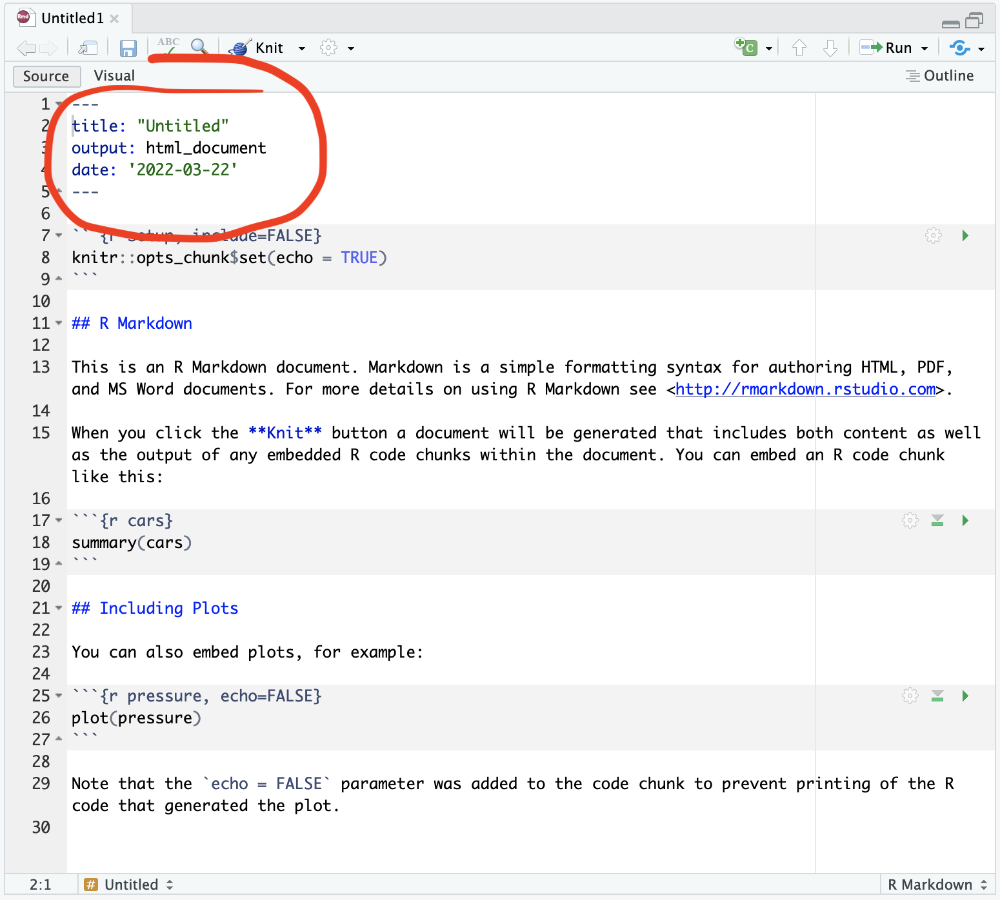
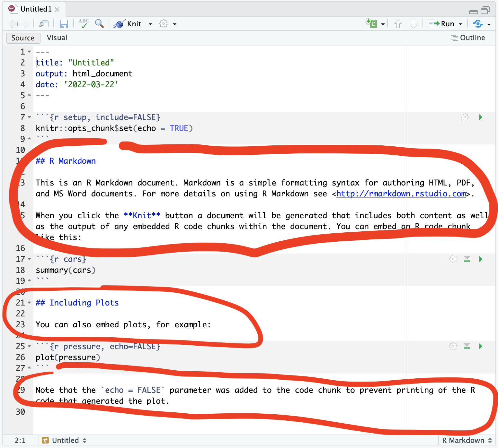
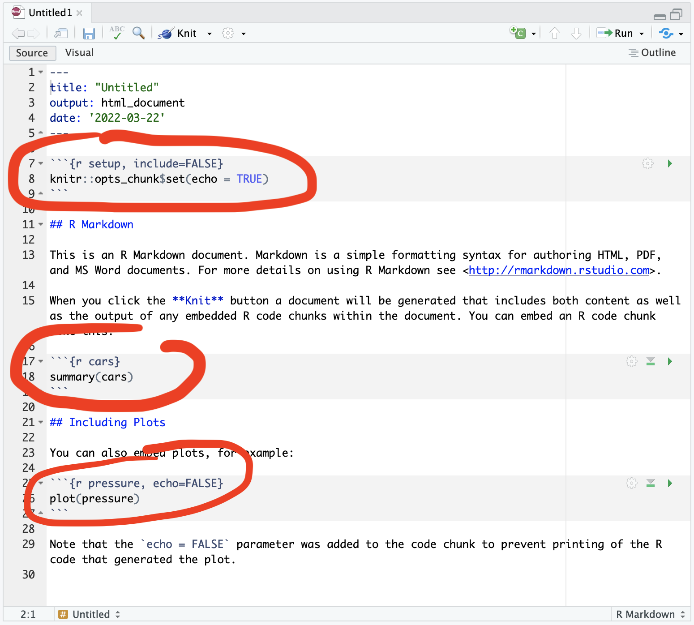
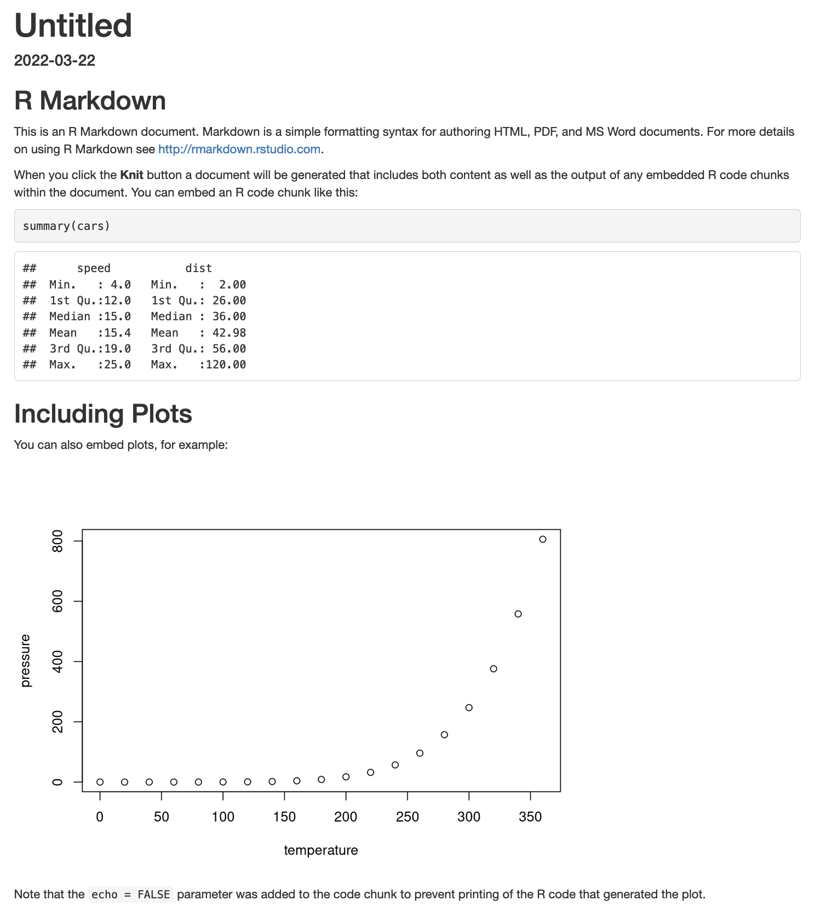
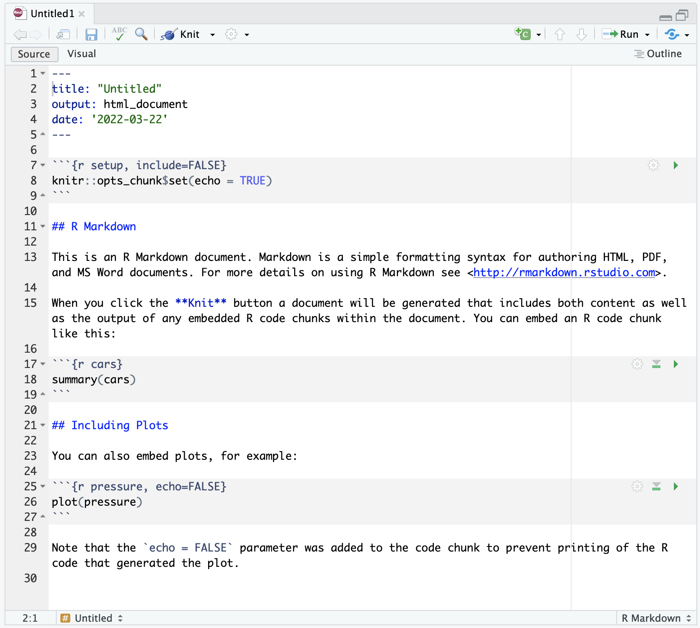
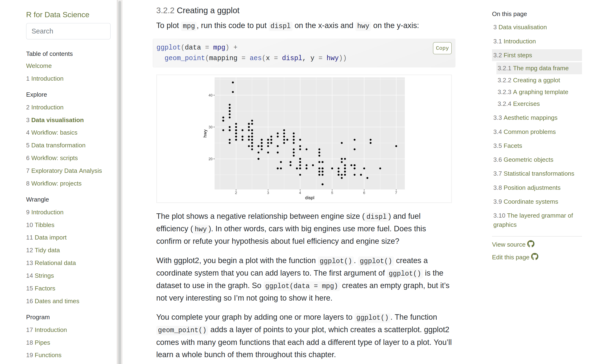
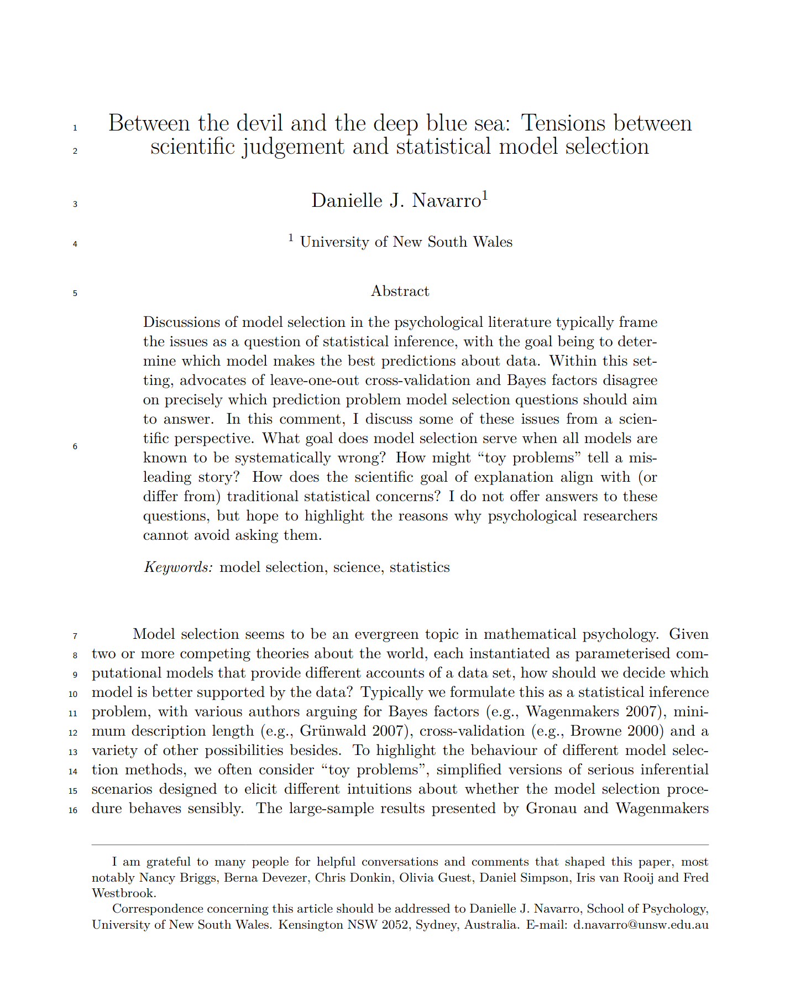

```{r setup, include = FALSE}
# libraries --------------------------------------------------------------------
library(anicon)
library(countdown)
library(fontawesome)
library(gapminder)
library(here)
library(knitr)
library(tidyverse)
library(tweetrmd)

# functions --------------------------------------------------------------------
# https://bookdown.org/yihui/rmarkdown-cookbook/font-color.html#using-an-r-function-to-write-raw-html-or-latex-code
colorize <- function(x, color) {sprintf("<span style='color: %s;'>%s</span>", color, x)}

# options ----------------------------------------------------------------------
options(scipen = 999, htmltools.preserve.raw = FALSE)
opts_chunk$set(echo = FALSE, fig.align = "center", fig.retina = 3)
theme_update(text = element_text(size = 24))

# data -------------------------------------------------------------------------
organisation_beta <- read_csv(here("data/organisation_beta.csv"))
```

```{r xaringan-extra-styles, echo=FALSE}
xaringanExtra::use_extra_styles(
  hover_code_line = TRUE, 
  mute_unhighlighted_code = TRUE
)
```

# Brief Introduction

Modern data science uses free and open-source computer languages:

* Proprietary languages (e.g., Matlab) and software (e.g., SPSS, Stata, SAS) are outdated
* Main open-source computer languages for data science are Python and R

While Python is the most used language by computer engineers for web and app development, R has some advantages:

.pull-left[
1. **Easy to write**, to read and to use
2. Focused on **reports and journal papers** with reproducibility
3. Advanced **statistical packages**
4. **Friendly and open** community

### So let's useR!
]

.pull-right[
```{r out.width='100%'}
tweet_screenshot(
  tweet_url("Pop_Watson", "1280351422953840640"),
  maxwidth = 300,
  hide_media = TRUE,
  theme = "dark"
  )
```
]

---

class: inverse, mline, center, middle

# 1. R and RStudio

---

# What are R and RStudio?

There are some key concepts you need to understand and to remember:

* R is the name of the language
* RStudio is the name of the upgraded interface to write R code

R is usually used via RStudio and First time users often confuse the two. At its simplest, **R is like a car’s engine** while **RStudio is like a car’s dashboard**.

.pull-left[
.center[R: The engine]
```{r out.width='100%'}
include_graphics("img/car_motor.jpeg")
```
]

.pull-right[
.center[RStudio: The dashboard]
```{r out.width='100%'}
include_graphics("img/car_dashboard.jpeg")
```
]

---
class: clear

## .center[**Time to enter ...**]

--

```{r out.width='150%'}
include_graphics("img/the_matrix.gif")
```

---

# Rstudio Cloud

In your webrowser (Chrome, Firefox, ...), go to: https://rstudio.cloud/
  - Sign up
  - In your workspace, Click "new project"

```{r out.width='100%'}
include_graphics("https://miro.medium.com/max/1400/1*JBHNRwGr3ZiyBzYWpvH6zg.png")
```

---

# Code in Rstudio

Most of the R code displayed in this lecture is included in these slides. Rather than typing it manually, open these slides in another tab to copy-paste the code

Two ways to access these slides:

  - From Loop: Lectures Slides > Chapter 5
  - Or from the URL: https://damien-dupre.github.io/mt611/lectures/chapter_5
  
```{r out.width='50%'}
include_graphics("https://c.tenor.com/0heitU7-tg4AAAAC/copy-paste-paste.gif")
```

---
class: inverse, mline, center, middle

# 2. Coding in RStudio

---

# RStudio IDE

When you open RStudio, you’ll see the following 3 windows (also called panes):

* **Console**: where the results are printed
* **Workspace**: where the objects are stored
* **Files, Plots, Package, Help and Viewer**: where data science materials are

```{r out.width='70%'}
include_graphics("img/rstudio_panes.png")
```

The last window **Code Editor** opens when creating a new R Script or R Markdown file

---

# Console: R’s Heart

The console displays 1. What has been ran, 2. The results (or some parts) of has been ran, and 3. The status of the R process.

.pull-left[
The Status of R is indicated by the symbol in the console prompt:

* `>` means ready to process code 
* `+` means incomplete command (escape with `ESC`)
* &#128721; at the top right corner means the console is busy processing your code
]

.pull-right[
```{r out.width = '100%'}
include_graphics("img/r_console.png")
```
]

You can execute code by typing it directly into the Console. __However, it will not be saved__. And if you make a mistake you will have to re-type everything all over again. 

Instead, it is better to write all your code in a document (R script or R Markdown) in the **Code Editor**.

---

# Environment: R’s Brain

The Environment tab of this pane shows you the names of all the data objects (like vectors, matrices, and data frames) that you have defined in your current R session. 

You can also see information like the number of observations and rows in data objects. 

```{r out.width='100%'}
include_graphics("https://www.statology.org/wp-content/uploads/2021/10/envir1.png")
```

---

# Files / Plots / Packages / Help

* The **Files** panel gives you access to the file directory on your hard drive.

* The **Plots** panel shows all your plots. There are buttons for opening the plot in a separate window and exporting the plot as a pdf or jpeg.

* The **Packages** shows a list of all the R packages installed on the local or remote machine and indicates whether or not they are currently loaded.

* With the **Help** menu for R functions you can access to essential information to use them. Just have a look at some of them by typling `F1` with the cursor on the function or by typing `?` followed by the function name such as:

```{r echo=TRUE, eval=FALSE}
?seq
?lm
```

---

# Code Editor: R's Nervous System

- It makes the link between all the previous pane and allows to reproduce actions and behaviours.

- You can open as many R Script / R Markdown as you want.

- These documents are the only documents that have to be saved. No need to save you data, figures and calculations as you can reproduce them every time instantaneously with the code.

- Save your eyes and look like a nerd by changing the code's appearance

```{r out.width='60%'}
include_graphics("https://miro.medium.com/max/1600/1*eLjON45R_kHIfg_IgL8FIg.jpeg")
```
.center.tiny[Credit: towardsdatascience.com [`r emo::ji("link")`](https://towardsdatascience.com/customize-your-rstudio-theme-914cca8b04b1)]

---
class: inverse, mline, center, middle

# 3. The Basics of R Code

---

# What are .R and .Rmd files?

**.R** is the extension for a R script (document including only R code): 
- Click **File > New File > R Script** in RStudio
- Includes only code which can be active or inactive (line starts with `#`)
- Used for code testing

Example of non-active code

```{r echo=TRUE}
# non active code
```

Example of active code

```{r echo=TRUE}
paste("active", "code")
1 + 1 # everything after `#` is non active and is used for comments
```

---

# What are .R and .Rmd files?

**.Rmd** is the extension for a R Markdown file: 
- Click **File > New File > R Markdown...** in RStudio
- Refers to a document that includes code and text
- Generates a specific type of output
  - .html (web page, slides, books, and dashboards)
  - .pdf (Academic LaTex papers and reports)
  - .doc (MS Word documents)
  
```{r out.width='80%'}
include_graphics("https://d33wubrfki0l68.cloudfront.net/59f29676ef5e4d74685e14f801bbc10c2dbd3cef/c0688/lesson-images/markdown-1-markup.png")
```

---

# How to Run R Code?

In a R Script, place your cursor anywhere on the line you want to run and either:

.pull-left[
- Press `Ctrl` & `Enter` (Win)
- Press `Command` & `Enter` (Mac)
- Click the `Run` button on RStudio's interface
]

.pull-right[
```{r out.width='100%'}
include_graphics("https://appsilon.com/wp-content/uploads/2020/05/4_blog_code_execution_optimized.gif")
```
]

In a R Markdown:
- Use the **green** arrow to run the current chunk of code
- Use the `Knit` button on RStudio's interface to create the output file

---

# What are R packages?

R packages extend the functionality of R. They are written by a worldwide community of R users and can be downloaded for free from the internet.

A good analogy for **R packages are like apps you can download onto a mobile phone**.

.pull-left[
.center[R: A new phone]
```{r out.width='100%'}
include_graphics("img/phone_design.jpeg")
```
]

.pull-right[
.center[R Packages: Apps you can download]
```{r out.width='100%'}
include_graphics("img/phone_apps.jpeg")
```
]

---

# What are R packages?

Say you have purchased a new phone, to use Instagram you need to **install the app once** and to **open the app** every time you want to use it.

The process is very similar for using an R package. You need to:

* **Install the package** with the function `install.packages()`.

```{r echo=TRUE, eval=FALSE}
install.packages("praise")
```

* **“Load” the package** with the function `library()`. 

```{r echo=TRUE, eval=FALSE}
library(praise)
```

Once the package is loaded you can use all the functions from this package such as:

```{r echo=TRUE, eval=FALSE}
praise()
```

---
class: title-slide, middle

## Live Demo

---
class: title-slide, middle

## Exercise

Open a R Script in RStudio. In this document:
- Use line 1 to **install the package "praise"**
- Use line 2 to **load the library praise**
- Use line 3 to **run the function `praise()`** as it is, without arguments

```{r}
countdown(minutes = 5, warn_when = 60)
```

---

# Calling Functions

Functions are algorithms (or lines of code) which transform data to something else. For example, the function `lm()`, uses data to compute the result of a linear regression model.
 
Functions are called by their name and have several arguments that require some information.

```{r echo=TRUE, eval=FALSE}
function_name(argument_1 = value_1, argument_2 = value_2, ...)
```

For example, the function `seq()` makes a sequences of numbers:
* The first argument `from` is the number starting the sequence
* The second argument `to` is last number of the sequence

```{r echo=TRUE, eval=TRUE}
seq(from = 1, to = 10)
```

---

# Assign Values to Objects in R

Usually the arguments of functions expects an Object name to access the data.

An object is a box that **can include anything** (e.g., values, dataframes, figures, models, functions, ...) and **has a name** that you have to choose. 

--

To create an object, you need to **assign something** to a name using the `<-` operator. If you type the name of the object, R will print out its content.

```{r echo=TRUE, eval=FALSE}
x <- 4
x
```

--

It is very important to distinguish values and objects in R:

```{r}
tribble(
                  ~Type,            ~Class,                        ~Example, 
               "Number",   "Numeric Value",                     "1, 2, ...",
     "Word with quotes", "Character Value",             '"one", "two", ...',
  "Word without quotes",     "Object Name", "function name, data name, ..."
  ) %>%
  kable(format = "html")
```

---

# Different R Objects

All object assignments have the same form:

```{r echo=TRUE, eval=FALSE}
object_name <- object_content
```

You want your object names to be descriptive, so you will need a convention for multiple words. I recommend **snake_case** where you separate lower-case words with `_`.

```{r, eval=FALSE, echo=TRUE}
numeric_value <- 1

character_value <- "one"

vectors_with_numeric_values <- c(1, 2)

vectors_with_character_values <- c("one", "two")

dataframe_example <- data.frame(col1 = c("one", "two"), col2 = c(1, 2))

dataframe_example <- data.frame(
  col1 = vectors_with_character_values, 
  col2 = vectors_with_numeric_values
  )
```

---
class: title-slide, middle

## Live Demo

---
class: title-slide, middle

## Exercise

In the same R Script in RStudio, **Copy and Paste and Run** the following code:

```
my_power <- c(0.5, 99.5)

my_knowledge <- c("without R", "with R")

barplot(height = my_power, names.arg = my_knowledge)
```

```{r}
countdown(minutes = 5, warn_when = 60)
```

---
class: inverse, mline, center, middle

# 4. Access Data in RStudio Cloud

---

# Open your Data as R Object (1)

RStudio Cloud is a free remote computer, the computing is not run on your computer.

To open Data on RStudio cloud, you first need to `Upload` your file on this computer and to `Import` the data in R.

.pull-left[
.center[Step 1: Upload your File]
```{r out.width='100%'}
include_graphics("https://community-cdn.rstudio.com/uploads/default/original/2X/9/91a128299a9d910f84279be9ecd89b60aa15f20b.png")
```
]

.pull-right[
.center[Step 2: Import your Data]
```{r out.width='100%'}
include_graphics("img/rstudio_import.png")
```
]

Remember that **.csv files are basically text files**

---

# Open your Data as R Object (2)

For early beginners on the Desktop version, directly open data with RStudio 's `Import Dataset` button.

```{r out.width='70%'}
include_graphics("https://support.rstudio.com/hc/article_attachments/360017333414/data-import-rstudio-overview.gif")
```

If you see your data in the preview, you can click `Import` to create an object containing your data. A code will be executed on the console, **Copy and Paste the first line of this code in your R script**. You will not have to do it manually once the code is in your script.

---

# Open your Data as R Object (3)

To ensure code reproducibility, open data with the appropriate function (e.g., `read.csv()` for csv files).

The main argument of these functions is `file` which corresponds to the path to a file, followed by the name of the file and it extension:

```{r echo=TRUE, eval=FALSE}
my_file_object <- read.csv("C:/path/to/my/file.csv") # Windows
my_file_object <- read.csv("/Users/path/to/my/file.csv") # Macos
```

The following codes will generate an error:

```{r echo=TRUE, eval=FALSE}
# Incomplete path
my_file_object <- read.csv("/path/to/my/file.csv")
# Missing file extension
my_file_object <- read.csv("C:/path/to/my/file")
# Use of backward slash
my_file_object <- read.csv("C:\path\to\my\file.csv")
```

---
class: title-slide, middle

## Live Demo

---
class: title-slide, middle

## Exercise

1. Click on `Upload` to upload your exercise data "{firstname}_data.csv" on your RStudio Cloud

2. Click on `Import` to import these data in R

```{r}
countdown(minutes = 5, warn_when = 60)
```

---
class: inverse, mline, center, middle

# 5. Save Your Data

---

# Save Your Data

Usually, only R Script file (.R) or R Markdown file (.Rmd) have to be saved as they allow the full replicability of transformations and result.

However if you want to use the data that have been transformed, joined or pivoted, a function has to be used according the type of export.

The simplest export is a .csv file with the function `write.csv()`. It as two main arguments:
- `x` which is the name of the object to save
- `file` which is the name of the output file

Note: don't forget the file extension in the argument `file`

Example:

```{r eval=FALSE, echo=TRUE}
# Saved in the current directory
write.csv(my_file_object, "my_file_name.csv")

# Saved in the directory you prefer
write.csv(my_file_object, "C:/path/to/my/my_file_name.csv") # Windows
write.csv(my_file_object, "/Users/path/to/my/my_file_name.csv") # Macos
```

---
class: title-slide, middle

## Exercise

Save your "{firstname}_data.csv" file under a new name by using the R object name that you previously gave

```{r}
countdown(minutes = 5, warn_when = 60)
```

---

# Become Expert in R

Because R is free, plenty of free learning materials are available online:

* Video tutorials in Youtube, Tik Tok (@chelseaparlettpelleriti, @tommyteaches, ...)
  
* Interactive tutorials, see for example:
  - [RStudio Primers](https://rstudio.cloud/learn/primers)
  - [R-Bootcamp](https://r-bootcamp.netlify.com)
  - [Introduction to R](https://www.quantargo.com/courses/course-r-introduction)
  - [DCU R tutorials](https://dcu-r-tutorials.netlify.app)

* Book tutorials, see for example:
  - [R for Data Science](https://r4ds.had.co.nz/) by Wickham & Grolemund (2017)
  - [A ModernDive into R and the tidyverse](https://moderndive.com/) by Ismay & Kim (2019)
  - [Getting Used to R, RStudio, and R Markdown](https://rbasics.netlify.com/) by Kennedy (2019)
  - [Introduction to Open Data Science](https://ohi-science.org/data-science-training/) by the Ocean Health Index Team (2019)
  
Note: All books are included in the [Big Book of R](https://www.bigbookofr.com/)

---

# How to solve your pRoblems

.pull-left[
### 1. Look at your error
  * If it's obvious, solve it by yourself
  * If it's not obvious, copy paste the error in google
  
### 2. Look at your object
  * `str(ObjectName)`

### 3. Look at the function
  * Documentation (`F1` or `?`)

### 4. Look at the web
  * Google "R how to ..."
  * Stack Overflow
]
.pull-right[
```{r out.width='100%'}
include_graphics("https://pbs.twimg.com/media/DAsjfPjXkAIBoET?format=jpg&name=medium")
```
]

---
class: inverse, mline, center, middle

# 6. Transformations with {dplyr}

---

# Using {dplyr} in the {tidyverse}

The {tidyverse} package is primarily made up of a set of super useful R packages ({ggplot2}, {dplyr}, {purrr}, {tidyr}, {readr}, {tibble}).

It is also a new way of thinking about implementing “tidy” data analysis. 

If you combine tidy thinking with the {tidyverse} packages, you will inevitably become a master of tidy analysis. 

The tidyverse has a very detailed website for more information: https://www.tidyverse.org/.

```{r eval=FALSE, echo=TRUE}
install.packages("tidyverse")
library(tidyverse)
```

---

# {dplyr}'s main functions

There are five **{dplyr}** functions that you will use to do the vast majority of data manipulations:

- `filter()`: Subset observations (pick observations by their values)

- `select()`: Subset variables (pick variables by their names)

- `mutate()`: Make new variables (create new variables with functions of existing variables)

- `summarise()`: Summarise data (collapse many values down to a single summary)

These can all be used in conjunction with `group_by()` which changes the scope of each function from operating on the entire dataset to operating on it group-by-group.

These five functions provide the verbs for a language of data manipulation.

---

# {dplyr}'s main functions

All verbs work similarly:

- `r colorize("The first argument is a dataframe object name", "red")` 
- `r colorize("The subsequent arguments describe how the dataframe is transformed", "green")` 
- `r colorize("The result is a new dataframe", "blue")`

Here is a generic example:

.center[**`r colorize("dataframe_transformed", "blue")` `<-` function_name(`r colorize("dataframe_name", "red")`, `r colorize("transformation", "green")`)**
]

---

# The gapminder dataset

The dataset used today is stored in the {gapminder} package into an object called `gapminder`. 

Each row in this table corresponds to a country at a specific year. For each row, we have 6 columns:

- **country**: Name of country.
- **year**: Year of the observation (between 1952 and 2007).
- **pop**: Number of people living in the country.
- **continent**: Which of the five continents the country is part of. 
- **lifeExp**: Life expectancy in years.
- **gdpPercap**: Gross domestic product (in US dollars).

---
class: title-slide, middle

## Live Demo

---
class: title-slide, middle

## Exercise

1. Install the packages {tidyverse} and {gapminder} which contains the data gapminder
2. Load the package {gapminder} to access the data
3. Use the function `str()` on the gapminder data 

```{r}
countdown(minutes = 5, warn_when = 60)
```

---
class: title-slide, middle

## The filter() function

---

# The filter() function

You will want to isolate bits of your data; maybe you want to only look at a single country or a few years. R calls this subsetting and `filter()` allows you to subset observations based on their values.

`filter()`'s transformation is a conditional statement, only observations TRUE to the condition are kept.

For example

```{r eval=FALSE, echo=TRUE}
filter(gapminder, country == "Ireland")
```

Importantly, Column/Variable names are not between quotation marks in the Tidyverse whereas the value to filter is:

- A Column/Variable is an object containing multiple values inside the data frame object.
- The string "Ireland" does not exist in our environment and will not be saved. It is here just as a value, which explains the quotation marks.

---

# Comparisons

To use filtering effectively, you have to know how to select the observations that you want using the comparison operators. R provides the standard suite: `>`, `>=`, `<`, `<=`, `!=` (not equal), and `==` (exactly equal).

When you are starting out with R, the easiest mistake to make is to use `=` instead of `==` when testing for equality. When this happens you will get an informative error:

```{r echo=TRUE, error=TRUE}
filter(gapminder, country = "Ireland")
```

---

# Multiple filters

Whereas the `filter()` can include as many conditions as possible, it is also possible to store the result of the `filter()` function in a new object and then to apply a new filter on this new object.

```{r eval=FALSE, echo=TRUE}
gapminder_ireland <- filter(gapminder, country == "Ireland")

gapminder_ireland_2007 <- filter(gapminder_ireland, year == 2007)
```

A choice is offered to you, you can either overwrite the original object by using the same object name or to use a different object name.

---
class: title-slide, middle

## Live Demo

---
class: title-slide, middle

## Exercise

1. Be sure that the packages {tidyverse} and {gapminder} are loaded
2. Create a new object that only contains `gapminder` data for France
3. Create a new object using the previous object that only contains data for France in 1982

```{r}
countdown(minutes = 5, warn_when = 60)
```

---
class: title-slide, middle

## The select() function

---

# The select() function

It is not uncommon to get datasets with hundreds or even thousands of variables. In this case, the first challenge is often narrowing in on the variables you are actually interested in. 

`select()` allows you to rapidly zoom in on a useful subset using operations based on the names of the variables. 

Again the first argument is the name of the data frame object to process and the following arguments are the name of the columns to keep.

```{r eval=FALSE, echo=TRUE}
select(gapminder, country, year, pop)
```

---

# Keep and remove variables

The `select()` function can not only be used to keep specific variables but it can also be used to remove them from the data frame object. 

To do so, just add the `-` sign in front of the variable name to be removed. For example:

```{r eval=FALSE, echo=TRUE}
gapminder_keep <- select(gapminder, country, year, pop)

gapminder_remove <- select(gapminder, -continent, -lifeExp, -gdpPercap)
```

`r faa("arrow-circle-right", animate="horizontal", speed="slow", color="blue")` In the previous example the objects `gapminder_keep` and `gapminder_remove` should have the same number of variable and therefore be equal.

---

# Select and rename variables

While you are keeping only specify variables with `select()`, these variables can also be renamed on the same time. 

The new name has to be first, followed by the `=` sign, and the old name.

Example:

```{r eval=FALSE, echo=TRUE}
select(gapminder, country, population = pop, measure_year = year)
```

---
class: title-slide, middle

## Live Demo

---
class: title-slide, middle

## Exercise

1/ From the data frame object `gapminder`, select the columns `lifeExp` and `gdpPercap` and rename them as life_expectancy and gdp_per_capita:

```{r eval=FALSE, echo=TRUE}
select(_ _ _, _ _ _ = _ _ _, _ _ _ = _ _ _)
```

2/ From the data frame object `gapminder`, remove the columns `pop` and `year` and assign the result in a new object. The display the value of this object:

```{r eval=FALSE, echo=TRUE}
new_data <- select(_ _ _, -_ _ _, -_ _ _)

new_data
```

```{r}
countdown(minutes = 5, warn_when = 60)
```

---
class: title-slide, middle

## The mutate() function

---

# The mutate() function

Besides selecting sets of existing columns, it is often useful to add new columns that are functions of existing columns. That is the job of `mutate()`. 

Once again the first argument is the name of the data frame object to modify, then the second argument is the name of the column to create followed by the `=` sign and the condition creating the new values.

For example we can create a new column called `gdp_total` which contains the values resulting from the multiplication between `pop` and `gdpPercap`:

```{r eval=FALSE, echo=TRUE}
mutate(gapminder, gdp_total = pop * gdpPercap)
```

`mutate()` can also create multiple columns in the same statement, they just have to be separated by a comma `,`.

---
class: title-slide, middle

## Live Demo

---
class: title-slide, middle

## Exercise

1/ From the data frame object `gapminder`, create a new column called `country_upper` with the function `toupper()` using the column `country`:

```{r eval=FALSE, echo=TRUE}
mutate(_ _ _, _ _ _ = _ _ _(_ _ _))
```

2/ From the data frame object `gapminder`, filter the countries in Europe and their values for 2007. Assign the result to an new object called `europe_2007`. 
Then create a new column called `europe_prop` corresponding to the value of the column `pop` divided by the total population in Europe in 2007.

```{r eval=FALSE, echo=TRUE}
europe_2007 <- filter(_ _ _, _ _ _ == _ _ _ & _ _ _ == _ _ _)

mutate(_ _ _, _ _ _ = _ _ _/_ _ _(_ _ _))
```

```{r}
countdown(minutes = 5, warn_when = 60)
```

---
class: title-slide, middle

## The summarise() function

---

# The summarise() function

The last key verb is `summarise()`. It collapses a data frame to a single row:

```{r eval=FALSE, echo=TRUE}
summarise(gapminder, mean(pop))
summarise(gapminder, sd(pop))
```

The result of `summarise()` is a dataframe, the default header of the summary is the calculation but a new header can be defined by using the `=` sign when summarising the data:

```{r eval=FALSE, echo=TRUE}
summarise(gapminder, m_pop = mean(pop))
summarise(gapminder, sd_pop = sd(pop))
```

Finally, more than one summary can be done inside a `summarise()`:

```{r eval=FALSE, echo=TRUE}
summarise(gapminder, m_pop = mean(pop), sd_pop = sd(pop))
```

---

# The summarise() function

`summarise()` is not terribly useful unless we pair it with `group_by()`. This changes the unit of analysis from the complete dataset to individual groups. Then, when you use the dplyr verbs on a grouped data frame they’ll be automatically applied “by group”. 

For example, if we applied exactly the same code to a data frame grouped by year, we get the average world population per year:

```{r echo=TRUE}
gapminder_by_year <- group_by(gapminder, year)

summarise(gapminder_by_year, mean_pop = mean(pop))
```

---
class: title-slide, middle

## Live Demo

---
class: title-slide, middle

## Exercise

1/ From the data frame object `gapminder`, summarise the population average with the `mean()` function by `year` and by `continent` by adding the second grouping variable after the first one (use a coma to separate them):

```{r eval=FALSE, echo=TRUE}
gapminder_group <- group_by(_ _ _, _ _ _, _ _ _)

summarise(_ _ _, _ _ _ = _ _ _(_ _ _))
```

2/ From the data frame object `gapminder`, summarise the population standard deviation with the `sd()` function by `year` and by `continent` by adding the second grouping variable after the first one (use a coma to separate them):

```{r eval=FALSE, echo=TRUE}
gapminder_group <- group_by(_ _ _, _ _ _, _ _ _)

summarise(_ _ _, _ _ _ = _ _ _(_ _ _))
```

```{r}
countdown(minutes = 5, warn_when = 60)
```

---
class: title-slide, middle

## The pipe operator %>%

---

# The Pipe Operator %>% (1)

We have seen how to create a sequence of numbers from 1 to 10 using the function `seq()`:

```{r echo=TRUE, eval=FALSE}
seq(1, 10)
#  [1]  1  2  3  4  5  6  7  8  9 10
```

If you want to know the sum of the numbers from 1 to 10, you might write some code like:

```{r echo=TRUE, eval=FALSE}
sum(c(1, 2, 3, 4, 5, 6, 7, 8, 9, 10))
```

To make the code shorter you could do instead:

```{r echo=TRUE, eval=FALSE}
sum(seq(1, 10))
```

The **tidyverse** makes heavy use of the pipe operator (`%>%`), which __takes whatever is on the left-hand-side of the pipe and makes it the first argument of whatever function is on the right-hand-side of the pipe__. 

Therefore `seq(1, 10) %>% sum()` is equivalent to `sum(seq(1, 10))`.

```{r echo=TRUE, eval=FALSE}
seq(1, 10) %>% sum()
```

---

# The Pipe Operator %>% (2)

Imagine you have a dataset made of 2 columns and you want to create a 3rd column which is the result of the addition of column 1 and column 2. Then you want to keep only the observations lower than 10, you might write code like this:

```{r echo=TRUE, eval=FALSE}
data_with_third_column <- mutate(data, column_3 = column_1 + column_2)

data_filter_third_column <- filter(data_with_third_column, column_3 < 10)
```

--

There’s another way to tackle the same problem with the pipe, `%>%`:

```{r echo=TRUE, eval=FALSE}
data_filter_third_column <- data %>% 
  mutate(column_3 = column_1 + column_2) %>% 
  filter(column_3 < 10)
```

--

You can read it as a series of imperative statements: 

> Create a new object call `data_filter_third_column` which takes the object `data`, **then** create a new column called `column_3`, **then** filter this column by keeping only the values lower than 10.

A good way to pronounce the pipe `%>%` when reading code is **“then”**.

---

# The pipe operator %>%

Imagine that we want to summarise the population average and standard deviation only of Europe. Using what you know about {dplyr}, you might write code like this:

```{r eval=FALSE, echo=TRUE}
gapminder_europe <- filter(gapminder, continent == "Europe")

gapminder_summary_europe <- summarise(gapminder_europe, 
    m_pop = mean(pop),
    sd_pop = sd(pop)
  )
```

This code is a little frustrating to write because we have to give each intermediate data frame a name, even though we don’t care about it. Naming things is hard, so this slows down our analysis.

--

There is another way to tackle the same problem with the pipe, `%>%`:

```{r eval=FALSE, echo=TRUE}
gapminder_summary_europe <- gapminder %>% 
  filter(continent == "Europe") %>% 
  summarise(m_pop = mean(pop), sd_pop = sd(pop))
```

---

# The pipe operator %>%

```{r eval=FALSE, echo=TRUE}
gapminder_summary_europe <- gapminder %>% 
  filter(continent == "Europe") %>% 
  summarise(m_pop = mean(pop), sd_pop = sd(pop))
```

Becomes

> Create the object "gapminder_summary_europe" from the object "gapminder", then

> Filter all the values exactly equals to "Europe" in the continent variable, then

> Summarise the average population as "m_pop" and the standard deviation as "sd_pop".

---
class: title-slide, middle

## Live Demo

---
class: title-slide, middle

## Exercise

1. If it hasn't been done already, load the tidyverse package

2. Execute the following code:

```{r eval=FALSE}
starwars %>%
  select(name, height, mass, homeworld) %>%
  mutate(height = height * 0.0328084) %>% # overwrite height values to feet
  group_by(homeworld) %>%
  filter(height == max(height)) %>%
  arrange(desc(height))
```

```{r}
countdown(minutes = 3, warn_when = 60)
```

---
class: title-slide, middle

## Exercise

1/ From the data frame object `gapminder`, summarise the population average with the `mean()` function by `year` and by `continent` by adding the second grouping variable after the first one (use a coma to separate them) and by using the pipe operator:

```{r eval=FALSE, echo=TRUE}
_ _ _ %>% 
  group_by(_ _ _, _ _ _) %>% 
  summarise(_ _ _ = _ _ _(_ _ _))
```

2/ From the data frame object `gapminder`, summarise the population standard deviation with the `sd()` function by `year` and by `continent` by adding the second grouping variable after the first one (use a coma to separate them) and by using the pipe operator:

```{r eval=FALSE, echo=TRUE}
_ _ _ %>% 
  group_by(_ _ _, _ _ _) %>% 
  summarise(_ _ _ = _ _ _(_ _ _))
```

```{r}
countdown(minutes = 5, warn_when = 60)
```

---
class: inverse, mline, center, middle

# 7. Visualistions with {ggplot2}

---

# Disable Scientific Number Format

By __default R uses scientific number format__ to display values when they are too long, which usually append in visualisations.

For example `1000000` is printed as:

```{r echo=FALSE}
format(1000000, scientific = TRUE)
```

To disable this scientific number format, include and __run the following code__ at the beginning of every script (ideally after loading the libraries) every time you restart R:

```{r echo=TRUE}
options(scipen = 999)
```

Now, `1000000` is printed as:

```{r echo=FALSE}
1000000
```

And your visualisations will not use the scientific number format anymore

---

# Using {ggplot2} in the {tidyverse}

The {ggplot2} package, as it provides an **easy way to create and to customise your plots**.

As a part of the {tidyverse} package, {ggplot2} is loaded when {tidyverse} is loaded as well:

```{r eval=FALSE, echo=TRUE}
# install.packages("tidyverse") if not done already (check list of packages)
library(tidyverse)
```

--

**“the grammar of graphics”** (the “gg” in ggplot) defines a set of rules for constructing statistical graphics by combining different types of layers. 

From the first (bottom) to the last (top), the mandatory layers are :

```{r out.width='50%'}
include_graphics("https://englelab.gatech.edu/useRguide/images/dataviz/ge_geom.png")
```

---

# Data

In {ggplot2}, the **data** layer is the name of the object that contains the variables to plot.

The visualisation is initiated with the function `ggplot()`

```{r eval=FALSE, echo=TRUE}
ggplot(data = my_dataframe) # the argument name can be omitted too
```

--

Let's try to use the gapminder data:

```{r echo=TRUE, fig.height=2}
ggplot(data = gapminder) # or ggplot(gapminder)
```

Only a grey frame is displayed: we need to define the axes (aesthetic mapping) and their corresponding layers.

**Then additional, layers are added with the symbol `+`.**

---

# Aesthetic Mapping

The **aesthetic mapping** refers to the frame of the plot, `x` for the variable in the x-axis and `y` for the variable in the y-axis. There are many more aesthetics such as `color`, `fill` and `group` but let's focus on the x and y axes for the moment. The mapping is performed by a function in {ggplot2} called `aes()` for aesthetics. 

This is an essential concept to remember, the mapping of a plot (frame axes) is built from aesthetics.

```{r echo=TRUE, eval=FALSE}
ggplot(data = my_dataframe) +
  aes(x = my_xaxis_variable, y = my_yaxis_variable)
```

--

Again, the arguments names of the `ggplot()` function and layers can be omitted if filled in the right order:

```{r echo=TRUE, eval=FALSE}
ggplot(my_dataframe) +
  aes(my_xaxis_variable, my_yaxis_variable)
```

Obviously, some type of layers are not suitable for all aesthetics, it depends on how many variables are included and their type (categorical or continuous). 

---

# Aesthetic Mapping

.pull-left[
**Aesthetic mapping represents** not only the variables defined as **x-axis** and **y-axis** but also, **colours** of borders (colors), colours of shapes (fill), **shapes**, **size**, ...
]

.pull-right[
```{r echo=TRUE, eval=FALSE}
ggplot(data = my_dataframe) +
 aes(
   x = my_xaxis_variable, 
   y = my_yaxis_variable,
   color = my_color_variable,
   fill = my_fill_variable,
   shape = my_shape_variable,
   size = my_size_variable
  )
```
]

--

For example, the following code is adding not only a x- and y-axis to a scatter plot, but also colours to the points:

.pull-left[
```{r aesthetic, echo=TRUE, fig.height=3, fig.show="hide"}
ggplot(data = gapminder) +
  aes(
    x = gdpPercap, 
    y = lifeExp, 
    color = continent
  )
```
]

.pull-right[
```{r, echo=FALSE}
include_graphics(fig_chunk("aesthetic", "png"))
```
]

---

# Geometries

**Geometries**, which are shapes we use to represent our data. There is a dedicated function for every type of shape to plot but all start with `geom_`

|function          |shape    |
|------------------|---------|
|`geom_point()`    |point    |
|`geom_line()`     |line     |
|`geom_bar()`      |bar      |
|`geom_histogram()`|histogram|
|`geom_boxplot()`  |boxplot  |
|...               |...      |

The list is very long but here are the main ones. Multiple **geometries** can be added as layers by using the same `+` symbol. 

---

# Geometries

Example for scatter plots:

```{r echo=TRUE, eval=FALSE}
ggplot(data = my_dataframe) +
  aes(x = my_xaxis_variable, y = my_yaxis_variable) +
  geom_point() 
```

Example for line graph:

```{r echo=TRUE, eval=FALSE}
ggplot(data = my_dataframe) +
  aes(x = my_xaxis_variable, y = my_yaxis_variable) +
  geom_line() 
```

Example for bar graph:

```{r echo=TRUE, eval=FALSE}
ggplot(data = my_dataframe) +
  aes(x = my_xaxis_variable, y = my_yaxis_variable) +
  geom_col() 
```

`r faa("arrow-circle-right", animate="horizontal", speed="slow", color="blue")` Note: Not all data is suitable for all types of geometries. You have to find the geometry that corresponds to your data.

---

# Geometries Applied to gapminder

Example for scatter plots:

```{r echo=TRUE, fig.height=5, fig.width=10}
ggplot(data = gapminder) +
  aes(x = gdpPercap, y = lifeExp, color = continent) +
  geom_point() 
```

---

# Geometries Applied to gapminder

Example for line graph:

```{r echo=TRUE, fig.height=5, fig.width=10}
ggplot(data = gapminder) +
  aes(x = year, y = lifeExp, color = country) +
  geom_line() +
  guides(color ="none") # removes legend because too many countries
```

---

# Geometries Applied to gapminder

Example for bar graph:

```{r echo=TRUE, fig.height=4, fig.width=12}
gapminder_avg_continent_2007 <- gapminder %>% 
  filter(year == 2007) %>% 
  group_by(continent) %>% 
  summarise(m_lifeExp = mean(lifeExp))

ggplot(data = gapminder_avg_continent_2007) +
  aes(x = continent, y = m_lifeExp, fill = continent) +
  geom_col() 
```

---

# Geometries with Statistics

`geom_smooth()` has one important extra argument called `method`. If method has the value "lm", a linear regression will be shown. If method has the value "loess" or "gam", a non-linear regression will be shown.

```{r echo=TRUE, fig.height=4, fig.width=12}
ggplot(gapminder) +
  aes(x = year, y = lifeExp, color = continent) +
  geom_point() +
  geom_smooth(method = "lm") +
  theme_classic()
```

---

# Inherited Propriety of Geometries

You can add as many geometry layers as you want, however repeating the mapping for each geometry layer is very redundant. 

Thankfully, if all your geometry layers are using the same aesthetics mapping, __it is possible to include this mapping inside the `ggplot()`__, then all the geometry layers will have the same mapping:

```{r echo=TRUE, eval=FALSE}
ggplot(gapminder, aes(x = year, y = lifeExp, color = country)) +
  geom_point() +
  geom_line()
```

--

If aesthetics are different for several geometry layers, it is also __possible to declare the aesthetics in the geometry__:

```{r echo=TRUE, eval=FALSE}
ggplot(gapminder) +
  geom_point(aes(x = year, y = lifeExp, shape = continent)) +
  geom_line(aes(x = year, y = lifeExp, color = country))
```

---

# Themes

Now, to make the plot more professional, let's remove that standard grey background using a different theme. 

Many themes come built into the {ggplot2} package. My preference is `theme_bw()` but once you start typing `theme_` a list of options will pop up.

```{r echo=TRUE, fig.height=4, fig.width=12}
ggplot(gapminder) +
  aes(x = gdpPercap, y = lifeExp, color = continent) +
  geom_point() +
  theme_bw()
```

---

# Themes

Built-in ggplot2 themes includes:

- `theme_bw()`
- `theme_classic()`
- `theme_minimal()`
- `theme_dark()`
- `theme_light()`
- ... 

```{r echo=FALSE, out.width='80%'}
include_graphics("https://thinkr.fr/wp-content/uploads/2019/07/ggplot-meme.jpg")
```

---

# Customising Plots

Take a look at the ggplot2 [cheat sheet](https://www.rstudio.com/wp-content/uploads/2016/11/ggplot2-cheatsheet-2.1.pdf), and think of ways you could improve the plot.


---

# Include ggplot in pipes

A very powerful way to create figures in R is to use a __ggplot at the end of a data transformation pipe__.

Indeed, having a data frame object as first argument of the `ggplot()` function is similar to using a pipe operator and chaining it to the `ggplot()` function:

```{r echo=TRUE, eval=FALSE}
# this classic representation:
ggplot(data = gapminder) +
  aes(x = gdpPercap, y = lifeExp, color = continent)
  geom_point()

# is the same as:
gapminder %>% 
  ggplot() +
  aes(x = gdpPercap, y = lifeExp, color = continent) +
  geom_point()

# is the same as:
gapminder %>% 
  ggplot(aes(x = gdpPercap, y = lifeExp, color = continent)) +
  geom_point()
```

The layers are still added with the `+` symbol.

---

# Include ggplot in pipes

By using the pipe with the data argument of `ggplot()`, it is also possible to modify the data frame using `filter()`, `select()`, `mutate()`, and `summarise()`.

Examples:

- `mutate()` and `filter()` to `ggplot()`:

```{r echo=TRUE, eval=FALSE}
gapminder %>% 
  mutate(gdpPercountry = gdpPercap*pop) %>% 
  filter(country == "Ireland") %>% 
  ggplot(aes(gdpPercountry, lifeExp, color = country)) +
  geom_line()
```

- `filter()` and `summarise()` to `ggplot()`:

```{r echo=TRUE, eval=FALSE}
gapminder %>% 
  filter(year == 2007) %>% 
  group_by(continent) %>% 
  summarise(s_pop = sum(pop)) %>% 
  ggplot(aes(continent, s_pop, fill = continent)) +
  geom_col()
```

---
class: title-slide, middle

## Live Demo

---
class: title-slide, middle

## Exercise

Build a ggplot with the `gapminder` dataset and one `geom_boxplot()` layer
which contains the x as `continent`, y as `lifeExp` and color as `continent` 
in its `aes()`. Use a theme of your choice as well:

```{r echo=TRUE, eval=FALSE}
_ _ _(_ _ _) +
  aes(x = _ _ _, y = _ _ _, color = _ _ _) +
  _ _ _() +
  _ _ _()
```

Build a ggplot with the `gapminder` dataset and one `geom_col()` layer which contains the x as `year`, y as `pop` and fill as `continent` in its `aes()`. Use a theme of your choice as well:

```{r echo=TRUE, eval=FALSE}
_ _ _(_ _ _) +
  aes(x = _ _ _, y = _ _ _, fill = _ _ _)
  _ _ _() +
  _ _ _()
```

```{r echo=FALSE}
countdown(minutes = 5, warn_when = 60)
```

---
class: inverse, mline, center, middle

# 8. Linear Regression Models in R

---

# Model and Equations

A model contains:

- Only one Outcome/Dependent Variable
- One or more Predictor/Independent Variables of any type (categorical or continuous)
- Main and/or Interaction Effects

To evaluate their relationship with the outcome, each effect hypothesis is related with a coefficient called **Estimate** and represented with $b$ as follow:

$$Outcome = b_0 + b_1 Pred1 + b_2 Pred2 + b_3 Pred1 * Pred2 + e$$

Testing for the significance of the effect means evaluating if this estimate $b$ value is significantly **different, higher or lower than 0** as hypothesised in $H_a$ by the scientist.

---

# Estimates and Linear Regression in R

The `lm()` function calculate each estimate and test them against 0 for you.

`lm()` has only two arguments that you should care about: `formula` and `data`. 

- `formula` is the translation of the equation of the model

- `data` is the name of the data frame object containing the variables.

Here is a generic example:

```{r echo=TRUE, eval=FALSE}
lm(formula = Outcome ~ Pred1 + Pred2, data = my_data_object)
```

Here is an example with {gapminder}:

```{r echo=TRUE, eval=FALSE}
lm(formula = lifeExp ~ gdpPercap + year, data = gapminder)
```

---

# Mastering the Formula

`lm()` has only one difficulty, the `formula`. The `formula` is the direct translation of the equation tested but with its own representation:

1. The = sign is replaced by `~` (read "according to" or "by")
2. Each predictor is added with the `+` sign
3. An interaction effect uses the symbol `:` instead of *

--

Here are some generic equations and their conversion in `formula`:

$$Outcome = b_0 + b_1 Pred1 + b_2 Pred2 + e$$

```{r echo=TRUE, eval=FALSE}
lm(formula = Outcome ~ Pred1 + Pred2, data = my_data_object)
```

$$Outcome = b_0 + b_1 Pred1 + b_2 Pred2 + b_3 Pred3 + e$$

```{r echo=TRUE, eval=FALSE}
lm(formula = Outcome ~ Pred1 + Pred2 + Pred3, data = my_data_object)
```

$$Outcome = b_0 + b_1 Pred1 + b_2 Pred2 + b_3 Pred1*Pred2 + e$$

```{r echo=TRUE, eval=FALSE}
lm(formula = Outcome ~ Pred1 + Pred2 + Pred1 : Pred2, data = my_data_object)
```

---

# Mastering the Formula

Here are some equations from the gapminder dataset and their conversion in `formula`:

--

$$lifeExp = b_0 + b_1 gdpPercap + b_2 year + e$$

```{r echo=TRUE, eval=FALSE}
lm(formula = lifeExp ~ gdpPercap + year, data = gapminder)
```

--

$$lifeExp = b_0 + b_1 gdpPercap + b_2 year + b_3 gdpPercap * year + e$$

```{r echo=TRUE, eval=FALSE}
lm(formula = lifeExp ~ gdpPercap + year + gdpPercap : year , data = gapminder)
```

---
class: title-slide, middle

## Live Demo

---
class: title-slide, middle

## Exercise

Test the following models in RStudio Cloud:

$$pop = b_0 + b_1 gdpPercap + b_2 lifeExp + e$$

$$pop = b_0 + b_1 gdpPercap + b_2 lifeExp + b_3 gdpPercap * lifeExp + e$$

```{r echo=FALSE}
countdown(minutes = 5, warn_when = 60)
```

---
class: title-slide, middle

## Linear Regression Results

---

# Categorical Predictor

Exactly as in Jamovi, `lm()` by default investigates continuous predictors or categorical predictors having 2 categories:

```{r echo=TRUE, eval=FALSE}
model_gapminder <- lm(formula = lifeExp ~ gdpPercap + year, data = gapminder)
```

However, to test the hypothesis of a categorical predictor having 3 or more categories, the ANOVA omnibus test is required.

It can be obtained by using the `aov()` function with the lm model as input:

```{r echo=TRUE, eval=FALSE}
model_gapminder <- lm(formula = lifeExp ~ country + year, data = gapminder)

aov(model_gapminder)
```

To make the code shorter, it is possible to pipe this `aov()`

```{r echo=TRUE}
model_gapminder <- lm(formula = lifeExp ~ country + year, data = gapminder) %>% aov()
```

---

# LM Summary

While the function `lm()` computes the model, the function `summary()` display the results

```{r echo=TRUE}
model_gapminder <- lm(formula = lifeExp ~ gdpPercap + year, data = gapminder)

summary(model_gapminder)
```

---

# LM Summary

The output of the `summary()` function is pretty dense, but let's analyse it line by line. 

The first line reminds us of what the actual regression model is:

```
Call:
lm(formula = lifeExp ~ gdpPercap + year, data = gapminder)
```

The next part provides a quick summary of the residuals (i.e., the &epsilon; values),

```
Residuals:
    Min      1Q  Median      3Q     Max 
-67.262  -6.954   1.219   7.759  19.553 
```

This can be convenient as a quick check that the model is okay. **Linear regression assumes that these residuals were normally distributed, with mean 0.** In particular it’s worth quickly checking to see if the median is close to zero, and to see if the first quartile is about the same size as the third quartile. If they look badly off, there’s a good chance that the assumptions of regression are violated. 

---

# LM Summary

The next part of the R output looks at the coefficients of the regression model:

```
Coefficients:
                 Estimate    Std. Error t value            Pr(>|t|)    
(Intercept) -418.42425945   27.61713769  -15.15 <0.0000000000000002 ***
gdpPercap      0.00066973    0.00002447   27.37 <0.0000000000000002 ***
year           0.23898275    0.01397107   17.11 <0.0000000000000002 ***
---
Signif. codes:  0 ‘***’ 0.001 ‘**’ 0.01 ‘*’ 0.05 ‘.’ 0.1 ‘ ’ 1
```

Each row in this table refers to one of the coefficient estimated in the regression model. 

The first row is the intercept term, and the later ones look at each of the predictors. The columns give you all of the relevant information:
- The first column is the actual estimate of b (e.g., -418.42425945 for the intercept, 0.00066973 for gdpPercap and 0.23898275 for year). 
- The second column is the standard error estimate (SE). 
- The third column gives you the t-statistic. 
- Finally, the fourth column gives you the actual p value for each of these tests. 

---

# LM Summary

The only thing that the previous table doesn’t list is the degrees of freedom used in the t-test, which is always N−K−1 and is listed immediately below, in this line:

```
Residual standard error: 9.694 on 1701 degrees of freedom
```

The value of df=1701 is equal to N−K−1, so that’s what we use for our t-tests. In the final part of the output we have the F-test and the R<sup>2</sup> values which assess the performance of the model as a whole

```
Multiple R-squared:  0.4375,	Adjusted R-squared:  0.4368 
F-statistic: 661.4 on 2 and 1701 DF,  p-value: < 0.00000000000000022
```

So in this case, the model did not perform significantly better than you’d expect by chance (F(2,1701) = 661.4, p < 0.001), which isn’t all that surprising: the R<sup>2</sup> = 0.4375 value indicate that the regression model accounts for 43.7% of the variability in the outcome measure. 

When we look back up at the t-tests for each of the individual coefficients, we have pretty strong evidence that gdpPercap and year have a significant effect. 

---

# Reporting Clean Results

To communicate about your statistical analyses in an academic report, the simplest method is to find the values in the `summary()` output and to copy-paste them in the text according to the format expected that we have seen in the previous lectures.

However, this task can be long, difficult and lead to human errors. Thankfully, R has additional packages that are providing alternative functions to read linear regression models and communicate results. Because there are too many packages, I will focus only on one additional packages: {report}.

```{r echo=FALSE}
include_graphics("https://memegenerator.net/img/instances/73408711/whoa-i-know-linear-regression.jpg")
```

---

# Automatic Results with {report}

To install {report} use the usual `install.packages()` function:

```{r echo=TRUE, eval=FALSE}
install.packages("report")
```

The package {report} will print a text containing all the statistics already in sentences ready to be interpreted (see https://easystats.github.io/report/).

To print the statistical analyses:

1. Load the package {report}
2. Create an object containing the output of the function `lm()`
3. Use this object as input of the function `report()` from the {report} package

**Note: If used in a RMarkdown document, the chunk containing `report()` has to include the chunk option `results='asis'`**

---

# Automatic Results with {report}

```{r echo=TRUE, warning = FALSE, results='asis'}
library(report)

model_gapminder <- lm(formula = lifeExp ~ gdpPercap + year, data = gapminder)

report(model_gapminder)
```

---
class: title-slide, middle

## Live Demo

---
class: title-slide, middle

## Exercise

In RStudio Cloud, check the `report()` output from the `lm()` function testing the following models:

$$pop = b_0 + b_1 gdpPercap + b_2 lifeExp + e$$

$$pop = b_0 + b_1 gdpPercap + b_2 lifeExp + b_3 gdpPercap * lifeExp + e$$

```{r echo=FALSE}
countdown(minutes = 5, warn_when = 60)
```

---
class: inverse, mline, center, middle

# 9. Academic Reports with Rmarkdown

---

# Objectives

In this lecture, with RStudio Cloud, we will see how to create **R Markdown** files (.Rmd) to embed text and code output and generate professional outputs.

--

#### What do I need to do before starting?

- Sign up for a free RStudio cloud account
- https://rstudio.cloud/

--

#### Where can I find more resources?

- More slides: 
  - [slides.djnavarro.net/starting-rmarkdown](https://slides.djnavarro.net/starting-rmarkdown)
  - [rmd4pharma.netlify.app/rmd-anatomy](https://rmd4pharma.netlify.app/static/slides/01-rmd-anatomy.html)
  - [rmd4pharma.netlify.app/graphics](https://rmd4pharma.netlify.app/static/slides/03-graphics.html)
- YouTube videos: [youtube.djnavarro.net/starting-rmarkdown](https://youtube.djnavarro.net/starting-rmarkdown)

---

# Two Sides of R Markdown Files

.pull-left[
### On the editor side...

- Write text in markdown
- Insert code using R
- Write "metadata" with YAML
]

.pull-right[
### On the output side...

- Output to HTML
- Output to PDF
- Output to Word
- Many other variations too
]

--

Try it by yourself:

1. Create a new R Markdown document: `File > New File > R Markdown`
2. A popup will appear, leave everything as default and click `Yes`
3. A new popup will appear, leave everything as default and click `OK`

--

## Let's dissect the document obtained!

---

# R Markdown Structure

R Markdown files have 3 different types of content:

#### 1. The YAML

Displayed between two series of `---` signs, it corresponds to the metadata shown in the header of the output file (e.g., title, author, date, ...) and the type of output (e.g., pdf, html, doc, ...)

#### 2. The Text

Written in Markdown style (i.e., text without formatting), it is used as core description in the output document

#### 3. The Code

Inserted in the R Markdown inside "chunks", the code is processed when creating the output and can display figures and tables

---

# The part inside --- is the "YAML"

```{r out.width='80%'}

```

---

# The text is Markdown 

```{r out.width='80%'}

```

---

# The part in grey is R code

```{r out.width='80%'}

```

---

# Create the Output File

.pull-left[
To generate the output file:

1. Go to `File > Knit Document` (a `Knit` shortcut icon is also displayed in the menu bar)
2. Give a name to your document and click `OK`

```{r out.width='80%'}
include_graphics("https://tech.me.holycross.edu/files/2016/12/knit.png")
```
]

.pull-right[
```{r out.width='100%'}

```
]

---

# R Markdown Editor vs Output

.pull-left[
```{r out.width='100%'}

```
]

.pull-right[
```{r out.width='100%'}

```
]

---
class: title-slide, middle

## The YAML

---

# Output HTML

### Simple

```
---
output: html_document
---
```

--

### Default

```
---
title: "My First R Markdown Document"
output: html_document
date: "99/99/9999"
---
```

--

### Elaborated

```
---
title: "My First R Markdown Document"
subtitle: "My Subtitle"
author: "Damien Dupre"
date: "99/99/9999"
output: html_document
---
```

---
class: title-slide, middle

## Markdown Style

---

# Emphasising text

--
.pull-left[
<br><br>
### What you type...
<br>
```

this is *italics*

this is **bold**

this is ***bold italics***
```
]
--
.pull-right[
<br><br>
### What you get...
<br>

this is *italics*

this is **bold**

this is ***bold italics***
]

---

# Creating lists

--
.pull-left[
<br><br>
### What you type...
<br>
```
- unnumbered lists
- look like this

1. numbered lists
2. look like this
```
]
--
.pull-right[
<br><br>
### What you get...
<br>

- unnumbered lists
- look like this

1. numbered lists
2. look like this
]

---

# Creating headings

--
.pull-left[
<br><br>
### What you type...
<br>
```
# Level 1 heading
## Level 2 heading
### Level 3 heading

```
]
--
.pull-right[
<br><br>
### What you get...
<br>

## Level 1 heading
### Level 2 heading
#### Level 3 heading
]

---

# Markdown Example

.pull-left[

**Example of a markdown document...**

```
## Introduction


Welcome to my **awesome** class. You 
will learn all kinds of useful things 
about R Markdown.


- Markdown is simple
- You can add R code
```
]

.pull-right[

**Here's what the output looks like...**

## Introduction
<br>
Welcome to my **awesome** class. You will learn 
all kinds of useful things about R Markdown. 

- Markdown is simple
- You can add R code

]

---
class: title-slide, middle

## Exercise

In RStudio Cloud:
- Create a new R Markdown file
- Remove all content except the YAML and save it as "my_first_rmarkdown.rmd"
- Write a sentence about your emotions (positive and negative) triggered by R
- Click "Knit" once finished

```{r echo=FALSE}
countdown(minutes = 5, warn_when = 60)
```

---
class: title-slide, middle

## The R Code Chunks 

---

# First Code Chunk

In the first code chunk, will be added all the __actions that will be applied to the following chunks__ (e.g., code option, library used, data downloaded, ...).

````markdown

`r ''````{r setup, include=FALSE}
# libraries
library(gapminder)
library(knitr)
library(tidyverse)
  
# data
organisation_beta <- read.csv("/cloud/project/organisation_beta.csv")
```

````

Every code chunk starts with 3 back ticks and finishes with 3 back ticks.

The starting back ticks are always followed by a set of {} including the code chunk options

---

# Code Chunk Options

Chunk output can be customized with knitr options (i.e., arguments set in the {} of a chunk header). Above, we use 1 argument:

- `include = FALSE` prevents code and results from appearing in the finished file. R Markdown still runs the code in the chunk, and the results can be used by other chunks.


Additional argument will be essential to use as well:

- `echo = FALSE` prevents code, but not the results from appearing in the finished file. This is a useful way to embed figures.
- `message = FALSE` prevents messages that are generated by code from appearing in the finished file.
- `warning = FALSE` prevents warnings that are generated by code from appearing in the finished.

See the **[R Markdown Reference Guide](https://www.rstudio.com/wp-content/uploads/2015/03/rmarkdown-reference.pdf)** for a complete list of knitr chunk options.

---

# Figures in the Output Document

As long as the package {tidyverse} is loaded and the data object created in the first setup chunk, then a __ggplot visualisation can be used in a separated chunk__:

````markdown
---
title: "Untitled"
output: html_document
---

`r ''````{r setup, include=FALSE}
library(tidyverse)

organisation_beta <- read.csv("/cloud/project/organisation_beta.csv")
```

# My Section Title

My text followed by my figure.

`r ''````{r}
ggplot(organisation_beta) +
  aes(salary, js_score) +
  geom_point()
```
````

---

# Figures in the Output Document

Warning, if the code results in the creation of an object, then the output will not be displayed:

```{r echo=TRUE, eval=FALSE}
plot_organisation_beta <- ggplot(organisation_beta) +
  aes(salary, js_score) +
  geom_point()
```

To be displayed there are 2 solutions:

#### 1. The content has to be printed by ending the code with the object name

```{r echo=TRUE, eval=FALSE}
plot_organisation_beta <- ggplot(organisation_beta) +
  aes(salary, js_score) +
  geom_point()

plot_organisation_beta
```

#### 2. The code is ran without creating an object

```{r echo=TRUE, eval=FALSE}
ggplot(organisation_beta) +
  aes(salary, js_score) +
  geom_point()
```

---

# Chunk Options for Visualisations

In this following example, when the output document is created:

- `echo = TRUE` indicates that not only the output of the code is shown but also the code itself
- `warning = FALSE` indicates that no R warning will be displayed
- `message = FALSE` indicates that no R message will be displayed

````markdown

`r ''````{r, echo = TRUE, warning = FALSE, message = FALSE}
ggplot(organisation_beta) +
  aes(salary, js_score) +
  geom_point()
```

````

---

# Visualisation Specific Options

Some chunk options are specific to visualisations outputs:

- fig.cap="caption of the figure"
- fig.height=5
- fig.width=5

Note, the default unit for height and width is inches.

````markdown
`r ''````{r, fig.cap="Example Caption", fig.height=2, fig.width=12, message=FALSE}
ggplot(organisation_beta) +
  aes(salary, js_score) +
  geom_point()
```
````

```{r, fig.cap="Example Caption", fig.height=2, fig.width=12, echo=FALSE, message=FALSE}
ggplot(organisation_beta) +
  aes(salary, js_score) +
  geom_point()
```

---
class: title-slide, middle

## Live Demo

---
class: inverse, mline, center, middle

# 4. Gallery

---

# Professional websites

```{r, echo=FALSE, out.width='70%'}
include_graphics("img/example_professional_site.png")
```

---

# Books

```{r, echo=FALSE, out.width='100%'}

```

---

# Academic papers

```{r, echo=FALSE, out.width='60%'}

```

---

# Slide decks

```{r, echo=FALSE, out.width='100%'}
include_graphics("https://raw.githubusercontent.com/katiejolly/blog/master/assets/slide-design/twitter_img_march.png")
```

---

# CV

```{r, echo=FALSE, out.width='80%'}
include_graphics("https://kevinrue.github.io/post/writing-my-cv-using-pagedown/featured_hu415bb52acda44839a73c9c4234bb7d44_345471_720x0_resize_lanczos_2.png")
```

---
class: inverse, mline, left, middle


# Thanks for your attention and don't hesitate to ask if you have any question!

[`r fa(name = "twitter")` @damien_dupre](http://twitter.com/damien_dupre)  
[`r fa(name = "github")` @damien-dupre](http://github.com/damien-dupre)  
[`r fa(name = "link")` damien-datasci-blog.netlify.app](https://damien-datasci-blog.netlify.app)  
[`r fa(name = "paper-plane")` damien.dupre@dcu.ie](mailto:damien.dupre@dcu.ie)
