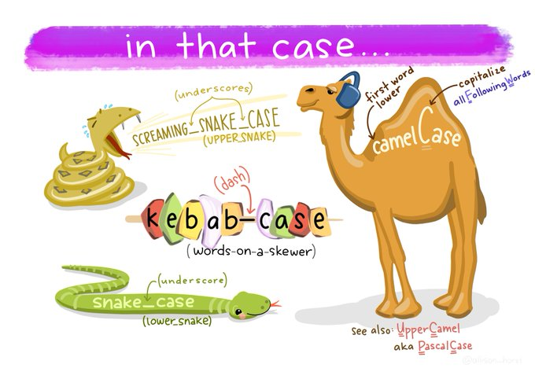
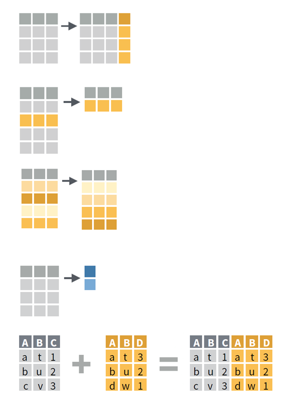
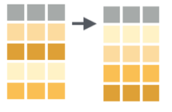
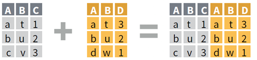
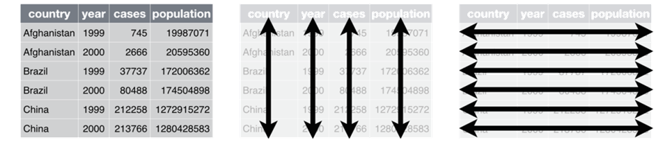
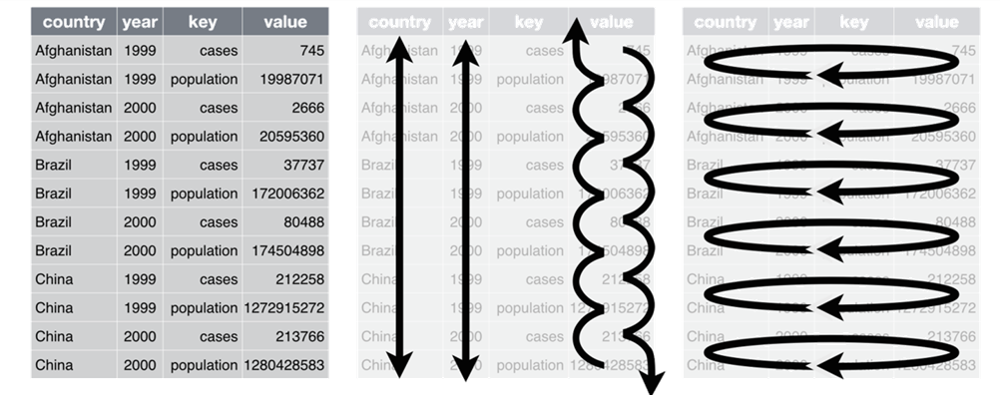
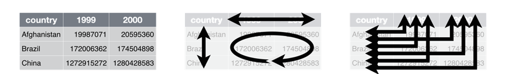
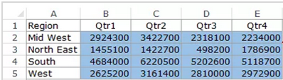
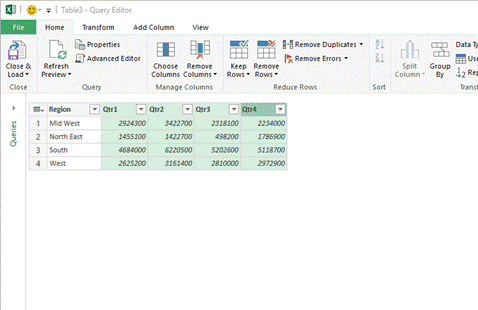

```{r setup, include = FALSE}
# general options --------------------------------------------------------------
options(scipen = 999)
set.seed(123)
# chunk options ----------------------------------------------------------------
knitr::opts_chunk$set(
  cache.extra = knitr::rand_seed, 
  message = FALSE, 
  warning = FALSE, 
  error = FALSE, 
  echo = FALSE,
  cache = FALSE,
  comment = "", 
  fig.align = "center", 
  fig.retina = 3
  )
# libraries --------------------------------------------------------------------
library(tidyverse)
library(fontawesome)
library(DiagrammeR)
```

class: inverse, mline, center, middle

# 1. Collecting Data

---

# Data Everywhere

```{r out.width = "35%"}
knitr::include_graphics("https://interworks.com.mk/wp-content/uploads/2019/12/12.jpg")
```

Big Data?

- Too large or too complex to be handled by conventional tools
- Larger then Microsoft Excel’s Limits (2016)
    - Total number of rows: 1,048,576 rows
    - Total number columns: 16,384 columns

---

# Collecting Data

A tool is required to collect data, but there are tools to measure anything:
  
- Naturalistic Objects
- Economic Status
- Social Events
- Psychological States

A tool, like a model, needs to be valid and reliable

```{r out.width = "35%"}
knitr::include_graphics("https://www.publichealthnotes.com/wp-content/uploads/2018/08/560px-Reliability_and_validity.svg_.png")
```

---

# Focus on Psychometric Scales

A psychometric scale is a series of questions (items) used to measure a latent variable.

--

A score has to be calculated from all the items to produce the variable to analyse:

- Average of all items (equal contribution to the latent variable score)
- Factor analysis (unequal contribution to the latent variable score)

--

A scale should have been validated by its authors: 

- Don't change the items except when possible
- Don't change items' range of possibilities

--

To be analysed a scale has some requirements:
- All the items must have the same range of possibilities/modalities
- All the items must be analysed in the same direction
- All the items must correlate together (scale reliability)
- A unique theoretical construct score has to be calculated from all the items

---

# Focus on Psychometric Scales

Previously assessed with paper-pencil method, they are now used online with Survey Design Software:

- Google Form (from your google drive, DCU hosted)
- Qualtrics (http://www.qualtrics.com, DCU Business School account)
- Survey Monkey (https://www.surveymonkey.com/, freemium)
- LimeSurvey (https://www.limesurvey.org/, freemium)
- Gorilla Experiment (https://gorilla.sc, pay per participants)

--
  
Remember: Always ask for age and gender

--

Participant recruitment by list of contact/email (between 15% and 10% answer rate)

--

Payed participants:
- Amazon MTurk (https://www.mturk.com/ mainly US and India)
- Prolific Academic (https://www.prolific.co/ world wide)
- Qualtrics
- Survey Monkey

---

# Survey Example

**Perceived Usefulness:**
- *(PU1)* Using R would improve my performance in statistical analysis 
- *(PU2)* Using R would increase my productivity in statistical analysis
- *(PU3)* Using R would enhance my effectiveness in statistical analysis
- *(PU4)* Using R would make it easier for me to engage in statistical analysis 
- *(PU5)* I think using R is very useful for me to engage in statistical analysis 

**Perceived Ease-Of-Use:**
- *(PEOU1)* I think learning to use R is easy 
- *(PEOU2)* I think doing what I want via R is easy 
- *(PEOU3)* I think becoming skillful at using R is easy 
- *(PEOU4)* I think using R is easy 

**Behavioural Intention:**
- *(BI1)* Assuming I had access to R, I intend to use it 
- *(BI2)* Given that I had access to R, I predict that I would use it 

---

# Survey Example

```{r eval=TRUE}
DiagrammeR::grViz("
digraph rmarkdown {
  graph [rankdir = LR]
  
  node [shape = oval]
  'Perceived Ease-of-use'; 'Perceived Usefulness'; 'Intention to Use'; 'Actual Use'
  
  node [shape = box]
  PU1; PU2; PU3; PU4; PU5; PEOU1; PEOU2; PEOU3; PEOU4; BI1; BI2; AU
  
  {PU1 PU2 PU3 PU4 PU5} -> 'Perceived Usefulness' [arrowhead = none]
  {PEOU1 PEOU2 PEOU3 PEOU4} -> 'Perceived Ease-of-use' [arrowhead = none]
  {BI1 BI2} -> 'Intention to Use' [arrowhead = none]
  {AU} -> 'Actual Use' [arrowhead = none]
  
  'Perceived Usefulness' -> 'Intention to Use'
  'Perceived Ease-of-use' -> {'Perceived Usefulness' 'Intention to Use'}
  'Intention to Use' -> 'Actual Use'
  
  subgraph {
      rank = same; 'Perceived Usefulness'; 'Perceived Ease-of-use';
  }
  
  subgraph {
      rank = same; PU1; PU2; PU3; PU4; PU5; PEOU1; PEOU2; PEOU3; PEOU4; BI1; BI2;
  }

}
", height = 400)
```

Google form: https://forms.gle/epRj45iR1jL7r3wV7

Qualtrics: https://dcubusinessschool.eu.qualtrics.com/jfe/form/SV_0JSAjOvXVxzJvgh

---

# Access to your data

Google Form
1. Login Google Account (be sure to use the DCU account)
2. Go to Drive
3. Click on your Survey form
4. Click on Response
5. Download Response Spreadsheet as .csv

Qualtrics
1. Login Qualtrics (DCU login/pwd)
2. Click on Data & Analysis
3. Click on Export & Import > Export Data...> CSV (Use numeric values)

Always save the unmodified raw version of your data on the cloud (google drive, dropbox, one drive, ...)

Make sure you can download them as a .csv file.

---

class: inverse, mline, center, middle

# 2. Cleaning Data

---

# Which Software?

If you don't have big data... use Microsoft Excel! 

Otherwise use R or Python.

```{r out.width = "50%"}
knitr::include_graphics("https://miro.medium.com/max/624/1*FAzumPnvzKUDolMG7SNcHw.png")
```

---

# Question from Kareem

```{r out.width = "100%"}
knitr::include_graphics("img/clean_tweet.png")
```

---

# Exercise

## Find what is going wrong with this table

```{r out.width = "100%"}
knitr::include_graphics("img/clean_zoom.jpg")
```

---

# Answer from Michael

```{r out.width = "100%"}
knitr::include_graphics("img/clean_answer.png")
```

---

# Use a Name Convention

An addition to Michael's list would be to transform headers with a proper naming convention

My suggestion is **snake_case**: all small letter and words separated by "_"

```{r out.width = "70%"}

```

---

# To Clean Data ...

### 1. Ditch the chart and all non values
Charts can mess up with other software

### 2. Column headings in row 1
No more than 1 heading row and remove blanks

### 3. Columns start at column A
Remove blanks before data

### 4. Use a naming convention
snake_case is preferable but any would do

### 5. Save as .csv file
Better format and keeps only the current sheet

---

class: title-slide, mline, center, middle

## Exercise: Clean unicef.xlsx

---

# Exercise: Clean unicef.xlsx

## On the MT611 Loop page, download and open the document “unicef.xlsx”

## Clean the 1st sheet of this file (15min)

---

class: inverse, mline, center, middle

# 3. Transform Data

---

# Master the Key Movements

Most important work is to tidy your data: 
- Takes time to saves time and solves problems
- Only 5 movements are necessary to master (almost) 

.pull-left[
## 1. Extension

## 2. Reduction

## 3. Direction

## 4. Aggregation

## 5. Combination
]

.pull-right[
```{r out.width = "70%"}

```
]

---

# Extension

- Extension = New Column
- In MS Excel:
  - First row is row name (name convention)
  - Second row is the function (starts with =)
  - Following rows are applied (squared corner)

```{r out.width = "50%"}
knitr::include_graphics("img/extension_img.png")
```

---

# Excel Functions

- For numeric values
  - Numeric operator ( + - / *)
  - $ (fixed parameter)
  - COUNT(), MIN(), MAX(), SUM(), AVERAGE (), STDEV()

- For character strings
  - LEFT()
  - CONCATENATE()

- Extra function
  - IF(condition, value if true, value if false)

---

# Reduction

- Reduction = Filter Column

- In MS Excel:
  - Select header row
  - In Data tab, use Filter
  - Click the drop-down arrow for the column you want to filter
  - Choose values to filter
  
```{r out.width = "50%"}
knitr::include_graphics("img/reduction_img.png")
```

---

# Excel Filters

- Rows already filtered have a row index are coloured in blue

- Copy-Paste filtered table in a new document if you want to work only on these values

```{r out.width = "50%"}
knitr::include_graphics("https://www.excel-easy.com/data-analysis/images/filter/filter-result.png")
```

---

# Direction

- Direction = Arrange Row Order

- In MS Excel:
  - Select table
  - In Data tab, use Sort
  - Choose column to sort and how to sort

```{r out.width = "40%"}

```

Be careful of taking into account all the table (all rows & all columns)

Double check if all columns changed!

---

# Aggregation

- Aggregation = Summary of Column

- In MS Excel:
  - Simple = use function at the end of a table
  - Complex = use pivot table
  
```{r out.width = "50%"}
knitr::include_graphics("img/aggregation_img.png")
```

---

# Pivot Table in Excel

1. Select data
2. In Insert, use Pivot Table
3. Drag columns to sort by row/column
4. Choose value column to be aggregated
5. Choose type of aggregation

If you want to use the Pivot Table for further analysis:

- Copy-Paste it in another document
- Paste as value (removes dynamic link)

---

# Combination

- Combination = Join two tables

- In MS Excel:
  - One Column = vlookup function
  - Multiple Columns = Power Query (Windows only)
  
```{r out.width = "50%"}

```

--

### =VLOOKUP(value, table, col_index, [range_lookup])

- value: The value to look for in the first column of a table
- table: The table from which to retrieve a value
- col_index: The column in the table from which to retrieve a value
- range_lookup: TRUE = approximate match / FALSE = exact match

---

class: title-slide, mline, center, middle

## Exercise: Transformations

---

# Exercise: Transformations

On the MT611 Loop page, download and open the document "employee_d&d_excerpt.xls"

1. **Extension**: Create a new variable/column which is the average response to all the questions from the survey for each employee (q1 to q9)

2. **Reduction**: Filter employee’s 2019 salary to keep only employees with a salary higher than 30k
3. **Aggregation**: Calculate the average salary by gender and by location
4. **Combination**: Using the VLOOKUP function, add to the table a column corresponding to the  2017 salary located in the 2nd sheet

---

class: inverse, mline, center, middle

# Extra Analytic Tips

---

# Tidy Data

- Each variable has its own column 
- Each observation is placed in its own row 
- Each value is placed in its own cell

```{r out.width = "100%"}

```

---

# Long or Wide?

## Long Format

```{r out.width = "80%"}

```

## Wide Format

```{r out.width = "80%"}

```

---

# Long or Wide?

```{r out.width = "100%"}

```

--

```{r out.width = "100%"}
knitr::include_graphics("img/long_and_wide.png")
```

---

# Reshape Table in Excel

In Data tab:

1. Get Data/New Query> From File > From [Workbook/CSV]
2. Select your file > Edit
3. Select columns to be reshaped
4. Transform
  - Pivot Columns: from long table to wide table
  - Unpivot Columns: from wide to long table
  
```{r out.width = "50%"}

```

---

# Repeat Action Automatically

In Excel, the Macro button allows to record a sequence of  actions and to reproduce these actions:

- VBA Code automatically recorded
- Useful to process similar data files

Recording a Macro:

1. View Tab
2. Use Macros > Record Macro
3. Do your actions
4. Save the macro with a keyboard shortcut
5. Use the macro again to reproduce your actions

---
class: inverse, mline, left, middle


# Thanks for your attention and don't hesitate if you have any question!

[`r fa(name = "twitter")` @damien_dupre](http://twitter.com/damien_dupre)  
[`r fa(name = "github")` @damien-dupre](http://github.com/damien-dupre)  
[`r fa(name = "link")` damien-datasci-blog.netlify.app](https://damien-datasci-blog.netlify.app)  
[`r fa(name = "paper-plane")` damien.dupre@dcu.ie](mailto:damien.dupre@dcu.ie)
