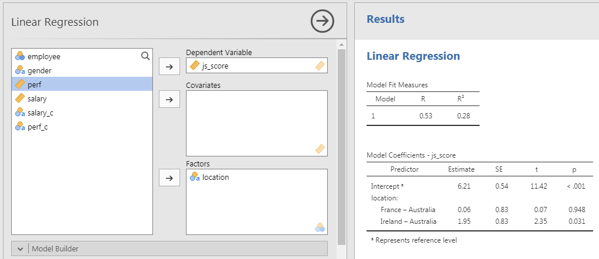

```{r setup, include = FALSE}
# general options --------------------------------------------------------------
options(scipen = 999)
set.seed(123)
# chunk options ----------------------------------------------------------------
knitr::opts_chunk$set(
  cache.extra = knitr::rand_seed, 
  message = FALSE, 
  warning = FALSE, 
  error = FALSE, 
  echo = FALSE,
  cache = FALSE,
  comment = "", 
  fig.align = "center", 
  fig.retina = 3
  )
# libraries --------------------------------------------------------------------
library(tidyverse)
library(fontawesome)
library(DiagrammeR)
library(patchwork)
library(ggrepel)
library(papaja)

# data -------------------------------------------------------------------------
dnd <- readr::read_csv(here::here("data/dnd.csv"))  

  tibble::tibble(
    gender = sample(c("male", "female"), 20, replace = TRUE),
    location = sample(c("Ireland", "France", "Australia"), 20, replace = TRUE),
    perf = rnorm(20, mean = 4, sd = 2),
    salary = rnorm(20, mean = 30000, sd = 1000),
    js_score = -55 + 0.002 * salary + rnorm(20, mean = 2, sd = 1)
  ) %>%
  tibble::rownames_to_column("employee") %>%
  dplyr::mutate(
    js_score = case_when(
      js_score > 10 ~ 10,
      js_score < 0 ~ 0,
      TRUE ~ js_score
    ),
    perf = case_when(
      perf > 10 ~ 10,
      perf < 0 ~ 0,
      TRUE ~ perf
    ),
    salary_c = case_when(
      salary >= mean(salary) ~ "high",
      salary < mean(salary) ~ "low"
    ),
    perf_c = case_when(
      perf >= mean(perf) + sd(perf) ~ "high",
      perf < mean(perf) + sd(perf) & perf >= mean(perf) - sd(perf) ~ "medium",
      perf < mean(perf) - sd(perf) ~ "low"
    ),
  ) %>%
  readr::write_csv(here::here("data/dnd.csv"))
  
# analyses ---------------------------------------------------------------------
m_js_high <- mean(dnd$js_score[dnd$salary_c == "high"])
m_js_low <- mean(dnd$js_score[dnd$salary_c == "low"])
lm_1 <- lm(js_score ~ salary, data = dnd) %>% apa_print
lm_2 <- lm(js_score ~ salary*perf, data = dnd) %>% apa_print
lm_c <- lm(js_score ~ salary_c, data = dnd) %>% apa_print
lm_c2 <- dnd %>% 
  dplyr::mutate(salary_c = factor(salary_c, level = c("low", "high"))) %>% 
  lm(js_score ~ salary_c, data = .) %>% apa_print
lm_c3 <- lm(js_score ~ location, data = dnd) %>% aov %>% apa_print

```

class: inverse, mline, center, middle

# 1. Regressions for Hypothesis Testing

---

# Vocabulary

"Linear Model", "Linear Regression", "Multiple Regression" or simply "Regression" are all referring to the same model: **The General Linear Model**.

It contains:

- Only one Outcome/Dependent Variable
- One or more Predictor/Independent Variables of any type (categorical or continuous)
- Made of Main and/or Interaction Effects

$$Y = \beta_{0} + \beta_{1} . X_{1} + \beta_{2} . X_{2} + ... + \beta_{n} . X_{n} + \epsilon$$

where $n$ is an expected effect (main or interaction)

**To test the significance of the effects, only one statistical method will be used for all hypotheses types which are Linear Regressions.**

Specific tests are available for certain type of hypothesis such as T-test or ANOVA but as they are special cases of Linear Regressions, their importance is limited (see [Jonas Kristoffer Lindeløv's blog post: Common statistical tests are linear models](https://lindeloev.github.io/tests-as-linear/)).

---

# Notes on the Equations

### 1. Using Greek or Latin alphabet

$$Y = \beta_{0} + \beta_{1} . X_{1} + \epsilon \; vs. \; Y = b_{0} + b_{1} . X_{1} + e$$

**Latin alphabet** (e.g. $b$) is used for parameters that are **non-standardized** (i.e., expressed in the unit of the predictor) whereas **Greek alphabet** (e.g. $\beta$) is used when parameters are **standardized** (i.e., expressed in term of correlation ranging from 1 to -1).

### 2. Using $i$s or not

$$Y = \beta_{0} + \beta_{1} . X_{1} + \epsilon \; vs. \; Y_{i} = \beta_{0} + \beta_{1} . X_{1_{i}} + \epsilon_{i}$$

$i$s indicate "for all possible observations". It is **more correct** in a mathematical writing but it is **usually not used** and will not be included in this lecture to no add to much complexity. 

### 3. Using hats or no hats

$\hat{Y}$ or $\hat{y}$ are used to indicate a **predicted value**. Indeed, an equation predicts values of the outcome variable therefore, $y$ should be $\hat{y}$ but it is generally used only by mathematicians.

---

# General Linear Model Everywhere

Most of the common statistical models (t-test, correlation, ANOVA; chi-square, etc.) are special cases of linear models.

This beautiful simplicity means that there is less to learn. In particular, it all comes down to $y = ax + b$ which most students know from secondary school. 

Unfortunately, stats intro courses are usually taught as if each test is an independent tool, needlessly making life more complicated for students and teachers alike.

```{r out.width = "35%"}
knitr::include_graphics("https://psyteachr.github.io/msc-data-skills/images/memes/glm_meme.png")
```

---

# Applied Example

### Imagine the following case study...

> The CEO of the D&D company has problems with his employee well-being and wants to investigate the relationship between **Job Satisfaction (js_score)**, **salary** and **performance (perf)**.

--

### Therefore the CEO formulate 3 hypotheses:

- The higher employees' $salary$ is, the higher their $js\_score$
- The higher employees' $perf$ is, the higher their $js\_score$
- The effect of $salary$ on $js\_score$ is bigger for high $perf$ than for low $perf$

--

### The corresponding model is:

$$js\_score = \beta_{0} + \beta_{1}.salary + \beta_{2}.perf + \beta_{1}.salary*perf + \epsilon$$

---

# Where the Regression Line comes from?

Draw all the possible lines on the frame. The best line, also called best fit, is the one which has the lowest amount or error. 

.pull-left[
```{r fig.width=5, fig.height=5}
  tibble(
    salary = rnorm(200, mean = 5, sd = 5),
    js_score = -1 + 0.02 * salary + rnorm(200, mean = 2, sd = 0.1),
    b0 = rnorm(200, 0, 1),
    b1 = rnorm(200, 0.02, 0.1)
  ) %>% 
  ggplot(aes(salary, js_score)) + 
  geom_abline(aes(intercept = b0, slope = b1), alpha = 1/4) +
  geom_point() +
  theme(
    axis.text.x = element_blank(), 
    axis.text.y = element_blank(),
    text = element_text(size = 20)
  )
```
]
.pull-right[
There are 200 models on this plot, but a lot are really bad! We need to find the good models by making precise our intuition that a good model is "close" to the data. 

Therefore, we need a way to quantify the distance between the data and a model. Then we can fit the model by finding the value of $\beta_0$ and $\beta_1$ that generate the model with the smallest distance from this data.
]

---

# Best Model, Lowest Error

The error of the model (i.e., $\epsilon$) is the sum of the prediction error for each point (distance between actual value and predicted value)

For each point this specific prediction error is called **Residual**

.pull-left[
```{r fig.width=5, fig.height=5}
linear_model <- lm(js_score ~ salary, dnd)

dnd$predicted <- predict(linear_model)   # Save the predicted values
dnd$residuals <- residuals(linear_model) # Save the residual values

plot_error <- dnd %>% 
  ggplot(aes(salary, js_score, label = residuals)) +
  geom_segment(aes(xend = salary, yend = predicted), color = "red") +
  geom_point() +
  geom_smooth(method = "lm", se = FALSE) +
  theme_bw() +
  theme(text = element_text(size = 20))

plotly::ggplotly(plot_error)
```
]
.pull-right[

The line which obtains the lowest error, has the smallest residuals. This line is chosen by the linear regression.

One common way to do this in statistics to use the "Mean-Square Error" (aka $MSE$) or the "Root-Mean-Square Error" (aka $RMSE$). We compute the difference between actual and predicted, square them, average them, and the take the square root for the $RMSE$. 

]

---

# The (Root-)Mean-Square Error

```{r fig.width=12, fig.height=5}
plot_residual <- dnd %>% 
  ggplot(aes(salary, js_score)) +
  geom_segment(aes(xend = salary, yend = predicted), colour = "red") +
  geom_point() +
  geom_smooth(method = "lm", se = FALSE) +
  scale_y_continuous(limits = c(0, 10)) +
  theme_bw() +
  theme(text = element_text(size = 20))

distance_residual <- dnd %>% 
  ggplot(aes(salary, residuals, label = round(residuals, 2))) +
  geom_hline(aes(yintercept = 0), linetype = "dashed") +
  geom_col(colour = "red", fill = "red") +
  geom_text(
    aes(y = residuals, vjust = ifelse(residuals >= 0, 0, 1)),
    position = position_dodge(width = 0.9),
    size = 5
  ) +
  scale_y_continuous(limits = c(-2.5, 2.5)) +
  theme_bw() +
  theme(text = element_text(size = 20))

plot_residual / distance_residual
```

$$MSE = \frac{\sum_{i=1}^{N}(y\,predicted_{i} - y\,actual_{i})^{2}}{N}\;RMSE = \sqrt{\frac{\sum_{i=1}^{N}(y\,predicted_{i} - y\,actual_{i})^{2}}{N}}$$

These calculations has lots of appealing mathematical properties, which we’re not going to talk about here. You’ll just have to take my word for it!

---

# Estimating Regression's Coefficients?

As previously indicated, you will not have to calculate all the possible lines in your data to find the best fit, a software will do it for you:

- JAMOVI, JASP or SPSS have a Graphic User Interface
- R, Python or Julia are language based and have no interface

<centre>

```{r out.width = "60%"}
knitr::include_graphics("img/lm_example.png")
```

</centre>

---

# JAMOVI: Stats. Open. Now.

- Can be downloaded on https://www.jamovi.org/

- Book "Learning Statistics with JAMOVI" free here: https://www.learnstatswithjamovi.com/

```{r out.width = "100%"}
knitr::include_graphics("img/jamovi_gui.png")
```

---
class: inverse, mline, left, middle

# 2. Hypothesis with Continuous Predictor

---

# Main Effect Example

.pull-left[
```{r}
dnd %>% 
  dplyr::select(employee, salary, js_score) %>% 
  knitr::kable(format = "html")
```
]
.pull-right[
```{r fig.height=5}
dnd %>% 
  ggplot(aes(x = salary, y = js_score, label = employee)) +
  geom_point(color = "red", size = 5) +
  geom_text_repel(point.padding = 0.5, size = 14) +
  scale_y_continuous(limits = c(0, 10)) +
  theme_bw() +
  theme(text = element_text(size = 20))
```
]

---

# Main Effect Example

.pull-left[
### Variables:
- DV = $js\_score$ (from 0 to 10)
- IV = $salary$ (from 0 to Inf.)

### Hypothesis (one-tailed):

- $H_a$: When $salary$ increases, $js\_score$ increases as well (i.e., $\beta_1>0$)

- $H_0$: When $salary$ increases, $js\_score$ results stay the same (i.e., $\beta_1=0$)

### Equation:

$$js\_score = \beta_{0} + \beta_{1} * salary + \epsilon$$
]

.pull-right[
```{r eval=TRUE, fig.height=10}
dnd %>% 
  ggplot(aes(x = salary, y = js_score, label = employee)) +
  geom_point(color = "black", size = 5) +
  geom_smooth(method = "lm", size = 2, fullrange = TRUE, se = FALSE) +
  geom_hline(yintercept = mean(dnd$js_score), color = "red", size = 2) +
  scale_y_continuous(limits = c(0, 10)) +
  theme_bw() +
  theme(text = element_text(size = 20)) +
  annotate(
    "text", 
    x = 29000, 
    y = 7.5, 
    label = bquote(H[0]*": "*beta[1]*" = 0"), 
    color = "red", 
    size = 6
  ) +
  annotate(
    "text", 
    x = 30500, 
    y = 10, 
    label = bquote(H[1]*": "*beta[1]*" > 0"), 
    color = "blue", 
    size = 6
  )
```
]
---

# Main Effect Example

### In JAMOVI:
1. Open your file
2. Set variables as continuous
3. **Analyses** > **Regression** > **Linear Regression**
4. Set $js\_score$ as DV and $salary$ as Covariates

```{r out.width = "100%"}
knitr::include_graphics("img/jamovi_lm_main.png")
```

---

# Anatomy of JAMOVI

### 1. Different symbol for variable types

```{r out.width = "15%"}
knitr::include_graphics("img/jamovi_icons.png")
```

### 2. Distinction between **Factors** and **Covariates**:
  - A Factor is a predictor of type categorical (nominal or ordinal)
  - A Covariate is a predictor of type continuous
  
Expected variable type is displayed in bottom right corner of boxes

### 3. Customise your analysis by unfolding optional boxes

### 4. Two linear regression tables by default:
  - Model Fit Measures
  - Model Coefficients
  
---

# Model Fit Measure Table

The **Model Fit Measure** table tests the prediction **accuracy of your overall model** (all predictors taken into account).

.pull-left[
- The **Model** column indicate the reference of the model in case you want to compare multiple models
]

.pull-right[
```{r out.width = "40%"}
knitr::include_graphics("img/jamovi_mfm.png")
```
]

- $R$ is the correlation between the outcome variable and all predictors taken into account (i.e., the closer to 1 or -1 the better, however in social science models with more that 0.2 or less than -0.2 are already excellent)
- $R$ has to be distinguished with $r$. $r$ is only for 1 predictor whereas $R$ is for a model that can include multiple predictors
- $R^2$ is the % of variance from the outcome explained by the model (e.g., $R^2 = 0.85$ means the model explains 85% of the variance of the outcome variable)
- $R^2$ is also called **Coefficient of Determination**

---

# More Model Fit Measures

```{r}
knitr::include_graphics("img/jamovi_mfm_full.png")
```

- $Adjusted\,R^2$ is a more conservative version of $R^2$, usually not reported
- $AIC$, $BIC$ and $RMSE$ are useful to compare multiple models, the lower the better
- **Overall Model F Test** is the statistical test to show that your model have significantly better predictions than a model without any predictor.
  - $F$ is the value of the statistical test comparing the results obtained with this sample using the full model with the results obtained with this sample using a model only with the intercept (i.e., $H_0$)
  - $df1$ is the degree of freedom "between group", its value corresponds to the amount of predictor in your model: $df1 = K$ (this is the easy explanation, see more details page 398 of "Learning Statistics with JAMOVI")
  - $df2$ is the degree of freedom "within group", its value corresponds to the amount of observation minus number of parameters minus 1: $df2 = N - K - 1$.
  - $p$ is the p-value, i.e the probability to obtain our prediction with our sample knowing that predictors have no effect in the real life (i.e., $p = P(data|H_0)$)

---

# Communicate Model Fit Measures

Remember that in null hypothesis testing, the p-value is the probability of the data given the null hypothesis: $P(data|H_0)$. It does not warrant conclusions about the probability of the null hypothesis given the data: $P(H_0|data)$.

To communicate results about a model, APA style is a good guide. Report as follow:

$R^2 = value_{R^2}$, $F(value_{df1},value_{df2}) = value_{F}$, $p = value_{p}$

From our example:

> The predictions from the model taking into account the predictors included are significantly different to the ones of a model with these predictors ( `r lm_1$full_result$modelfit$r2`).

Note about p-values: 
 - If p-value is higher than 0.001, write $p = 0.58$
 - If p-value is lower than 0.001, write $p < 0.001$
 - But never $p = 0.000$

---

# Model Coefficients Table

The **Model Coefficients** table tests the prediction accuracy of each predictor (intercept included. This table is **used to test each hypotheses** separately.

```{r}
knitr::include_graphics("img/jamovi_mc.png")
```

- **Predictor** is the list of variables associated to parameters in your model (main and interaction) which includes the intercept
- **Estimate** is the non-standardized relationship estimate of the best prediction line (expressed in the unit of the variable)
- **SE** is the Standard Error and indicate how spread are the values around the estimate
- $t$ is the value of the statistical test comparing the estimate obtained with this sample with an estimate of 0 (i.e., $H_0$)
- $p$ is the p-value, i.e the probability to obtain our prediction with our sample knowing that predictor have no effect in the real life

---

# More Model Coefficients

```{r}
knitr::include_graphics("img/jamovi_mc_full.png")
```

- **Omnibus ANOVA Test** is an alternative way to test model's coefficient but **use only for a categorical predictor with more than 2 modalities**
- **Estimate Confidence Interval** defines the limits of the range where Estimate are still possible to be in given the sample size
- **Standardize Estimate** indicates the strength and direction of the relationship in term of correlation

--

Note that in our example, because there is only one predictor:

1. The Standardize Estimate is the correlation
2. The F-test in the Model Fit Measure table is the same as the F-test in the Omnibus ANOVA Test
3. The p-value in the Model Fit Measure table is the same as the one in the Omnibus ANOVA Test and in the Model Coefficient table

---

# Communicate Model Coefficients

To report the test of a coefficient, use the following:

$b = value_b$, **95% CI** $[value_{lower\,CI}$, $value_{upper\,CI}]$, $t(N - K - 1) = value_t$, $p = value_{p}$

From our example:

> The effect of $salary$ on $js\_score$ is statistically significant, therefore $H_0$ can be rejected ( `r lm_1$full_result$salary`).

---

# $p$-hacking in Correlation Tables

The use of correlation tables is widespread in the literature, and they are a great tool for descriptive analysis but **do not test your hypotheses with correlation tables**. A good practice is to remove all $p$-values or $p$-stars from them.

$p$-values should only be produced to test an hypothesis that has been already formulated, any other is use is called $p$**-hacking**.

```{r out.width = "40%"}
knitr::include_graphics("https://media.makeameme.org/created/what-is-something-5ea39c449c.jpg")
```

---

# Interaction Effect Example

### Variables:
- DV = $js\_score$ (from 0 to 10)
- IV1 = $salary$ (from 0 to Inf.)
- IV2 = $perf$ (from 0 to 10)

### Hypothesis (one-tailed):

- $H_{a_{1}}$: When $salary$ increases, $js\_score$ increases as well (i.e., $\beta_1>0$) 
- $H_{0_{1}}$: When $salary$ increases, $js\_score$ results stay the same (i.e., $\beta_1=0$)

- $H_{a_{2}}$: When $perf$ increases, $js\_score$ increases as well (i.e., $\beta_2>0$) 
- $H_{0_{2}}$: When $perf$ increases, $js\_score$ results stay the same (i.e., $\beta_2=0$)

- $H_{a_{3}}$: The effect of $salary$ on $js\_score$ increases when $perf$ increases (i.e., $\beta_3>0$) 
- $H_{0_{3}}$: The effect of $salary$ on $js\_score$ is the same when $perf$ increases (i.e., $\beta_3=0$)

---

# Interaction Effect Example

### Equation:

$$js\_score = \beta_{0} + \beta_{1}.salary + \beta_{2}.perf + \beta_{3}.salary*perf + \epsilon$$

Note: The test of the interaction $\beta_{3}.salary*perf$ corresponds to the test of a new variable for which values of $salary$ and values of $perf$ are multiplied

```{r out.width = "40%"}
knitr::include_graphics("img/meme_interaction_1.jpg")
```

---

# Interaction Effect Example

### In JAMOVI

1. Open your file
2. Set variables as **continuous**
3. Analyses > Regression> Linear Regression
4. Set $js\_score$ as DV and $salary$ as well as $perf$ as Covariates
4. In **Model Builder** option: Select both $salary$ and $perf$ to bring them in the covariates at once and to obtain a third term called $salary*perf$

```{r}
knitr::include_graphics("img/jamovi_lm_int.png")
```

---

# Communicate Results

### Overall model:

> The prediction provided by the model with all predictors is significantly better that the model without predictors ( `r lm_2$full_result$modelfit$r2`).

### Salary Hypothesis:

> The effect of $salary$ on $js\_score$ is statistically significant, therefore $H_{0_{1}}$ can be rejected ( `r lm_2$full_result$salary`).

### Perf Hypothesis:

> The effect of $perf$ on $js\_score$ is not statistically significant, therefore $H_{0_{2}}$ can't be rejected ( `r lm_2$full_result$perf`).

### Interaction Hypothesis:

> The interaction effect is not statistically significant, therefore $H_{0_{3}}$ can't be rejected ( `r lm_2$full_result$salary_perf`).

---

# Representing Interaction Effects

### To create a figure automatically in JAMOVI

- Go to Estimated Marginal Means
- Tick Marginal Means plot
- Select both predictor and bring them in Marginal Mean box at once

```{r out.width = "70%"}
knitr::include_graphics("img/jamovi_lm_int_plot.png")
```

To plot the interaction between 2 continuous predictors, one of them has to be **transform into categorical ordinal variable** of 3 groups: **+1SD**, **Mean**, **-1SD**.

---

# Representing Interaction Effects

In our case:
- +1SD is the group of high perf (observations higher than average + 1SD)
- Mean is the group of average perf (observations between average + 1SD and average - 1SD)
- -1SD  is the group of low perf (observations lower than average - 1SD)

Warning: When representing the results of the linear regression **don't use the QQ-plot instead**

Note: $salary*perf$ is a **two-way interaction** but interactions can three-, four-, n-way such as $salary*perf*gender$ or $salary*perf*gender*age$. However the more complex the interaction, the more difficult to interpret its effect.

---
class: title-slide, middle

## Exercise (10 min)

1. Open the dataset dnd.csv in JAMOVI and **reproduce the results obtained by testing**:
$$js\_score = \beta_{0} + \beta_{1}.salary + \epsilon$$
$$js\_score = \beta_{0} + \beta_{1}.salary + \beta_{2}.perf + \beta_{3}.salary*perf + \epsilon$$

2. Create a new variable $salary\_perf$ by multiplying the values of $salary$ and $perf$ and **test the following model**:
$$js\_score = \beta_{0} + \beta_{1}.salary + \beta_{2}.perf + \beta_{3}.salary\_perf + \epsilon$$

3. **Test a model which contains only**:
$$js\_score = \beta_{0} + \beta_{1}.salary + \beta_{2}.salary*perf + \epsilon$$

---
class: inverse, mline, left, middle

# 3. Hypothesis with Categorical Predictor

---

# Categorical Predictor with 2 Modalities

### Variable transformation

Instead of using $salary$ as a **continuous variable**, let's convert it as $salary\_c$ which is a **categorical variable**:
- Everything higher than or equal to salary average is labelled "**high**" salary
- Everything lower than salary average is labelled "**low**" salary

### Hypothesis

The average $js\_score$ of employer having a **high** $salary\_c$ is higher than for those having a **low** $salary\_c$

### In mathematical terms

$$H_a: \mu(js\_score)_{high\,salary} > \mu(js\_score)_{low\,salary}$$
$$H_0: \mu(js\_score)_{high\,salary} = \mu(js\_score)_{low\,salary}$$

---

# Categorical Predictor with 2 Modalities

### The trick to remember

**Comparing the difference between two averages is the same as comparing the slope of the line crossing these two averages**

### Explanation

.pull-left[
- If two averages are **equal**, then the **slope of the line crossing these two averages is 0**
- If two averages are **not equal**, then **the slope of the line crossing these two averages is not 0**
]
.pull-right[
```{r fig.width=4, fig.height=4}
ggplot(dnd, aes(x = salary_c, y = js_score)) + 
  geom_jitter(width = 0.1) +
  geom_segment(x = 1, xend = 2, y = m_js_high, yend = m_js_low, lwd = 2, color = "red") +
  geom_hline(yintercept = (m_js_high + m_js_low)/2, linetype = "dashed") +
  stat_summary(fun = mean, geom = "errorbar", aes(ymax = ..y.., ymin = ..y..), lwd = 2, color = "blue") +
  theme(
    legend.position = "none",
    text = element_text(size = 20)
    )
```
]

Here **high is coded with the value 1** and **low is coded with the value 2**

---

# Categorical Predictor with 2 Modalities

### Warning

JAMOVI and other software **automatically code categorical variable following alphabetical order** but sometimes you need your own system of coding to make. 

For example, here **low coded with the value 1** and **high coded with the value 2** would make more sense

```{r fig.width=4, fig.height=4}
dnd %>% 
  dplyr::mutate(salary_c = factor(salary_c, levels = c("low", "high"))) %>% 
  ggplot(aes(x = salary_c, y = js_score)) + 
  geom_jitter(width = 0.1) +
  geom_segment(x = 1, xend = 2, yend = m_js_high, y = m_js_low, lwd = 2, color = "red") +
  geom_hline(yintercept = (m_js_high + m_js_low)/2, linetype = "dashed") +
  stat_summary(fun = mean, geom = "errorbar", aes(ymax = ..y.., ymin = ..y..), lwd = 2, color = "blue") +
  theme(
    legend.position = "none",
    text = element_text(size = 20)
    )
```

---

# Categorical Predictor with 2 Modalities

The way how categorical variables are coded will influence:
- The sign of the estimate (positive vs. negative)
- The value of the non-standardized estimate

But **it doesn't change the value of the statistical test** nor the $p$-value obtained

Note: This test is usually done using a $t$-test but will produce the same result as $t$-test is a special case of the General Linear Model

### To sum up

**To test the influence of a categorical predictor** variable either nominal or ordinal **having two modalities** (e.g., high vs. low, male vs. female, France vs. Ireland), it is possible to **test if the $\beta$ associated to this predictor is significantly different, higher or lower than 0**.

### Equation

$$js\_score = \beta_{0} + \beta_{1} * salary\_c + \epsilon$$

---

# Testing Categorical Predictors

### In JAMOVI

1. Open your file
2. Set variables in their **correct type** (continuous, cat. nominal or cat. ordinal)
3. **Analyses > Regression > Linear Regression**
4. Set $js\_score$ as DV and $salary\_c$ as Factors

```{r out.width = "100%"}
knitr::include_graphics("img/jamovi_lm_main_c2.png")
```

---

# Testing Categorical Predictors

### Model:

> The prediction provided by the model with all predictors is significantly better that the model without predictors ( `r lm_c$full_result$modelfit$r2`).

### Hypothesis (high = 1 vs. low = 2, default):

> The effect of $salary\_c$ on $js\_score$ is statistically significant, therefore $H_{0_{1}}$ can be rejected ( **`r lm_c$full_result$salary_c`**).

### Hypothesis (low = 1 vs. high = 2, recoded):

> The effect of $salary\_c$ on $js\_score$ is statistically significant, therefore $H_{0_{1}}$ can be rejected ( **`r lm_c2$full_result$salary_c`**).

---

# Coding of Categorical Predictors

Choosing 1 and 2 are **just arbitrary numerical values** but any other possibility will produce the same $p$-value

However choosing codes separated by 1 is handy because it's easily interpretable, the **non-standardized estimate corresponds to the change from one modality to another**:

> When "low" is coded 1 and "high" coded 2, the average $js\_score$ for "high" $salary\_c$ employes is `r round(m_js_high - m_js_low, 2)` higher than the average $js\_score$ for "low" $salary\_c$ employees

---

# Coding of Categorical Predictors

### Special case called **Dummy Coding** when a modality is coded 0 and the other 1:
- Then the intercept, value of JS when salary is 0 corresponds to the modality coded 0
- The test of the intercept is the test of the average for the modality coded 0 against an average of 0
- Is called simple effect

### Special case called **Deviation Coding** when a modality is coded 1 and the other -1:
- Then the intercept, corresponds to the average between the two modalities
- The test of the intercept is the test of the average for the variable
- However, the distance between 1 and -1 is 2 units so the estimate is not as easy to interpret, therefore it is possible to choose modalities coded 0.5 vs. -0.5 instead

---

# Interaction with Categorical Variables

### In JAMOVI

1. Open your file
2. Set variables according their type
3. **Analyses > Regression > Linear Regression**
4. Set $js\_score$ as DV and $salary\_c$ as well as $gender$ as Factors
4. In **Model Builder** option: select both $salary\_c$ and $gender$ to bring them in the Factors at once

### Model Tested

$$js\_score = \beta_{0} + \beta_{1}.salary\_c + \beta_{2}.gender + \beta_{3}.salary\_c*gender + \epsilon$$

Note: The test of the interaction effect corresponds to the test of a variable resulting from the multiplication between the codes of $salary\_c$ and the codes of $gender$.

---

# Interaction with Categorical Variables

```{r out.width = "100%"}
knitr::include_graphics("img/jamovi_lm_main_cint.png")
```

---

# Categorical Predictor with 3+ Modalities

### Problem with more than 2 groups

I would like to test the effect of the variable $location$ which has 3 modalities: "Ireland", "France" and "Australia".

```{r}

```

There is not 1 result for $location$ but 2!
- Comparison of "France" vs. "Australia"
- Comparison of "Ireland" vs. "Australia"

### How can I test the effect of the full variable?

---

# Categorical Predictor with 3+ Modalities

An hypothesis for a categorical predictor with 3 or more modalities predicts that at least one group among the 3 groups will have an average significantly different than the other averages.

### With $location$ the hypothesis is the following

> The average $js\_score$ of employees working in at least one specific $location$ will be significantly different than the average $js\_score$ of employees working in the other $location$.

### In mathematical terms

- $H_0$: it is true that $\mu_{Ireland} = \mu_{France} = \mu_{Australia}$
- $H_a$: it is **not** true that $\mu_{Ireland} = \mu_{France} = \mu_{Australia}$

This analysis is usually preformed using a one-way ANOVA but as ANOVA are special cases of the General Linear Model, let's keep this approach.

---

# Categorical Predictor with 3+ Modalities

```{r}
dnd %>% 
  ggplot(aes(x = location, y =  js_score)) + 
  geom_jitter(width = 0.1) +
  geom_hline(yintercept = mean(dnd$js_score), linetype = "dashed") +
  stat_summary(fun = mean, geom = "errorbar", aes(ymax = ..y.., ymin = ..y..), lwd = 2, color = "blue") +
  theme(
    legend.position = "none",
    text = element_text(size = 20)
  )
```

---

# Categorical Predictor with 3+ Modalities

### In JAMOVI

1. Open your file
2. Set variables according their type
3. Analyses > Regression > Linear Regression
4. Set $js\_score$ as DV and $location$ as Factors
5. In **Model Coefficients** option: select **Omnibus Test ANOVA test**

```{r out.width = "40%"}
knitr::include_graphics("img/jamovi_lm_main_c32.png")
```

### Results

> The is a significant effect of employee's $location$ on their average $js\_score$ ( `r lm_c3$statistic$location`)

---
class: title-slide, middle

## Exercise (10 min)

Using the dnd.csv dataset, test the following models:

1. $$js\_score = \beta_{0} + \beta_{1}.salary\_c + \beta_{2}.location + \epsilon$$

2. $$js\_score = \beta_{0} + \beta_{1}.salary\_c + \beta_{2}.location + \beta_{3}.salary\_c*location + \epsilon$$

3. $$js\_score = \beta_{0} + \beta_{1}.salary + \beta_{2}.location + \epsilon$$

4. $$js\_score = \beta_{0} + \beta_{1}.salary + \beta_{2}.location + \beta_{3}.salary*location + \epsilon$$

5. $$js\_score = \beta_{0} + \beta_{1}.salary + \beta_{2}.location + \beta_{3}.perf + \epsilon$$

6. $$js\_score = \beta_{0} + \beta_{1}.salary + \beta_{2}.location + \beta_{3}.perf + \beta_{4}.salary*location +$$
$$\beta_{5}.perf*location + \beta_{6}.perf*salary + \beta_{7}.salary*location*perf + \epsilon$$

---

# Coming up in MT611

### More questions to answer

- How to test for a specific group being different than other in categorical variables with 3+ modalities?
- What are the conditions to apply a General Linear Model?
- What are $p$-values and how to obtain the predicted effect?

### Even more complicated models with JAMOVI

- Mediations and Moderated Mediations
- Structural Equation Models
- Generalized Linear Models
- Generalized Linear Mixed Models

### Always more homework

**For next lecture, read Chapter 12 of "Learning Statistics with JAMOVI"**
https://www.learnstatswithjamovi.com/

---
class: inverse, mline, left, middle


# Thanks for your attention and don't hesitate if you have any question!

[`r fa(name = "twitter")` @damien_dupre](http://twitter.com/damien_dupre)  
[`r fa(name = "github")` @damien-dupre](http://github.com/damien-dupre)  
[`r fa(name = "link")` damien-datasci-blog.netlify.app](https://damien-datasci-blog.netlify.app)  
[`r fa(name = "paper-plane")` damien.dupre@dcu.ie](mailto:damien.dupre@dcu.ie)
