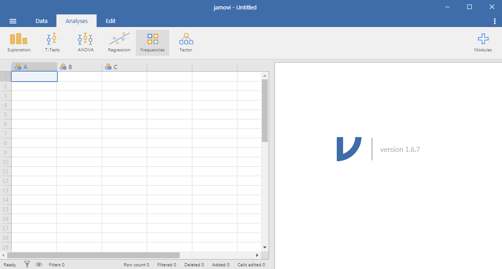
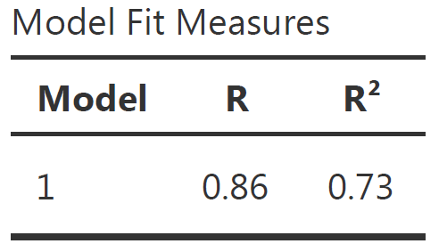
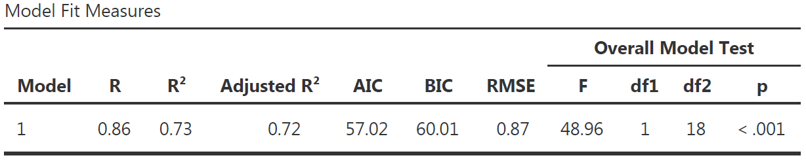
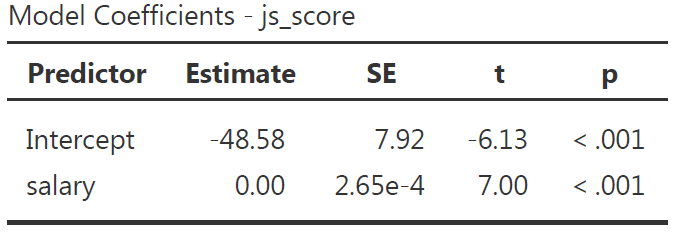
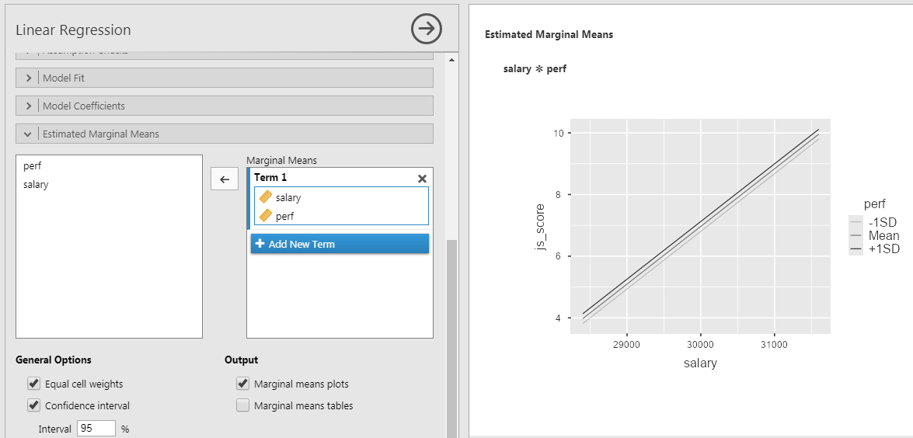

```{r setup, include = FALSE}
# libraries --------------------------------------------------------------------
library(anicon)
library(countdown)
library(fontawesome)
library(ggrepel)
library(knitr)
library(papaja)
library(patchwork)
library(tidyverse)

# general options --------------------------------------------------------------
options(scipen = 999)
set.seed(123)

# chunk options ----------------------------------------------------------------
opts_chunk$set(
  cache.extra = rand_seed, 
  message = FALSE, 
  warning = FALSE, 
  error = FALSE, 
  echo = FALSE,
  cache = FALSE,
  comment = "", 
  fig.align = "center", 
  fig.retina = 3
  )

# data -------------------------------------------------------------------------
organisation_beta <- readr::read_csv(here::here("data/organisation_beta.csv"))  

  # tibble::tibble(
  #   gender = sample(c("male", "female"), 20, replace = TRUE),
  #   location = sample(c("Ireland", "France", "Australia"), 20, replace = TRUE),
  #   perf = rnorm(20, mean = 4, sd = 2),
  #   salary = rnorm(20, mean = 30000, sd = 1000),
  #   js_score = -55 + 0.002 * salary + rnorm(20, mean = 2, sd = 1)
  # ) |>
  # tibble::rownames_to_column("employee") |>
  # dplyr::mutate(
  #   js_score = case_when(
  #     js_score > 10 ~ 10,
  #     js_score < 0 ~ 0,
  #     TRUE ~ js_score
  #   ),
  #   perf = case_when(
  #     perf > 10 ~ 10,
  #     perf < 0 ~ 0,
  #     TRUE ~ perf
  #   ),
  #   salary_c = case_when(
  #     salary >= mean(salary) ~ "high",
  #     salary < mean(salary) ~ "low"
  #   ),
  #   perf_c = case_when(
  #     perf >= mean(perf) + sd(perf) ~ "high",
  #     perf < mean(perf) + sd(perf) & perf >= mean(perf) - sd(perf) ~ "medium",
  #     perf < mean(perf) - sd(perf) ~ "low"
  #   ),
  # ) |>
  # readr::write_csv(here::here("data/organisation_beta.csv"))
  
# analyses ---------------------------------------------------------------------
lm_1 <- lm(js_score ~ salary, data = organisation_beta) |> apa_print()
lm_2 <- lm(js_score ~ salary*perf, data = organisation_beta) |> apa_print()

```

# Results Section in Academic Papers

The results section is always structured in the same way:

#### 1. Descriptive Statistics

> Short description of every variable involved in the hypotheses (predictors and outcome).

> Made of numeric summaries (Mean and Standard Deviation values), distribution figures, and a correlation matrix.

#### 2. Inferential Statistics

> Indicating the relevance of the model in a conventional style.

> Communicating the test of each hypothesis in a conventional style.

**The results have to indicate for every hypothesis if the null hypothesis is rejected (and the alternative hypothesis considered as plausible) or not rejected.**

---

class: inverse, mline, center, middle

# 1. Regressions for Hypothesis Testing

---

# Vocabulary

"Linear Model", "Linear Regression", "Multiple Regression" or simply "Regression" are all referring to the same model: **The General Linear Model**.

It contains:

- Only one Outcome/Dependent Variable
- One or more Predictor/Independent Variables of any type (categorical or continuous)
- Made of Main and/or Interaction Effects

$$Y = b_{0} + b_{1}\,Predictor\,1 + b_{2}\,Predictor\,2+ ... + b_{n}\,Predictor\,n + e$$

A Linear Regression is used **to test all the hypotheses at once** and to calculate the predictors' estimate.

Specific tests are available for certain type of hypothesis such as T-test or ANOVA but as they are special cases of Linear Regressions, their importance is limited (see [Jonas Kristoffer Lindeløv's blog post: Common statistical tests are linear models](https://lindeloev.github.io/tests-as-linear/)).

---

# General Linear Model Everywhere

.pull-left[
Most of the common statistical models (t-test, correlation, ANOVA; chi-square, etc.) are **special cases of linear models**.

This beautiful simplicity means that there is less to learn. In particular, it all comes down to $y = ax + b$ which most students know from secondary school. 

Unfortunately, **stats intro courses are usually taught as if each test is an independent tool**, needlessly making life more complicated for students and teachers alike.

Here, only **one test is taught to rule them all**: the General Linear Model (GLM).
]

.pull-right[
```{r out.width = "100%"}
include_graphics("https://psyteachr.github.io/msc-data-skills/images/memes/glm_meme.png")
```
]

---

# Applied Example

### Imagine the following case study...

> The CEO of Organisation Beta has problems with the well-being of employees and wants to investigate the relationship between **Job Satisfaction (js_score)**, **salary** and **performance (perf)**.

--

### Therefore the CEO formulate 3 hypotheses:

- $H_{a1}$: $js\_score$ increases when $salary$ increases 
- $H_{a2}$: $js\_score$ increases when $perf$ increases
- $H_{a3}$: The effect of $salary$ on $js\_score$ increases when $perf$ increases

--

### The corresponding model is:

$$js\_score = b_{0} + b_{1}\,salary + b_{2}\,perf + b_{3}\,salary*perf +  e$$

---

# Where the Regression Line comes from?

Draw all the possible lines on the frame. The best line, also called best fit, is the one which has the lowest amount or error. 

.pull-left[
```{r fig.width=5, fig.height=5}
  tibble(
    salary = rnorm(200, mean = 5, sd = 5),
    js_score = -1 + 0.02 * salary + rnorm(200, mean = 2, sd = 0.1),
    b0 = rnorm(200, 0, 1),
    b1 = rnorm(200, 0.02, 0.1)
  ) |> 
  ggplot(aes(salary, js_score)) + 
  geom_abline(aes(intercept = b0, slope = b1), alpha = 1/4) +
  geom_point() +
  theme(
    axis.text.x = element_blank(), 
    axis.text.y = element_blank(),
    text = element_text(size = 20)
  )
```
]
.pull-right[
There are 200 models on this plot, but a lot are really bad! We need to find the good models by making precise our intuition that a good model is "close" to the data. 

Therefore, we need a way to quantify the distance between the data and a model. Then we can fit the model by finding the value of $b_0$ and $b_1$ that generate the model with the smallest distance from this data.
]

---

# Best Model, Lowest Error

For each point this specific prediction error is called **Residual** $e_i$ where $i$ is a specific observation (e.g., employee here).

The error of the model is the sum of the prediction error for each point (distance between actual value and predicted value).

.pull-left[
```{r fig.width=5, fig.height=5}
linear_model_1 <- lm(js_score ~ salary, organisation_beta)

organisation_beta$predicted <- predict(linear_model_1)   # Save the predicted values
organisation_beta$residuals <- residuals(linear_model_1) # Save the residual values

plot_error <- organisation_beta |> 
  ggplot(aes(salary, js_score, label = residuals)) +
  geom_segment(aes(xend = salary, yend = predicted), color = "red") +
  geom_point() +
  geom_smooth(method = "lm", se = FALSE) +
  theme_bw() +
  theme(text = element_text(size = 20))

plotly::ggplotly(plot_error)
```
]
.pull-right[

The line which obtains the lowest error, has the smallest residuals. This line is chosen by the linear regression.

One common way to do this in statistics to use the "Mean-Square Error" (aka $MSE$) or the "Root-Mean-Square Error" (aka $RMSE$). We compute the difference between actual and predicted values, square them, sum them and divide them by $n$ observations (and the take the square root of them for the $RMSE$). 

]

---

# The (Root-)Mean-Square Error

```{r fig.width=12, fig.height=5}
plot_residual <- organisation_beta |> 
  ggplot(aes(salary, js_score)) +
  geom_segment(aes(xend = salary, yend = predicted), colour = "red") +
  geom_point() +
  geom_smooth(method = "lm", se = FALSE) +
  scale_y_continuous(limits = c(0, 10)) +
  theme_bw() +
  theme(text = element_text(size = 20))

distance_residual <- organisation_beta |> 
  ggplot(aes(salary, residuals, label = round(residuals, 2))) +
  geom_hline(aes(yintercept = 0), linetype = "dashed") +
  geom_col(colour = "red", fill = "red") +
  geom_text(
    aes(y = residuals, vjust = ifelse(residuals >= 0, 0, 1)),
    position = position_dodge(width = 0.9),
    size = 5
  ) +
  scale_y_continuous(limits = c(-2.5, 2.5)) +
  theme_bw() +
  theme(text = element_text(size = 20))

plot_residual / distance_residual
```

$$MSE = \frac{\sum_{i=1}^{N}(y\,predicted_{i} - y\,actual_{i})^{2}}{N}\;RMSE = \sqrt{\frac{\sum_{i=1}^{N}(y\,predicted_{i} - y\,actual_{i})^{2}}{N}}$$

These calculations has lots of appealing mathematical properties, which we are not going to talk about here. You will just have to take my word for it!

---

# Analysis of the Estimate

Once the best line is found, each estimate of the tested equation is calculated by a software (i.e., $b_0, b_1, ..., b_n$).

- $b_0$ is the intercept and has no interest for hypothesis testing
- $b_1, ..., b_n$ are predictors' effect estimate and each of them is used to test an hypothesis

The predictors' effect estimate $b_1, ..., b_n$ are **the value of the slope of the best line between each predictor** and the outcome. 

It indicates **how many units of the outcome variable increases/decreases/changes when the predictor increases by 1 unit**

Technically, $b$ is a weight or multiplier applied to the Predictor's values to obtain the Outcome's expected values

---

# Analysis of the Estimate

- If $b_1, ..., b_n = 0$, then:
  - The regression line is horizontal (no slope)
  - When the Predictor increases by 1 unit, the Outcome variable does not change
  - **The null alternative hypothesis is not rejected**

--

- If $b_1, ..., b_n > 0$, then:
  - The regression line is positive (slope up)
  - When the Predictor increases by 1 unit, the Outcome variable increases by $b$
  - **The null hypothesis is rejected and the alternative hypothesis considered as plausible**

--

- If $b_1, ..., b_n < 0$, then:
  - The regression line is negative (slope down)
  - When the Predictor increases by 1 unit, the Outcome variable decreases by $b$
  - **The null hypothesis is rejected and the alternative hypothesis considered as plausible**

---

# Significance of Effect's Estimate

The statistical significance of an effect estimate depends on the **strength of the relationship** and on the **sample size**:

- An estimate of $b_1 = 0.02$ can be very small but still significantly different from $b_1 = 0$
- Whereas an estimate of $b_1 = 0.35$ can be stronger but in fact not significantly different from $b_1 = 0$

--

The significance is the probability to obtain your results with your sample in the null hypothesis scenario:

- Also called $p$-value
- Is between 0% and 100% which corresponds to a value between 0.0 and 1.0

**If the $p$-value is lower to 5% or 0.05, then the probability to obtain your results in the null hypothesis scenario is low enough to say that the null hypothesis scenario is rejected and there must be a link between the variables.**

--

Remember that the $p$-value is the probability of the data given the null hypothesis: $P(data|H_0)$.

---

# Estimating Regression's Coefficients

As previously indicated, you will not have to calculate all the possible lines in your data to find the best fit, a software will do it for you:

- JAMOVI, JASP or SPSS have a Graphic User Interface
- R, Python or Julia are language based and have no interface

```{r out.width = "60%"}
include_graphics("img/lm_example.png")
```

---

# Estimating Regression's Coefficients

The output of any software is two tables:
- Model Fit Measure Table
- Model Coefficients Table

The **Model Fit Measure** table tests the prediction **accuracy of your overall model** (all predictors taken into account).

The **Model Coefficients** table provide an estimate to each predictor $b_1, ..., b_n$ (as well as the intercept $b_0$). the value of the estimate is statistically tested with a $p$-value to see if it is statistically different from 0 (null hypothesis). Therefore, this table is **used to test each hypotheses** separately.

---

# JAMOVI: Stats. Open. Now.

Jamovi is a statistical spreadsheet software designed to be **easy to use**. Jamovi is a compelling alternative to costly statistical products such as SPSS, SAS and JMP to cite a few.

Jamovi will always be **free and open** because Jamovi is made by the scientific community, for the scientific community.

- It can be **downloaded from its website** https://www.jamovi.org/
- It can also be **used without installation**, in a web browser, https://cloud.jamovi.org/ for **online demo** but this demo undergoes periods of downtime, and may cease functioning (without warning) at any time.

`r faa("exclamation-triangle", animate="flash", speed="slow", color="red")` Book "Learning Statistics with JAMOVI" free here: https://www.learnstatswithjamovi.com/

```{r out.width = "100%"}
include_graphics("https://www.jamovi.org/assets/header-logo.svg")
```

---

# JAMOVI GUI

```{r out.width = "100%"}

```

---

# Anatomy of JAMOVI

### 1. Different symbols for **variable types**

```{r out.width = "15%"}
include_graphics("img/jamovi_icons.png")
```

### 2. Distinction between **Factors** and **Covariates**:
  - A Factor is a predictor of type categorical (nominal or ordinal)
  - A Covariate is a predictor of type continuous
  
`r faa("exclamation-triangle", animate="flash", speed="slow", color="red")` Expected variable type is displayed in bottom right corner of boxes

### 3. Customise your analysis by **unfolding optional boxes**

### 4. Two linear regression **tables by default**:
  - Model Fit Measures
  - Model Coefficients

---
class: inverse, mline, left, middle

# 2. Hypothesis with Continuous Predictor

---

# Main Effect Example

.pull-left[
### Variables:
- Outcome = $js\_score$ (from 0 to 10)
- Predictor = $salary$ (from 0 to Inf.)

### Hypothesis:

- $H_a$: $js\_score$ increases when $salary$ increases (i.e., $b_1>0$)
- $H_0$: $js\_score$ stay the same when $salary$ increases (i.e., $b_1=0$)

### Equation:

$$js\_score = b_{0} + b_{1}\,salary + e$$
]

.pull-right[
```{r}
organisation_beta |> 
  dplyr::select(employee, salary, js_score) |> 
  kable(format = "html")
```
]

---

# Main Effect Example

.pull-left[
```{r fig.height=10}
organisation_beta |> 
  ggplot(aes(x = salary, y = js_score, label = employee)) +
  geom_point(color = "red", size = 5) +
  geom_text_repel(point.padding = 0.5, size = 14) +
  scale_y_continuous(limits = c(0, 10)) +
  theme_bw() +
  theme(text = element_text(size = 20))
```
]
.pull-right[
```{r fig.height=10}
organisation_beta |> 
  ggplot(aes(x = salary, y = js_score, label = employee)) +
  geom_point(color = "black", size = 5) +
  geom_smooth(method = "lm", formula = "y ~ x", size = 2, fullrange = TRUE, se = FALSE) +
  geom_hline(yintercept = mean(organisation_beta$js_score), color = "red", size = 2) +
  scale_y_continuous(limits = c(0, 10)) +
  theme_bw() +
  theme(text = element_text(size = 20)) +
  annotate(
    "text", 
    x = 29000, 
    y = 7.5, 
    label = "H[0]:b[1] == 0", 
    color = "red", 
    size = 6,
    parse = TRUE
  ) +
  annotate(
    "text", 
    x = 30500, 
    y = 10, 
    label = "H[1]:b[1] > 0", 
    color = "blue", 
    size = 6,
    parse = TRUE
  )
```
]

---

# Main Effect Example

### In JAMOVI

1. Open your file
2. Set variables as **continuous**
3. **Analyses** > **Regression** > **Linear Regression**
4. Set $js\_score$ as DV (i.e., Outcome) and $salary$ as Covariates (i.e., Continuous Predictor)

```{r out.width = "100%"}
include_graphics("img/jamovi_lm_main.png")
```

---
class: title-slide, middle

## Live Demo

---
class: title-slide, middle

## Reporting the **Model Fit Measure Table**
  
---

# Model Fit Measure Table

The **Model Fit Measure** table tests the prediction **accuracy of your overall model** (all predictors taken into account).

$Model_{a}: js\_score = b_{0} + b_{1}\;salary + e\;vs.\; Model_{0}: js\_score = b_{0} + e$

```{r out.width = "25%"}

```

--

Default Columns:

- The **Model** column indicate the reference of the model in case you want to compare multiple models
- $R$ is the correlation between the outcome variable and all predictors taken into account (i.e., the closer to 1 or -1 the better, however in social science models with more that 0.2 or less than -0.2 are already excellent)
- $R^2$ is the % of variance from the outcome explained by the model (e.g., $R^2 = 0.73$ means the model explains 73% of the variance of the outcome variable). $R^2$ is also called **Coefficient of Determination**

---

# More Model Fit Measures

```{r}

```

--

- $Adjusted\,R^2$ is a more conservative version of $R^2$, usually not reported
- $AIC$, $BIC$ and $RMSE$ are useful to compare multiple models, the lower the better
- **Overall Model F Test** is the statistical test to show that your model have significantly better predictions than a model without any predictor.
  - $F$ is the value of the statistical test comparing the results obtained with this sample using the full model with the results obtained with this sample using a model only with the intercept (i.e., $H_0$)
  - $df1$ is the degree of freedom "between group", its value corresponds to the amount of predictor in your model: $df1 = K$ (this is the easy explanation, see more details page 398 of "Learning Statistics with JAMOVI")
  - $df2$ is the degree of freedom "within group", its value corresponds to the amount of observation minus number of parameters minus 1: $df2 = N - K - 1$.
  - $p$ is the p-value, i.e the probability to obtain our prediction with our sample in the null hypothesis scenario (i.e., $p = P(data|H_0)$)

---

# Communicate Model Fit Measures

To communicate results about a model, APA style is a good guide. **Report the following values** using the Model Fit Measure table with all options:

$$R^2 = value_{R^2}, F(value_{df1},value_{df2}) = value_{F}, p = value_{p}$$

--

Model Fit Measure table with all options from our example and corresponding sentence to include in the result section:

```{r}

```

> The predictions from the alternative model (i.e., with our predictors) are significantly better than the predictions from a null model ( `r lm_1$full_result$modelfit$r2`).

--

Note about p-values:

- If the value in the table is $< 0.001$, then write $p < 0.001$ in the text
- Else write $p = value_p$ (e.g., $p = 0.58$ ) but never $p =< 0.001$

---
class: title-slide, middle

## Reporting the **Model Coefficients Table**

---

# Model Coefficients Table

The **Model Coefficients** table provide an estimate to each predictor $b_1, ..., b_n$ (as well as the intercept $b_0$). the value of the estimate is statistically tested with a $p$-value to see if it is statistically different from 0 (null hypothesis).

```{r}

```

--

Default Columns:

- **Predictor** is the list of variables associated to parameters in your model (main and interaction) which includes the intercept
- **Estimate** is the non-standardized relationship estimate of the best prediction line (expressed in the unit of the variable)
- **SE** is the Standard Error and indicate how spread are the values around the estimate
- $t$ is the value of the statistical test comparing the estimate obtained with this sample with an estimate of 0 (i.e., $H_0$)
- $p$ is the p-value, i.e the probability to obtain our prediction with our sample in the null hypothesis scenario 

---

# More Model Coefficients

```{r}
include_graphics("img/jamovi_mc_full.png")
```

--

- **Omnibus ANOVA Test** is an alternative way to test model's coefficient but **use only for a categorical predictor with more than 2 modalities**
- **Estimate Confidence Interval** defines the limits of the range where Estimate are still possible to be in given the sample size
- **Standardize Estimate** indicates the strength and direction of the relationship in term of correlation

--

Note that in our example, because there is only one predictor:

1. The Standardize Estimate is the correlation
2. The F-test in the Model Fit Measure table is the same as the F-test in the Omnibus ANOVA Test
3. The p-value in the Model Fit Measure table is the same as the one in the Omnibus ANOVA Test and in the Model Coefficient table

---

# Communicate Model Coefficients

**Report the following values** using the Model Coefficients table with all options:

$$b = value_b, 95\% CI [value_{lower\,CI}, value_{upper\,CI}], t(df_2) = value_t, p = value_{p}$$

--

Model Coefficients table with all options from our example and corresponding sentence to include in the result section:

```{r}
include_graphics("img/jamovi_mc_full.png")
```

> The effect of $salary$ on $js\_score$ is statistically significant, therefore $H_0$ can be rejected (** `r lm_1$full_result$salary`**).

---

# $p$-hacking in Correlation Tables

The use of correlation tables is widespread in the literature, and they are a great tool for descriptive analysis but **do not test your hypotheses with correlation tables**. A good practice is to remove all $p$-values or $p$-stars from them.

$p$-values should only be produced to test an hypothesis that has been already formulated, any other is use is called $p$**-hacking**.

```{r out.width = "40%"}
include_graphics("https://media.makeameme.org/created/what-is-something-5ea39c449c.jpg")
```

---

# Interaction Effect Example

### Variables
- Outcome = $js\_score$ (from 0 to 10)
- Predictor 1 = $salary$ (from 0 to Inf.)
- Predictor 2 = $perf$ (from 0 to 10)

### Hypotheses

--

- $H_{a_{1}}$: $js\_score$ increases when $salary$ increases (i.e., $b_1>0$) 
  - $H_{0_{1}}$: $js\_score$ stay the same when $salary$ increases (i.e., $b_1=0$)

--

- $H_{a_{2}}$: $js\_score$ increases when $perf$ increases (i.e., $b_2>0$) 
  - $H_{0_{2}}$: $js\_score$ stay the same when $perf$ increases (i.e., $b_2=0$)
  
--

- $H_{a_{3}}$: The effect of $salary$ on $js\_score$ increases when $perf$ increases (i.e., $b_3>0$) 
  - $H_{0_{3}}$: The effect of $salary$ on $js\_score$ is the same when $perf$ increases (i.e., $b_3=0$)

---

# Interaction Effect Example

### Equation

$$js\_score = b_{0} + b_{1}\,salary + b_{2}\,perf + b_{3}\,salary*perf + e$$

Note: The test of the interaction $b_{3}\,salary*perf$ corresponds to the test of a new variable for which values of $salary$ and values of $perf$ are multiplied

```{r out.width = "40%"}
include_graphics("img/meme_interaction_1.jpg")
```

---

# Interaction Effect Example

### In JAMOVI

1. Open your file
2. Set variables as **continuous**
3. **Analyses** > **Regression** > **Linear Regression**
4. Set $js\_score$ as DV and $salary$ as well as $perf$ as Covariates
4. In **Model Builder** option: 
  - Select both $salary$ and $perf$ to bring them in the covariates at once and to obtain a third term called $salary*perf$

```{r}
include_graphics("img/jamovi_lm_int.png")
```

---

# Communicate Results

### Overall model:

> The prediction provided by the model with all predictors is significantly better than a model without predictors ( `r lm_2$full_result$modelfit$r2`).

### Salary Hypothesis:

> The effect of $salary$ on $js\_score$ is statistically significant, therefore $H_{0_{1}}$ can be rejected ( `r lm_2$full_result$salary`).

### Perf Hypothesis:

> The effect of $perf$ on $js\_score$ is not statistically significant, therefore $H_{0_{2}}$ can't be rejected ( `r lm_2$full_result$perf`).

### Interaction Hypothesis:

> The interaction effect is not statistically significant, therefore $H_{0_{3}}$ can't be rejected ( `r lm_2$full_result$salary_perf`).

---

# Representing Interaction Effects

### To create a figure automatically in JAMOVI

- Go to Estimated Marginal Means
- Tick Marginal Means plot
- Select both predictor and bring them in Marginal Mean box at once

```{r out.width = "70%"}

```

To plot the interaction between 2 continuous predictors, one of them has to be **transform into categorical ordinal variable** of 3 groups: **+1SD**, **Mean**, **-1SD**.

---

# Representing Interaction Effects

In this case:
- **+1SD** is the group of **high perf** (observations higher than avg. + 1SD)
- **Mean** is the group of **average perf** (observations between avg. + 1SD and avg. - 1SD)
- **-1SD**  is the group of **low perf** (observations lower than avg. - 1SD)

Warning: When representing the results of the linear regression **don't use the QQ-plot instead**

Note: $salary*perf$ is a **two-way interaction** but interactions can three-, four-, n-way such as $salary*perf*gender$ or $salary*perf*gender*age$. However the more complex the interaction, the more difficult to interpret its effect.

---
class: title-slide, middle

## Exercise

Open the file `organisation_beta.csv` in JAMOVI and  ...

1. Reproduce the results obtained by testing the following models:
  - $js\_score = b_{0} + b_{1}\,salary + e$
  - $js\_score = b_{0} + b_{1}\,salary + b_{2}\,perf + b_{3}\,salary*perf + e$
2. Test the following model:
$$js\_score = b_{0} + b_{1}\,gender + b_{2}\,perf + b_{3}\,gender*perf + e$$

```{r}
countdown(minutes = 10, warn_when = 60)
```

---
class: inverse, mline, left, middle


# Thanks for your attention and don't hesitate to ask if you have any questions!

[`r fa(name = "twitter")` @damien_dupre](http://twitter.com/damien_dupre)  
[`r fa(name = "github")` @damien-dupre](http://github.com/damien-dupre)  
[`r fa(name = "link")` damien-datasci-blog.netlify.app](https://damien-datasci-blog.netlify.app)  
[`r fa(name = "paper-plane")` damien.dupre@dcu.ie](mailto:damien.dupre@dcu.ie)
