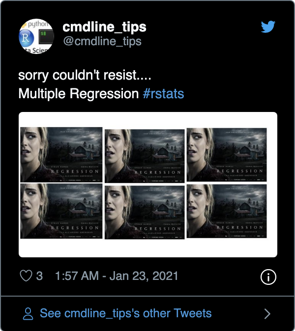

```{r setup, include = FALSE}
# general options --------------------------------------------------------------
options(
  scipen = 999,
  htmltools.preserve.raw = FALSE
  )
set.seed(123)
# chunk options ----------------------------------------------------------------
knitr::opts_chunk$set(
  cache.extra = knitr::rand_seed, 
  message = FALSE, 
  warning = FALSE, 
  error = FALSE, 
  echo = FALSE,
  cache = FALSE,
  comment = "", 
  fig.align = "center", 
  fig.retina = 3
  )
# libraries --------------------------------------------------------------------
library(tidyverse)
library(fontawesome)
library(DiagrammeR)
library(patchwork)
library(ggrepel)
library(papaja)
library(knitr)
library(kableExtra)
library(countdown)

# data -------------------------------------------------------------------------
dnd <- readr::read_csv(here::here("data/dnd.csv"))  

  # tibble::tibble(
  #   gender = sample(c("male", "female"), 20, replace = TRUE),
  #   location = sample(c("Ireland", "France", "Australia"), 20, replace = TRUE),
  #   perf = rnorm(20, mean = 4, sd = 2),
  #   salary = rnorm(20, mean = 30000, sd = 1000),
  #   js_score = -55 + 0.002 * salary + rnorm(20, mean = 2, sd = 1)
  # ) %>%
  # tibble::rownames_to_column("employee") %>%
  # dplyr::mutate(
  #   js_score = case_when(
  #     js_score > 10 ~ 10,
  #     js_score < 0 ~ 0,
  #     TRUE ~ js_score
  #   ),
  #   perf = case_when(
  #     perf > 10 ~ 10,
  #     perf < 0 ~ 0,
  #     TRUE ~ perf
  #   ),
  #   salary_c = case_when(
  #     salary >= mean(salary) ~ "high",
  #     salary < mean(salary) ~ "low"
  #   ),
  #   perf_c = case_when(
  #     perf >= mean(perf) + sd(perf) ~ "high",
  #     perf < mean(perf) + sd(perf) & perf >= mean(perf) - sd(perf) ~ "medium",
  #     perf < mean(perf) - sd(perf) ~ "low"
  #   ),
  # ) %>%
  # readr::write_csv(here::here("data/dnd.csv"))

# analyses ---------------------------------------------------------------------
m_js_high <- mean(dnd$js_score[dnd$salary_c == "high"])
m_js_low <- mean(dnd$js_score[dnd$salary_c == "low"])
lm_1 <- lm(js_score ~ salary, data = dnd) %>% apa_print
lm_2 <- lm(js_score ~ salary*perf, data = dnd) %>% apa_print
lm_c <- lm(js_score ~ salary_c, data = dnd) %>% apa_print
lm_c2 <- dnd %>% 
  dplyr::mutate(salary_c = factor(salary_c, level = c("low", "high"))) %>% 
  lm(js_score ~ salary_c, data = .) %>% apa_print
lm_c3 <- lm(js_score ~ location, data = dnd) %>% aov %>% apa_print

```

# Previously in MT611 ...

.pull-left[
We have seen:

- How to perform linear regressions and multiple linear regressions analyses with Jamovi
- How to analyse main and interaction effects with Jamovi
- What are the main conditions to apply a linear regression model and how to test them
]

.pull-right[
```{r out.width='80%'}

```

]

Let's see them again quickly with the "dnd.csv" file!

---
class: title-slide, middle

## Live Demo

---

# Today in MT611

We will have a deep dive in the processing of Categorical predictor variables with linear regressions:

- How to analyse a Categorical predictor with only 2 categories?
- How to analyse a Categorical predictor with more than 2 categories?
- What are contrasts and how to manipulate them?

```{r out.width = "50%"}
knitr::include_graphics("https://memegenerator.net/img/instances/82194202/what-if-we-enter-a-categorical-variable-in-a-regression-model.jpg")
```

---

class: inverse, mline, center, middle

# 1. Hypotheses with Categorical Predictors having 2 Categories

---

# Example of Categorical Coding

.pull-left[
Imagine we decide to sample 3 males and 3 females from the classroom and we want to see if the difference between their math exams averages is due **to sampling luck or is reflecting a real difference in the population**.

That is, **is the difference between male and female student statistically significant?**
]

.pull-right[
```{r}
df2 <- 
  data.frame(
    participant = c("ppt1", "ppt2", "ppt3", "ppt4", "ppt5", "ppt6"), 
    gender = c("Female", "Male", "Male", "Female", "Male", "Female"),
    exam_mark = c(89, 64, 72, 77, 78, 69)
  ) %>% 
  dplyr::mutate(
    gender_c = case_when(gender == "Female" ~ 1, gender == "Male" ~ 2)
  )

df2 %>% 
  dplyr::select(-gender_c) %>% 
  knitr::kable(format = "html")
```
]

---

# Example of Categorical Coding

.pull-left[

.center[When using a Categorical variable having 2 category, **e.g., comparing female vs. male** ...]

```{r fig.height=5}
df2 %>% 
  ggplot(aes(x = gender, y = exam_mark)) +
  geom_point(color = "black", size = 5) +
  stat_summary(fun = "mean", colour = "blue", size = 6, geom = "point") +
  theme_bw() +
  theme(
    text = element_text(size = 20)
  )
```
]

.pull-right[

.center[... is the same as **comparing female coded 1 and male coded 2**]

```{r fig.height=5}
df2 %>% 
  ggplot(aes(x = gender_c, y = exam_mark)) +
  geom_point(color = "black", size = 5) +
  stat_summary(fun = "mean", colour = "blue", size = 6, geom = "point") +
  scale_x_continuous(breaks = c(1, 2), limits = c(0.5, 2.5)) +
  theme_bw() +
  theme(
    text = element_text(size = 20)
  )
```
]

---

# Categorical Coding in Linear Regression

For Categorical variables having 2 categories, **by default the Linear Regression recodes with the alphabetical order** (Female first then Male).

However you can manually choose to recode the variable yourself by creating a new variable, such as...

.pull-left[

In JAMOVI, recode variable gender as 2 if is "female" else as 1

`IF(gender == "female", 2, 1)`
]

.pull-right[

In JAMOVI, recode variable gender as 1 if is "female" else as 3

`IF(gender == "female", 1, 3)`
]

.center[**What happens with these different codings? How different the results are?**]

--

.pull-left[
If the order of codes is reversed:

- Sign of the effect estimate $\beta$ changes but not its size
- Test of the intercept is different (value of Y when X = 0 changes)
]

.pull-right[
If the distance between codes increases:

- Size of the effect estimate $\beta$ changes but not its sign
- Test of the intercept is different (value of Y when X = 0 changes)
]

---

# Categorical Coding in Linear Regression

.pull-left[

.center[Female = 1 and Male = 2]

```{r fig.height=4}
df2 %>% 
  ggplot(aes(x = gender_c, y = exam_mark)) +
  geom_point(color = "black", size = 5) +
  stat_summary(fun = "mean", colour = "blue", size = 6, geom = "point") +
  scale_x_continuous(breaks = c(1, 2), limits = c(0.5, 2.5)) +
  theme_bw() +
  theme(
    text = element_text(size = 20)
  )
```

```{r results='asis'}
df2 %>% 
  lm(data = ., formula = exam_mark ~ gender_c) %>% 
  broom::tidy() %>% 
  dplyr::mutate(p.value = format.pval(round(p.value, 3), eps = 0.001)) %>% 
  knitr::kable(digits = 2) %>%
  kable_styling(font_size = 16)
```
]

.pull-right[

.center[Female = 2 and Male = 1]

```{r fig.height=4}
df2  %>% 
  dplyr::mutate(gender_c = case_when(
    gender == "Female" ~ 2,
    gender == "Male" ~ 1
  )) %>% 
  ggplot(aes(x = gender_c, y = exam_mark)) +
  geom_point(color = "black", size = 5) +
  stat_summary(fun = "mean", colour = "blue", size = 6, geom = "point") +
  scale_x_continuous(breaks = c(1, 2), limits = c(0.5, 2.5)) +
  theme_bw() +
  theme(
    text = element_text(size = 20)
  )
```

```{r results='asis'}
df2 %>% 
  dplyr::mutate(gender_c = case_when(
    gender == "Female" ~ 2,
    gender == "Male" ~ 1
  )) %>% 
  lm(data = ., formula = exam_mark ~ gender_c) %>% 
  broom::tidy() %>% 
  dplyr::mutate(p.value = format.pval(round(p.value, 3), eps = 0.001)) %>% 
  knitr::kable(digits = 2) %>%
  kable_styling(font_size = 16)
```
]

---

# Categorical Coding in Linear Regression

.pull-left[

.center[Female = 1 and Male = 2]

```{r fig.height=4}
df2 %>% 
  ggplot(aes(x = gender_c, y = exam_mark)) +
  geom_point(color = "black", size = 5) +
  stat_summary(fun = "mean", colour = "blue", size = 6, geom = "point") +
  scale_x_continuous(breaks = c(1, 2), limits = c(0.5, 2.5)) +
  theme_bw() +
  theme(
    text = element_text(size = 20)
  )
```

```{r results='asis'}
df2 %>% 
  lm(data = ., formula = exam_mark ~ gender_c) %>% 
  broom::tidy() %>% 
  dplyr::mutate(p.value = format.pval(round(p.value, 3), eps = 0.001)) %>% 
  knitr::kable(digits = 2) %>%
  kable_styling(font_size = 16)
```
]

.pull-right[

.center[Female = 1 and Male = 3]

```{r fig.height=4}
df2  %>% 
  dplyr::mutate(gender_c = case_when(
    gender == "Female" ~ 1,
    gender == "Male" ~ 3
  )) %>% 
  ggplot(aes(x = gender_c, y = exam_mark)) +
  geom_point(color = "black", size = 5) +
  stat_summary(fun = "mean", colour = "blue", size = 6, geom = "point") +
  scale_x_continuous(breaks = c(1, 3), limits = c(0.5, 3.5)) +
  theme_bw() +
  theme(
    text = element_text(size = 20)
  )
```

```{r results='asis'}
df2 %>% 
  dplyr::mutate(gender_c = case_when(
    gender == "Female" ~ 1,
    gender == "Male" ~ 3
  )) %>% 
  lm(data = ., formula = exam_mark ~ gender_c) %>% 
  broom::tidy() %>% 
  dplyr::mutate(p.value = format.pval(round(p.value, 3), eps = 0.001)) %>% 
  knitr::kable(digits = 2) %>%
  kable_styling(font_size = 16)
```
]

---

# Categorical Predictor with 2 Categories

Let's use another example with the `dnd` dataset!

### Variable transformation

Instead of using $salary$ as a **continuous variable**, let's convert it as $salary\_c$ which is a **categorical variable**:
- Everything higher than or equal to salary average is labelled "**high**" salary
- Everything lower than salary average is labelled "**low**" salary

### Hypothesis

The average $js\_score$ of employer having a **high** $salary\_c$ is higher than for those having a **low** $salary\_c$

### In mathematical terms

$$H_a: \mu(js\_score)_{high\,salary} \neq \mu(js\_score)_{low\,salary}$$
$$H_0: \mu(js\_score)_{high\,salary} = \mu(js\_score)_{low\,salary}$$

---
class: title-slide, middle

## Live Demo

---

# Categorical Predictor with 2 Categories

Why $t$-test and Linear Regression obtain the exact **same** results?

.pull-left[

Hypothesis Testing in $t$-test

- $H_a: \mu_{1} \neq \mu_{2}$
- $H_0: \mu_{1} = \mu_{2}$
]

.pull-right[

Hypothesis Testing in Linear Regression

- $H_a: \beta_{1} \neq 0$
- $H_0: \beta_{1} = 0$

]

If $\mu_{1} \neq \mu_{2}$ then the slope of the line between group averages is different than 0 ( $\beta_{1} \neq 0$ ).

If $\mu_{1} = \mu_{2}$ then the slope of the line between group averages is equal to 0 ( $\beta_{1} = 0$ ).

What you don't know is that the Linear Regression automatically recode all Categorical variables to Continuous variables.

---

# Categorical Predictor with 2 Categories

### The trick to remember

**Comparing the difference between two averages is the same as comparing the slope of the line crossing these two averages**

### Explanation

.pull-left[
- If two averages are **equal**, then the **slope of the line crossing these two averages is 0**
- If two averages are **not equal**, then **the slope of the line crossing these two averages is not 0**
]

.pull-right[
```{r fig.width=4, fig.height=4}
ggplot(dnd, aes(x = salary_c, y = js_score)) + 
  geom_jitter(width = 0.1) +
  geom_segment(x = 1, xend = 2, y = m_js_high, yend = m_js_low, lwd = 2, color = "red") +
  geom_hline(yintercept = (m_js_high + m_js_low)/2, linetype = "dashed") +
  stat_summary(fun = mean, geom = "errorbar", aes(ymax = ..y.., ymin = ..y..), lwd = 2, color = "blue") +
  theme(
    legend.position = "none",
    text = element_text(size = 20)
    ) +
  labs(caption = "high coded 1 and low coded 2 (default)")
```
]

---

# Categorical Predictor with 2 Categories

### Warning

JAMOVI and other software **automatically code categorical variable following alphabetical order** but sometimes you need your own system of coding to make. 

For example, here **low coded with the value 1** and **high coded with the value 2** would make more sense

```{r fig.width=4, fig.height=4}
dnd %>% 
  dplyr::mutate(salary_c = factor(salary_c, levels = c("low", "high"))) %>% 
  ggplot(aes(x = salary_c, y = js_score)) + 
  geom_jitter(width = 0.1) +
  geom_segment(x = 1, xend = 2, yend = m_js_high, y = m_js_low, lwd = 2, color = "red") +
  geom_hline(yintercept = (m_js_high + m_js_low)/2, linetype = "dashed") +
  stat_summary(fun = mean, geom = "errorbar", aes(ymax = ..y.., ymin = ..y..), lwd = 2, color = "blue") +
  theme(
    legend.position = "none",
    text = element_text(size = 20)
    )
```

---

# Categorical Predictor with 2 Categories

The way how categorical variables are coded will influence:
- The sign of the estimate (positive vs. negative)
- The value of the non-standardized estimate

But **it doesn't change the value of the statistical test** nor the $p$-value obtained

Note: This test is usually done using a $t$-test but will produce the same result as $t$-test is a special case of the General Linear Model

### To sum up

**To test the influence of a categorical predictor** variable either nominal or ordinal **having two categories** (e.g., high vs. low, male vs. female, France vs. Ireland), it is possible to **test if the $\beta$ associated to this predictor is significantly different than 0**.

### Equation

$$js\_score = \beta_{0} + \beta_{1} * salary\_c + \epsilon$$

---

# Testing Categorical Predictors

### In JAMOVI

1. Open your file
2. Set variables in their **correct type** (continuous, cat. nominal or cat. ordinal)
3. **Analyses > Regression > Linear Regression**
4. Set $js\_score$ as DV and $salary\_c$ as Factors

```{r out.width = "100%"}
knitr::include_graphics("img/jamovi_lm_main_c2.png")
```

---

# Testing Categorical Predictors

### Model

> The prediction provided by the model with all predictors is significantly better than a model without predictors (** `r lm_c$full_result$modelfit$r2`**).

### Hypothesis (high = 1 vs. low = 2, default)

> The effect of $salary\_c$ on $js\_score$ is statistically significant, therefore $H_{0}$ can be rejected (** `r lm_c$full_result$salary_c`**).

### Hypothesis (low = 1 vs. high = 2, recoded)

> The effect of $salary\_c$ on $js\_score$ is statistically significant, therefore $H_{0}$ can be rejected (** `r lm_c2$full_result$salary_c`**).

---

# Coding of Categorical Predictors

Choosing 1 and 2 are **just arbitrary numerical values** but any other possibility will produce the same $p$-value

However choosing codes separated by 1 is handy because it's easily interpretable, the **non-standardized estimate corresponds to the change from one category to another**:

> When "low" is coded 1 and "high" coded 2, the average $js\_score$ for "high" $salary\_c$ employes is `r round(m_js_high - m_js_low, 2)` higher than the average $js\_score$ for "low" $salary\_c$ employees

---

# Coding of Categorical Predictors

### Special case called **Dummy Coding** when a category is coded 0 and the other 1:
- Then the intercept, value of $js\_score$ when salary is 0 corresponds to the category coded 0
- The test of the intercept is the test of the average for the category coded 0 against an average of 0
- Is called simple effect

### Special case called **Deviation Coding** when a category is coded 1 and the other -1:
- Then the intercept, corresponds to the average between the two categories
- The test of the intercept is the test of the average for the variable
- However, the distance between 1 and -1 is 2 units so the estimate is not as easy to interpret, therefore it is possible to choose categories coded 0.5 vs. -0.5 instead

---

# Dummy Coding in Linear Regression

Dummy Coding is when a category is coded 0 and the other coded 1. For example:

```
# In JAMOVI, recode female as 0 and male as 1 (Dummy Coding)
IF(gender == "female", 0, 1)
```

Dummy Coding is useful because one of the category becomes the intercept and is tested against 0.

.pull-left[

```{r fig.height=4}
df2  %>% 
  dplyr::mutate(gender_c = case_when(
    gender == "Female" ~ 0,
    gender == "Male" ~ 1
  )) %>% 
  ggplot(aes(x = gender_c, y = exam_mark)) +
  geom_point(color = "black", size = 5) +
  stat_summary(fun = "mean", colour = "blue", size = 6, geom = "point") +
  scale_x_continuous(breaks = c(0, 1), limits = c(-0.5, 1.5)) +
  theme_bw() +
  theme(
    text = element_text(size = 20)
  )
```
]

.pull-right[

```{r results='asis'}
df2 %>% 
  dplyr::mutate(gender_c = case_when(
    gender == "Female" ~ 0,
    gender == "Male" ~ 1
  )) %>% 
  lm(data = ., formula = exam_mark ~ gender_c) %>% 
  broom::tidy() %>% 
  dplyr::mutate(p.value = format.pval(round(p.value, 3), eps = 0.001)) %>% 
  knitr::kable(digits = 2) %>%
  kable_styling(font_size = 16)
```
]

---

# Deviation Coding in Linear Regression

Deviation Coding is when the intercept is situated between the codes of the categories. For example:

```
# In JAMOVI, recode female as -1 and male as 1 (Deviation Coding)
IF(gender == "female", -1, 1)
```

Deviation Coding is useful because the average of the categories becomes the intercept and is tested against 0.

However, in the Deviation Coding using -1 vs. +1, the distance between the categories is 2 not 1. Therefore, even if the test of the slop is the exact same, the value of the slop (the estimate) is twice lower.

Consequently it is possible to use a Deviation Coding with -0.5 vs. +0.5 to keep the distance of 1 between the categories.

```
# In JAMOVI, recode female as -0.5 and male as 0.5 (Deviation Coding)
IF(gender == "female", -0.5, 0.5)
```

---

# Deviation Coding in Linear Regression

.pull-left[

.center[Female = -1 and Male = 1]

```{r fig.height=4}
df2 %>%
  dplyr::mutate(gender_c = case_when(
    gender == "Female" ~ -1,
    gender == "Male" ~ 1
  )) %>% 
  ggplot(aes(x = gender_c, y = exam_mark)) +
  geom_point(color = "black", size = 5) +
  stat_summary(fun = "mean", colour = "blue", size = 6, geom = "point") +
  scale_x_continuous(breaks = c(-1, 1), limits = c(-1.5, 1.5)) +
  theme_bw() +
  theme(
    text = element_text(size = 20)
  )
```

```{r results='asis'}
df2 %>% 
  dplyr::mutate(gender_c = case_when(
    gender == "Female" ~ -1,
    gender == "Male" ~ 1
  )) %>% 
  lm(data = ., formula = exam_mark ~ gender_c) %>% 
  broom::tidy() %>% 
  dplyr::mutate(p.value = format.pval(round(p.value, 3), eps = 0.001)) %>% 
  knitr::kable(digits = 2) %>%
  kable_styling(font_size = 16)
```
]

.pull-right[

.center[Female = -0.5 and Male = 0.5]

```{r fig.height=4}
df2  %>% 
  dplyr::mutate(gender_c = case_when(
    gender == "Female" ~ -0.5,
    gender == "Male" ~ 0.5
  )) %>% 
  ggplot(aes(x = gender_c, y = exam_mark)) +
  geom_point(color = "black", size = 5) +
  stat_summary(fun = "mean", colour = "blue", size = 6, geom = "point") +
  scale_x_continuous(breaks = c(-0.5, 0.5), limits = c(-1, 1)) +
  theme_bw() +
  theme(
    text = element_text(size = 20)
  )
```

```{r results='asis'}
df2 %>% 
  dplyr::mutate(gender_c = case_when(
    gender == "Female" ~ -0.5,
    gender == "Male" ~ 0.5
  )) %>% 
  lm(data = ., formula = exam_mark ~ gender_c) %>% 
  broom::tidy() %>% 
  dplyr::mutate(p.value = format.pval(round(p.value, 3), eps = 0.001)) %>% 
  knitr::kable(digits = 2) %>%
  kable_styling(font_size = 16)
```
]

---

# Interaction with Categorical Variables

### In JAMOVI

1. Open your file
2. Set variables according their type
3. **Analyses > Regression > Linear Regression**
4. Set $js\_score$ as DV and $salary\_c$ as well as $gender$ as Factors
4. In **Model Builder** option: select both $salary\_c$ and $gender$ to bring them in the Factors at once

### Model Tested

$$js\_score = \beta_{0} + \beta_{1}.salary\_c + \beta_{2}.gender + \beta_{3}.salary\_c*gender + \epsilon$$

Note: The test of the interaction effect corresponds to the test of a variable resulting from the multiplication between the codes of $salary\_c$ and the codes of $gender$.

---

# Interaction with Categorical Variables

```{r out.width = "100%"}
knitr::include_graphics("img/jamovi_lm_main_cint.png")
```

---
class: title-slide, middle

## Live Demo

---
class: title-slide, middle

## Exercise

With the "dnd.csv" data, test the following models and conclude on each effect:

Model 1: $js\_score = \beta_{0} + \beta_{1}.perf\_c + \beta_{2}.gender + \beta_{3}.perf\_c*gender + \epsilon$

Model 2: $js\_score = \beta_{0} + \beta_{1}.perf\_c + \beta_{2}.location + \beta_{3}.perf\_c*location+ \epsilon$

```{r}
countdown(minutes = 10, warn_when = 60)
```

---

class: inverse, mline, center, middle

# 2. Hypotheses with Categorical Predictor having 3+ Categories

---

# Categorical Predictor with 3+ Categories

### Problem with more than 2 groups

I would like to test the effect of the variable $location$ which has 3 categories: "Ireland", "France" and "Australia".

```{r}
knitr::include_graphics("img/jamovi_lm_main_c31.png")
```

There is not 1 result for $location$ but 2!
- Comparison of "France" vs. "Australia"
- Comparison of "Ireland" vs. "Australia"

### How can I test the effect of the full variable?

---

# Coding Predictors with 3+ categories

Y/Outcome/DV = $exam\_mark$(Continuous variable from 0 to 100)

X/Predictor/IV = $location$ (Categorical variable with 3 categories: *Ireland*, *France* and *Spain*)

.pull-left[
```{r}
df4 <- data.frame(
  participant = c("ppt1", "ppt2", "ppt3", "ppt4", "ppt5", "ppt6", "ppt7", "ppt8"), 
  location = c("Ireland", "France", "Spain", "Spain", "Ireland", "France", "Spain", "Ireland"),
  exam_mark = c(89, 64, 71, 77, 96, 69, 59, 99)
) %>% 
  dplyr::mutate(location_c = case_when(
    location == "Ireland" ~ 1,
    location == "France" ~ 2,
    location == "Spain" ~ 3
  ))

knitr::kable(df4, format = "html") %>% 
  kableExtra::kable_styling(font_size = 14)
```
]

.pull-right[
```{r fig.height=5}
df4 %>% 
  ggplot(aes(x = factor(location, level = c("Ireland", "France", "Spain")), y = exam_mark)) +
  geom_point(color = "black", size = 5) +
  stat_summary(fun = "mean", colour = "blue", size = 6, geom = "point") +
  scale_x_discrete("location") +
  theme_bw() +
  theme(
    text = element_text(size = 20)
  )
```
]

---

# Coding Predictors with 3+ categories

$t$-test can only compare 2 categories. Because Linear Regression Models are (kind of) $t$-test, categories will be compared 2-by-2 with one category as the reference to compare all the others.

For example a linear regression of `location` on `exam_mark` will display not one effect for the `location` but the effect of the 2-by-2 comparison using a reference group by alphabetical order:

```{r results='asis'}
df4 %>% 
  lm(data = ., formula = exam_mark ~ location) %>% 
  broom::tidy() %>% 
  dplyr::mutate(p.value = format.pval(round(p.value, 3), eps = 0.001)) %>% 
  knitr::kable(digits = 2) %>%
  kable_styling(font_size = 16)
```

In our case the reference is the group "France" (first letter).

Here is our problem: **How to test the overall effect of a variable with 3 or more Categories?**

---

# ANOVA Test for Overall Effects

Beside (Multiple) Linear Regression and $t$-test, researchers are using ANOVA a lot. ANOVA, stands for Analysis of Variance and is also a sub category of Linear Regression Models.

ANOVA is used to calculate the overall effect of categorical variable having more that 2 categories as $t$-test cannot cope. In the case of testing 1 categorical variable, a "one-way" ANOVA is performed.

**How ANOVA is working?**

### In real words
- $H_a$: at least one group is different from the others
- $H_0$: all the groups are the same

### In mathematical terms
- $H_a$: it is **not true** that $\mu_{1} = \mu_{2} = \mu_{3}$
- $H_0$: it is **true** that $\mu_{1} = \mu_{2} = \mu_{3}$

---

# ANOVA Test for Overall Effects

I won't go too much in the details but to check if at least one group is different from the others, the distance of each value to the overall mean (Between−group variation) is compared to the distance of each value to their group mean(Within−group variation).

If the Between−group variation is the same as the Within−group variation, all the groups are the same.

```{r out.width = '100%'}
knitr::include_graphics("img/one_way_anova_basics.png")
```

---

# ANOVA Test for Overall Effects

In JAMOVI, an ANOVA table can be obtain alongside the coefficient table to obtain a summary of the Categorical effect:

```{r}
res <- jmv::linReg(
    data = df4,
    dep = exam_mark,
    factors = location,
    blocks = list(
        list(
            "location")),
    refLevels = list(
        list(
            var="location",
            ref="France")),
    anova = TRUE)

res$models[[1]][[1]]
```

**ANOVA is only testing if all the group averages are the same or not, but it does not tell us which average is different and how.**

In our example, the ANOVA table told us that there is a significant effect of the variable `location` on `exam_mark`.

However, the ANOVA test does not tell which group is different from the others. If your hypothesis states a specific difference for one or multiple groups there are two different ways to test it: **Post-hoc tests** or **Contrasts**.

---

# ANOVA in our Example

An hypothesis for a categorical predictor with 3 or more categories predicts that **at least one group among the 3 groups will have an average significantly different than the other averages**.

### With $location$ the hypothesis is the following

> The average $js\_score$ of employees working in at least one specific $location$ will be significantly different than the average $js\_score$ of employees working in the other $location$.

### In mathematical terms

- $H_0$: it is true that $\mu_{Ireland} = \mu_{France} = \mu_{Australia}$
- $H_a$: it is **not** true that $\mu_{Ireland} = \mu_{France} = \mu_{Australia}$

This analysis is usually preformed using a one-way ANOVA but as ANOVA are special cases of the General Linear Model, let's keep this approach.

---

# ANOVA in our Example

```{r}
dnd %>% 
  ggplot(aes(x = location, y =  js_score)) + 
  geom_jitter(width = 0.1) +
  geom_hline(yintercept = mean(dnd$js_score), linetype = "dashed") +
  stat_summary(fun = mean, geom = "errorbar", aes(ymax = ..y.., ymin = ..y..), lwd = 2, color = "blue") +
  theme(
    legend.position = "none",
    text = element_text(size = 20)
  )
```

---

# ANOVA in our Example

### In JAMOVI

1. Open your file
2. Set variables according their type
3. Analyses > Regression > Linear Regression
4. Set $js\_score$ as DV and $location$ as Factors
5. In **Model Coefficients** option: select **Omnibus Test ANOVA test**

```{r out.width = "40%"}
knitr::include_graphics("img/jamovi_lm_main_c32.png")
```

### Results

> The is a significant effect of employee's $location$ on their average $js\_score$ ( `r lm_c3$statistic$location`)

---
class: title-slide, middle

## Live Demo

---
class: title-slide, middle

## Exercise

Using the dnd.csv dataset, test the following models:

Model 1: $js\_score = \beta_{0} + \beta_{1}.salary + \beta_{2}.location + \beta_{3}.perf + \epsilon$

Model 2: $$js\_score = \beta_{0} + \beta_{1}.salary + \beta_{2}.location + \beta_{3}.perf + \beta_{4}.salary*location +$$
$$\beta_{5}.perf*location + \beta_{6}.perf*salary + \beta_{7}.salary*location*perf + \epsilon$$

```{r}
countdown(minutes = 5, warn_when = 60)
```

---
class: inverse, mline, left, middle

# 3. Manipulating Contrast with Categorical Predictors

---

# Post-hoc Tests 

>How to obtain a test of specific categories when using a categorical variable with 3 or more categories?

The "Post-hoc" runs a separate $t$-test for all the pairwise category comparison:

```{r}
res <- jmv::ANOVA(
    formula = exam_mark ~ location,
    data = df4,
    postHoc = ~ location)

res$postHoc[[1]] %>% 
  knitr::kable(digits = 2)
```

Even if it looks useful, "Post-hoc" test can be considered as $p$-Hacking because **there is no specific hypothesis testing, everything is compared**.

Some corrections for multiple tests are available such as Tukey, Scheffe, Bonferroni or Holm, but they are still very close to the bad science boundary.

---

# Contrasts or Factorial ANOVA

Actually, you are mastering Contrasts already. 

With Contrasts you can test specific comparisons with categories of a Categorical Predictor.

Contrasts is the name for the coding used to convert a categorical variable to continuous like Dummy Coding or Deviation Coding but there are many more type of Coding systems such as Treatment, Sum to zero, Polynomial ...

Unfortunately Contrast have a couple of rules: 
- **Categories with the same code are averaged together**
- **The number of contrast is the number of categories - 1**
- **The value 0 means the category is not taken into account** (except treatment contrast)

The best way to understand the contrast is by manually creating new variable corresponding to your contrast.

---

# Sum to Zero Contrasts

Also called "Simple" contrast, each contrast encodes the difference between one of the groups and a baseline category, which in this case corresponds to the first group:

```{r}
tibble::tribble(
  ~category, ~Contrast1, ~Contrast2,
  "Placebo",  -1, -1,
  "Vaccine 1",  1,  0,
  "Vaccine 2",    0,  1
) %>% 
  knitr::kable()
```

In this example:
- Contrast 1 compares Placebo with Vaccine 1
- Contrast 2 compares Placebo with Vaccine 2

However I won't be able to compare Vaccine 1 and Vaccine 2

---

# Polynomial Contrasts

Used to test linear and even non linear effect, they are the most powerful of all the contrasts: Contrast 1 is called Linear, Contrast 2 is Quadratic, Contrast 3 is Cubic, Contrast 4 is Quartic ...

```{r}
tibble::tribble(
  ~category, ~Contrast_1, ~Contrast_2,
  "Low",  -1,  1,
  "Medium",  0, -2,
  "High",    1,  1
) %>% 
  knitr::kable()
```

In this example:
- Contrast 1 checks the linear increase between **Low**, **Medium**, **High**
- Contrast 2 checks the quadratic change between **Low**, **Medium**, **High** 

If the hypothesis specified a linear increase, we would expect Contrast 1 to be significant but Contrast 2 to be non-significant

---
class: title-slide, middle

## Live Demo

---

# Comparison of Contrasts Results

```{r}
df5 <- df4 %>% 
  dplyr::mutate(
    treatment_c1 = case_when( location == "Ireland" ~ 1, location == "France" ~ 0, location == "Spain" ~ 0),
    treatment_c2 = case_when( location == "Ireland" ~ 0, location == "France" ~ 0, location == "Spain" ~ 1),
    sum_c1 = case_when( location == "Ireland" ~ 1, location == "France" ~ -1, location == "Spain" ~ 0),
    sum_c2 = case_when( location == "Ireland" ~ 0, location == "France" ~ -1, location == "Spain" ~ 1),
    poly_c1 = case_when( location == "Ireland" ~ 0, location == "France" ~ -1, location == "Spain" ~ 1),
    poly_c2 = case_when( location == "Ireland" ~ -2, location == "France" ~ 1, location == "Spain" ~ 1)
    )
```

Let's see what happens with different contrast to compare the average $js\_score$ according employee's $location$: **France**, **Ireland**, **Spain**

### Sum to Zero Contrasts

.pull-left[
```{r}
tibble::tribble(
  ~category, ~sum_c1, ~sum_c2,
  "France",  -1,  -1,
  "Ireland",  1,   0,
  "Spain",    0,   1
) %>% 
  knitr::kable() %>%
  kable_styling(font_size = 17)
```
]

.pull-right[
```{r results='asis'}
df5 %>% 
  lm(data = ., formula = exam_mark ~ sum_c1 + sum_c2) %>% 
  broom::tidy() %>% 
  dplyr::mutate(p.value = format.pval(round(p.value, 3), eps = 0.001)) %>% 
  knitr::kable(digits = 2) %>%
  kable_styling(font_size = 17)
```
]

### Polynomial Contrasts

.pull-left[
```{r}
tibble::tribble(
  ~category, ~poly_c1, ~poly_c2,
  "France",  -1,   1,
  "Ireland",  0,  -2,
  "Spain",    1,   1
) %>% 
  knitr::kable() %>%
  kable_styling(font_size = 17)
```
]

.pull-right[
```{r results='asis'}
df5 %>% 
  lm(data = ., formula = exam_mark ~ poly_c1 + poly_c2) %>% 
  broom::tidy() %>% 
  dplyr::mutate(p.value = format.pval(round(p.value, 3), eps = 0.001)) %>% 
  knitr::kable(digits = 2) %>%
  kable_styling(font_size = 17)
```
]

---
class: title-slide, middle

## Exercise

1. Using the dnd.csv dataset, create contrast variables to reproduce the results obtained with Sum to Zero Contrasts and Polynomial Contrasts

2. When it's done explicit the hypotheses tested, the representation of the models and their corresponding equation

```{r}
countdown(minutes = 10, warn_when = 60)
```

---

# Solution - Sum to Zero Contrasts

Variables:

- Outcome = $js\_score$ (from 0 to 10)
- Predictor 1 = $sum\_c1$ (France vs Ireland)
- Predictor 2 = $sum\_c2$ (France vs Spain)

Hypotheses:

- $H_{a_1}$: The average $js\_score$ of French employees is different than the average $js\_score$ of Spanish employees
- $H_{0_1}$: The average $js\_score$ of French employees is the same as the average $js\_score$ of Spanish employees

- $H_{a_1}$: The average $js\_score$ of French and Spanish employees is different than the average $js\_score$ of Irish employees
- $H_{0_1}$: The average $js\_score$ of French and Spanish is the same as the average $js\_score$ of Irish employees

---

# Solution - Sum to Zero Contrasts

Model:

```{r eval=TRUE, fig.align="center"}
DiagrammeR::grViz("
  digraph {
    graph [rankdir = LR]
    node [shape = circle]
    js_score
    node [shape = square]
    sum_c1, sum_c2
    
    sum_c1 -> js_score [label= β1]
    sum_c2 -> js_score [label= β2]
  }", height = 200, width = 500)
```

Equation:

- $js\_score = \beta_{0} + \beta_{1}.sum\_c1 + \beta_{2}.sum\_c2 + \epsilon$

---

# Solution - Polynomial Contrasts

Variables:

- Outcome = $js\_score$ (from 0 to 10)
- Predictor 1 = $poly\_c1$ (France vs Ireland)
- Predictor 2 = $poly\_c2$ (France vs Spain)

Hypotheses:

- $H_{a_1}$: The average $js\_score$ of French employees is different than the average $js\_score$ of Irish employees
- $H_{0_1}$: The average $js\_score$ of French employees is the same as the average $js\_score$ of Irish employees

- $H_{a_2}$: The average $js\_score$ of French employees is different than the average $js\_score$ of Spanish employees
- $H_{0_2}$: The average $js\_score$ of French employees is the same as the average $js\_score$ of Spanish employees

---

# Solution - Polynomial Contrasts

Model:

```{r eval=TRUE, fig.align="center"}
DiagrammeR::grViz("
  digraph {
    graph [rankdir = LR]
    node [shape = circle]
    js_score
    node [shape = square]
    poly_c1, poly_c2
    
    poly_c1 -> js_score [label= β1]
    poly_c2 -> js_score [label= β2]
  }", height = 200, width = 500)
```

Equation:

- $js\_score = \beta_{0} + \beta_{1}.poly\_c1 + \beta_{2}.poly\_c2 + \epsilon$

---
class: inverse, mline, left, middle


# Thanks for your attention and don't hesitate if you have any question!

[`r fa(name = "twitter")` @damien_dupre](http://twitter.com/damien_dupre)  
[`r fa(name = "github")` @damien-dupre](http://github.com/damien-dupre)  
[`r fa(name = "link")` damien-datasci-blog.netlify.app](https://damien-datasci-blog.netlify.app)  
[`r fa(name = "paper-plane")` damien.dupre@dcu.ie](mailto:damien.dupre@dcu.ie)
