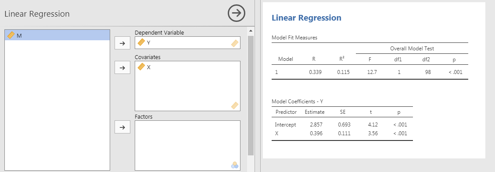
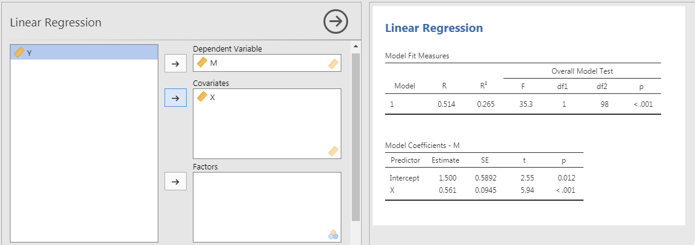
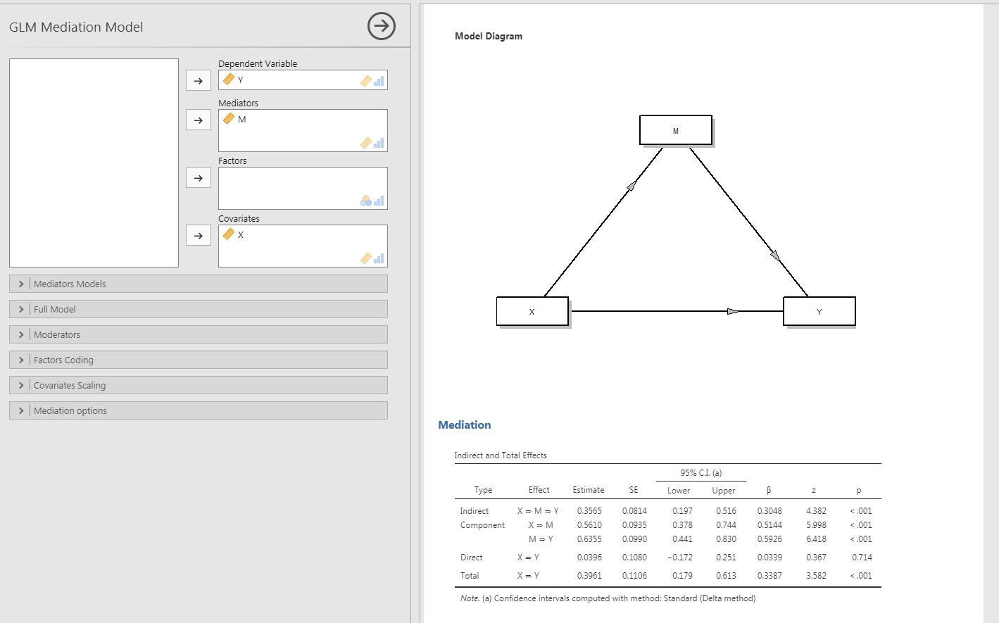
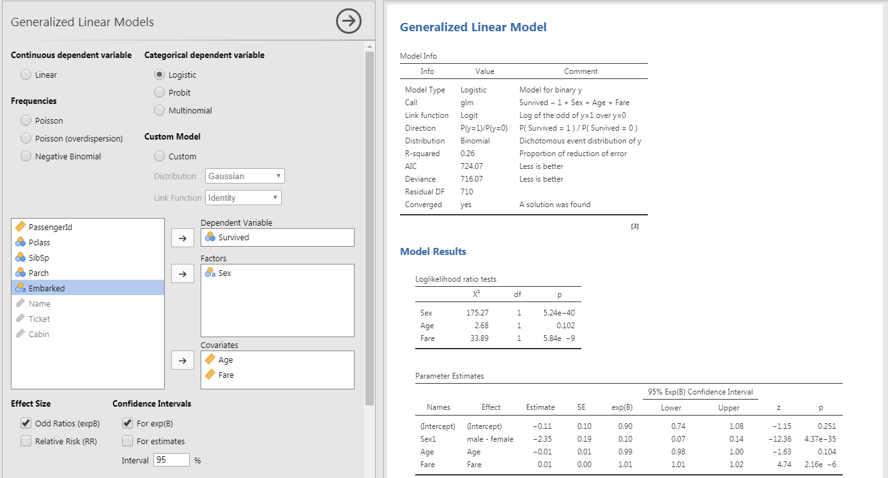
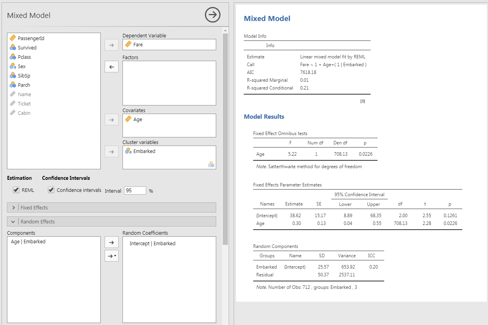

```{r setup, include = FALSE}
# general options --------------------------------------------------------------
options(scipen = 999)
set.seed(123)
# chunk options ----------------------------------------------------------------
knitr::opts_chunk$set(
  cache.extra = knitr::rand_seed, 
  message = FALSE, 
  warning = FALSE, 
  error = FALSE, 
  echo = FALSE,
  cache = FALSE,
  comment = "", 
  fig.align = "center", 
  fig.retina = 3
  )
# libraries --------------------------------------------------------------------
library(tidyverse)
library(fontawesome)
library(DiagrammeR)
library(patchwork)
library(ggrepel)
library(papaja)
# data -------------------------------------------------------------------------
```

# Model IDs

Regression  Models can be distinguished by:
- Type of Outcome Variables
- Amount of Outcome Variables 
- Amount of Predictor Variables
- Amount of Equation Processed
- Inclusion of Control Variables

---

class: inverse, mline, center, middle

# 1. Mediation Models

---

# Model ID

- Type of Outcome Variables: Continuous
- Amount of Outcome Variables: 2 (Final Outcome Variable and Mediator)
- Amount of Predictor Variables: 2 (Original Predictor and Mediator)
- Amount of Equation Processed: 3 (Including 2 Requirements)
- Inclusion of Control Variables: As Predictors

---

# Mediation Effect

The mediation model is a path analysis which involves 3 different linear models.

Let's take the example from [University of Virginia](https://data.library.virginia.edu/introduction-to-mediation-analysis/): $self-esteem$ mediates the effect of $grades$ on $happiness$

Data analysis is also presented in the [Jamovi Advanced Mediation Model website](https://jamovi-amm.github.io/glm_example1.html) and the data can be downloaded [here](https://jamovi-amm.github.io/glm_example1.html)

```{r}
DiagrammeR::grViz("
  digraph {
    graph [rankdir = LR]
  
    node []
    'self-esteem'; 'math exam results'; happiness
    
    'math exam results' -> {happiness 'self-esteem'}
    'self-esteem' -> happiness

  }", width = 800)
```

---

# Mediation Effect

Imagine that previous studies have suggested that higher grades predict higher happiness. This is called **Direct Effect**.

```{r out.width="50%"}
knitr::include_graphics("https://data.library.virginia.edu/files/mediation_ex1.png")
```

However, grades are not the real reason that happiness increases. Let's hypothesize that good grades boost one’s self-esteem and then high self-esteem boosts one’s happiness. This is the **Indirect Effect**.

```{r out.width="50%"}
knitr::include_graphics("https://data.library.virginia.edu/files/mediation_ex2.png")
```

Self-esteem is a mediator that explains the underlying mechanism of the relationship between grades (or $X$) and happiness (or $Y$).

A mediation analysis is comprised of **three sets of regression**: $X$ → $Y$, $X$ → $M$, and $X$ + $M$ → $Y$. They are just three regression analyses!

---

# Analyse Mediation Effects

## Step 1

```{r out.width = "70%"}
knitr::include_graphics("https://data.library.virginia.edu/files/mediation_step1.png")
```

$$Y = \beta_{0} + \beta_{1}.X + \epsilon$$

Is $\beta_{1}$ significant? We want $X$ to affect $Y$ (Direct Effect). If there is no relationship between $X$ and $Y$, there is nothing to mediate.

---

# Analyse Mediation Effects

## Step 2

```{r out.width = "70%"}
knitr::include_graphics("https://data.library.virginia.edu/files/mediation_step2.png")
```

$$M = \beta_{0} + \beta_{2}.X + \epsilon$$

Is $\beta_{2}$ significant? We want $X$ to affect $M$. If $X$ and $M$ have no relationship, $M$ is just a third variable that may or may not be associated with $Y$. A mediation makes sense only if $X$ affects $M$.

---

# Analyse Mediation Effects

## Step 3

```{r out.width = "70%"}
knitr::include_graphics("https://data.library.virginia.edu/files/mediation_step3.png")
```

$$Y = \beta_{0} + \beta_{4}.X + \beta_{3}.M + \epsilon$$

Is $\beta_{4}$ non-significant or smaller than before? We want $M$ to affect $Y$, but $X$ to no longer affect $Y$ (or $X$ to still affect $Y$ but in a smaller magnitude).

If the effect of $X$ on $Y$ completely disappears, $M$ fully mediates between $X$ and $Y$. If the effect of X on Y still exists, but in a smaller magnitude, M partially mediates between $X$ and $Y$.

To see if this mediation effect is statistically significant (different from zero or not). To do so, a specific test to compare $\beta_{1}$ and $\beta_{4}$ is performed (called Sobel or bootstrapping).

---

# Mediation Analysis in JAMOVI

In JAMOVI it is possible to do all steps at once using the jAMM module (jamovi Advanced Mediation Models)

To do it, install the jAMM module by clicking on the cross "Modules" at top right corner > JAMOVI library.

Then follow the example described here: https://jamovi-amm.github.io/glm_example1.html

```{r out.width="70%"}
knitr::include_graphics("https://jamovi-amm.github.io/pics/logosm.png")
```

---

# Check Requirements in JAMOVI

## Is X → Y significant?

```{r out.width='100%'}

```

$p < 0.001$ i.e. lower than 0.05 so $X$ has a significant effect on $Y$.

---

# Check Requirements in JAMOVI

## Is X → M significant?

```{r out.width='100%'}

```

$p < 0.001$ i.e. lower than 0.05 so $X$ has a significant effect on $M$.

---

# Mediation Effect Test in JAMOVI

## Is $\beta_{4}$ non significant?

Module medmod > GLM Mediation Model

```{r out.width="70%"}

```

$p = 0.714$ for $\beta_{4}$ while $\beta_{1}$ was significant, therefore M (self-esteem) mediate the relationship between X (grades) and Y (happiness).

---

# More Advanced Mediation Models

See: https://jamovi-amm.github.io/glm_example2.html

```{r out.width="70%"}
knitr::include_graphics("https://jamovi-amm.github.io/examples/muller/moderator2.png")
```

---
class: inverse, mline, center, middle

# 2. Structural Equation Models

---

# Model ID

- Type of Outcome Variables: Continuous
- Amount of Outcome Variables: 1 or More
- Amount of Predictor Variables: 1 or More
- Amount of Equation Processed: 1 for each Outcome Variable
- Inclusion of Control Variables: As Predictors

---
class: inverse, mline, center, middle

# 3. Generalized Linear Models

---

# Model ID

- Type of Outcome Variables: Categorical
- Amount of Outcome Variables: 1
- Amount of Predictor Variables: 1 or More
- Amount of Equation Processed: 1
- Inclusion of Control Variables: As Predictors

---

# Generalized Linear Models

So far all the model tested had the assumption that residuals are following a normal distribution. This is the case if the outcome variable is Continuous.

However, Linear models can also be used with outcome variable that are not Continuous. In this case a **Generalized Linear Model** is used.

Three different outcome variables can be tested:
- if the outcome variable has only 2 possibilities (e.g., survive: "yes" or "no"), this is a **Logistic Regression**
- if the outcome variable has only 2 possibilities but one of theme is very rare, this is a **Poisson Regression**
- if the outcome variable has more than 2 possibilities, this is a **Multinominal Regression**

---

# Generalized Linear Models

Let's keep the example of the titanic dataset. The most interesting outcome variable is the survive variable which says if the passenger has survived (coded 1) or not (coded 0).

Because this outcome variable is Categorical (even if coded with numbers), we can expect its residuals to follow a Logistic distribution.

In JAMOVI, a Generalized Linear Model with logistic distribution can be computed using the **GAMLj** Module as follow:

```{r out.width = '70%'}

```

---
class: inverse, mline, center, middle

# 4. Linear Mixed Models

---

# Model ID

- Type of Outcome Variables: Continuous
- Amount of Outcome Variables: 1
- Amount of Predictor Variables: 1 or More
- Amount of Equation Processed: 1
- Inclusion of Control Variables: As Random Effect

---

# Linear Mixed Models

Linear Mixed Models are common (Multiple) Linear Regression Model with includes control variables.

These control variables are called "Random Effects" (by opposition to predictor variables with are called "Fixed Effects").

They are included in the model in order to take into account their variability but they are not tested. **Control variables included as "Random Effects" are variables for which you suppose there are differences but you have no specific hypothesis about them.**

Examples of these "Random Effects" can be location of measurement, days of the measurement, differences between individuals ...

---

# Linear Mixed Models

Let's use the titanic dataset example. We want to test that Age has an effect on passengers Fare, but this effect might be different according to where the passengers have embarked.

In our linear mixed model, `Age` will be a Fixed Effect and `Embarked` the Random Effect. In JAMOVI, linear mixed model can be computed using the **GAMLj** Module as follow:

```{r out.width = '70%'}

```

---
class: inverse, mline, left, middle


# Thanks for your attention and don't hesitate if you have any question!

[`r fa(name = "twitter")` @damien_dupre](http://twitter.com/damien_dupre)  
[`r fa(name = "github")` @damien-dupre](http://github.com/damien-dupre)  
[`r fa(name = "link")` damien-datasci-blog.netlify.app](https://damien-datasci-blog.netlify.app)  
[`r fa(name = "paper-plane")` damien.dupre@dcu.ie](mailto:damien.dupre@dcu.ie)
