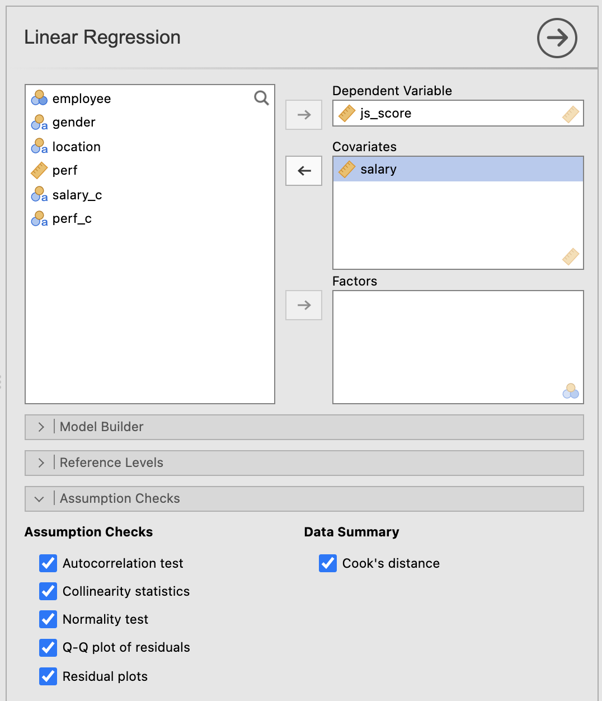
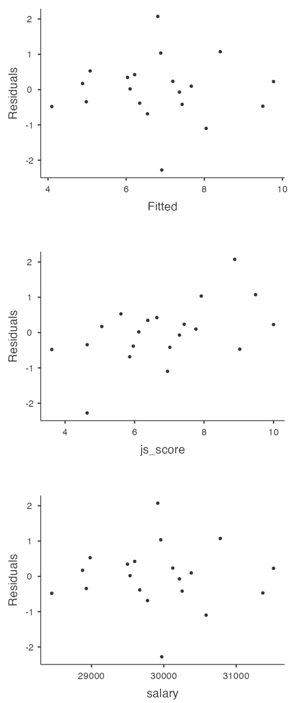
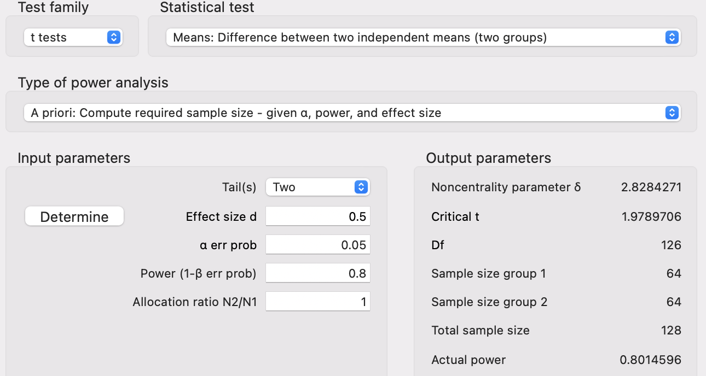
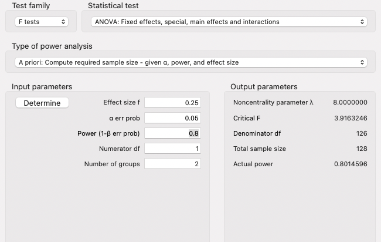
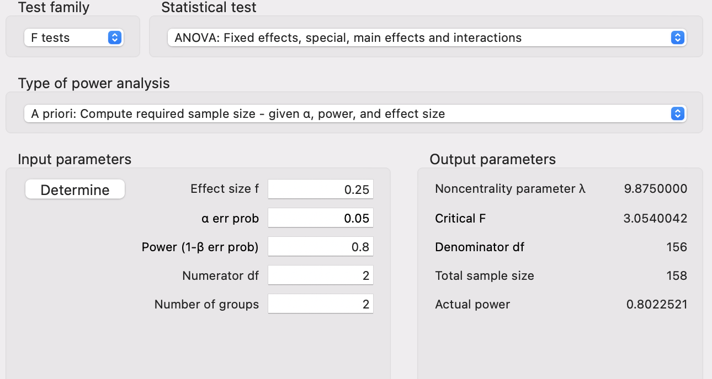
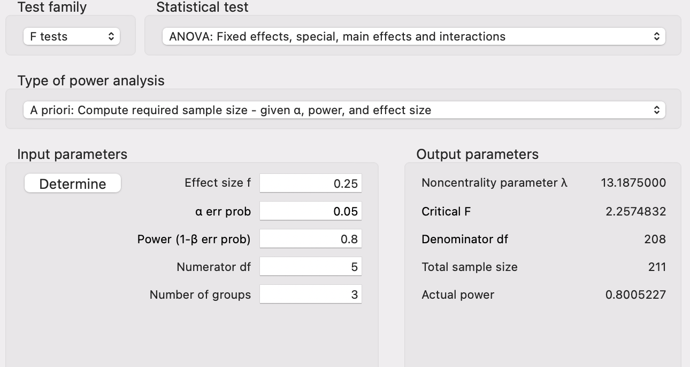

```{r setup, include = FALSE}
# libraries --------------------------------------------------------------------
library(countdown)
library(fontawesome)
library(ggcorrplot)
library(knitr)
library(papaja)
library(patchwork)
library(tidyverse)

# general options --------------------------------------------------------------
options(scipen = 999)
set.seed(123)
# chunk options ----------------------------------------------------------------
opts_chunk$set(
  cache.extra = rand_seed, 
  message = FALSE, 
  warning = FALSE, 
  error = FALSE, 
  echo = FALSE,
  cache = FALSE,
  comment = "", 
  fig.align = "center", 
  fig.retina = 3
  )

# data -------------------------------------------------------------------------
iqsize <- read.table(here::here("data/iqsize.txt"), header = TRUE)
organisation_beta <- readr::read_csv(here::here("data/organisation_beta.csv"))  

  # tibble::tibble(
  #   gender = sample(c("male", "female"), 20, replace = TRUE),
  #   location = sample(c("Ireland", "France", "Australia"), 20, replace = TRUE),
  #   perf = rnorm(20, mean = 4, sd = 2),
  #   salary = rnorm(20, mean = 30000, sd = 1000),
  #   js_score = -55 + 0.002 * salary + rnorm(20, mean = 2, sd = 1)
  # ) |>
  # tibble::rownames_to_column("employee") |>
  # dplyr::mutate(
  #   js_score = case_when(
  #     js_score > 10 ~ 10,
  #     js_score < 0 ~ 0,
  #     TRUE ~ js_score
  #   ),
  #   perf = case_when(
  #     perf > 10 ~ 10,
  #     perf < 0 ~ 0,
  #     TRUE ~ perf
  #   ),
  #   salary_c = case_when(
  #     salary >= mean(salary) ~ "high",
  #     salary < mean(salary) ~ "low"
  #   ),
  #   perf_c = case_when(
  #     perf >= mean(perf) + sd(perf) ~ "high",
  #     perf < mean(perf) + sd(perf) & perf >= mean(perf) - sd(perf) ~ "medium",
  #     perf < mean(perf) - sd(perf) ~ "low"
  #   ),
  # ) |>
  # readr::write_csv(here::here("data/organisation_beta.csv"))
```

class: inverse, mline, center, middle

# 1. Assumptions of General Linear Regression Models

---

# Assumptions of General Linear Regression Models

Statistical tests are widely used to test hypotheses, exactly how we just did but all statistical tests have requirements to meet before being applied.

The General Linear Model has 4 requirements:

## 1. **L**inearity (of the effects)

## 2. **I**ndependence (of observations)

## 3. **N**ormality (of the residuals)

## 4. **E**qual Variance (of the residuals) 

While the assumption of a Linear Model are never perfectly met in reality, we must check if there are reasonable enough assumption that we can work with them.

---

# Assumptions of General Linear Regression Models

All assumptions can be checked with Jamovi, except the Independence of observations which is more about self-assessment.

.pull-left[
In the Linear Regression options, open **Assumption Checks** and **tick all the boxes**.

Some boxes will be used for the additional assumptions (following chapter), but 2 are used to check the main assumptions: 
- **Q-Q plot of residuals** to check the normality of residuals (assumption 3) 
- **Residual plots** to check equal variance of the residuals (assumption 4)
]

.pull-right[
```{r}

```
]

---
class: title-slide, middle

## 1. Linearity (of the effects)

---

# Assumptions 1: Linearity

A pretty fundamental assumption of the General Linear Regression Model is that the relationship between X and Y actually is linear.

To check it in Jamovi, **plot the data and have a look**:

```{r fig.height=4, fig.width=10}
df <- data.frame(
  x = c(0,5,10,6 ,9,13,15,16,20,21,24,26,29,30,32,34,36,38,40,43,44,45, 50,60) - 15,
  y = c(0.00,0.10,0.25,0.15,0.24,0.26,0.30,0.31,0.40,0.41,0.49,0.50,0.56, 0.80,0.90,1.00,1.00,1.00,0.80,0.50,0.40,0.20,0.15,0.00)*10
  )

raw_plot <- df |> 
  ggplot(aes(x, y)) +
  geom_point() +
  theme_bw()

linear_model_1 <- lm(y ~ x, data = df)

df$predicted <- predict(linear_model_1)   # Save the predicted values
df$residuals <- residuals(linear_model_1) # Save the residual values

linear_plot <- df |> 
  ggplot(aes(x, y)) +
  geom_segment(aes(xend = x, yend = predicted)) +
  geom_point() +
  geom_smooth(method = "lm") +
  theme_bw()

loess_model <- loess(y ~ x, data = df, span = 5)

df$predicted <- predict(loess_model)   # Save the predicted values
df$residuals <- residuals(loess_model) # Save the residual values

loess_plot <- df |> 
  ggplot(aes(x, y)) +
  geom_segment(aes(xend = x, yend = predicted)) +
  geom_point() +
  geom_smooth(method = "loess", span = 5) +
  theme_bw()

raw_plot + linear_plot + loess_plot
```

If the shape of the data is non linear then even the best linear model will have very big residuals and therefore very high $MSE$ or $RMSE$.

---
class: title-slide, middle

## 2. Independence (of observations)

---

# Assumptions 2: Independence

To check this assumption, you need to know how the data were collected. **Is there a reason why two observations could be artificially related?**

> For example, an experiment investigating marriage satisfaction according the duration of the marriage will be flawed if data are collected from both partners. Indeed the satisfaction from 1 member of the couple should be correlated to the satisfaction of the other couple. 

Make sure your participant does not know each others or then use the so called "linear mixed models".

In general, this is really just a "catch all" assumption, to the effect that "there's nothing else funny going on in the residuals". If there is something weird (e.g., the residuals all depend heavily on some other unmeasured variable) going on, it might screw things up.

---
class: title-slide, middle

## 3. Normality (of the residuals)

---

# Assumptions 3: Normality

Like many of the models in statistics, the General Linear Model **assumes that the residuals are normally distributed**. 

Note that **it's actually okay if the predictor and the outcome variables are non-normal**, as long as the residuals $e$ are normal.

### Three kinds of residuals:

- **Ordinary residuals**: Distance between the prediction and the observed value from your variable (called $e_i$). In case of a multiple linear regression with variables using different scales, the ordinary residuals will have different scales as well.

- **Standardised residuals**: Normalised residuals used for comparison between variables having different scales.
 
- **Studentised residuals**: Normalised residuals for even more standardised comparisons between variables having different scales.

---

# Assumptions 3: Normality

To check it in Jamovi, **use a Q-Q plot**

```{r fig.height=4, fig.width=10}
df <- data.frame(
  normal = rnorm(1000)
  ) |> 
  dplyr::mutate(
    skew_right = ifelse(normal > 0, normal * 2.5, normal),
    skew_left = ifelse(normal < 0, normal * 2.5, normal),
    fat_tails = normal * 2.5
  ) |> 
  tidyr::pivot_longer(everything(), names_to = "type", values_to = "value") |> 
  dplyr::mutate(type = factor(type, levels = c("normal", "skew_right", "skew_left", "fat_tails")))
  
distribution_plot <- df |> 
  ggplot(aes(x = value, y = ..density..)) +
  geom_histogram(colour = "black", fill = "white") +
  facet_grid(.~type) +
  theme_bw()

qq_plot <- df |> 
  ggplot(aes(sample = value)) + 
  stat_qq() + 
  stat_qq_line() +
  facet_grid(.~type) +
  theme_bw()

distribution_plot/qq_plot
```

- If the residuals are normality distributed, then the line formed by the dots follows the diagonal line (plot 1 and 4)
- If the residuals are skewed right/left, then the line formed by the dots deviates from the diagonal (plot 2 and 3)

---
class: title-slide, middle

## 4. Equal Variance (of the residuals)

---

# Assumptions 4: Equal Variance

.pull-left[
Also called Homogeneity or Homoscedasticity, the General Linear Regression Model assumes that each residual $e_i$ is generated from a normal distribution: **the standard deviation of the residual should be the same for all values of the Predictor**. 

In Jamovi, use **Residuals Plot** option providing a scatterplot for each predictor variable, the outcome variable, and the predicted values against residuals.

If the Equal Variance is met **we should see no pattern in the first plot, only a cloud of points**.

With other software, a line is drawn in this residual vs. fitted plot. A flat line would indicate Equal Variance of residuals.
]

.pull-right[
```{r out.width="60%"}

```
]

---
class: title-slide, middle

## Live Demo

---
class: title-slide, middle

## Exercise

Test the assumptions of the following linear regression: 

$$js\_score = b_{0} + b_{1}\,perf + e$$

### 1. **L**inearity (of the effects)

### 2. **I**ndependence (of observations)

### 3. **N**ormality (of the residuals)

### 4. **E**qual Variance (of the residuals) 

```{r}
countdown(minutes = 10, warn_when = 60)
```

---
class: inverse, mline, center, middle

# 2. More Assumptions of General Linear Regression Models

---

# Uncorrelated Predictors

In a multiple General Linear Regression Model, you don't want your predictors to be too strongly correlated with each other:

* This isn't technically an assumption of the General Linear Regression Model, but in practice it's required
* Predictors that are too strongly correlated with each other (referred to as collinearity) can cause problems when evaluating the model

### How to check it
- JAMOVI: **Regression > Correlation Matrix > Plot Correlation Matrix**

### Example

.pull-left[
Imagine American scientist trying to predict individual's IQ by using their height, weight and the size of their brain as follow:

$$IQ = b_0 + b_1\,Height + b_2\,Weight + b_3\,Brain + e$$
]

.pull-right[
```{r, fig.height=3, fig.width=3}
iqsize |> 
  cor() |> 
  ggcorrplot(
    hc.order = TRUE,
    type = "lower",
    outline.col = "white",
    lab = TRUE
  )
```
]

---

# Uncorrelated Predictors

**Variance Inflation Factors** (VIFs) is a very good measure of the extent to which a variable is correlated with all the other variables in the model. **A cut off value of 5 is commonly used**.

### How to check it

- JAMOVI: **Regression > Linear Regression: Assumption Checks "Collinearity statistics"**

```{r}
res <- jmv::linReg(
    data = iqsize,
    dep = PIQ,
    covs = vars(Brain, Height, Weight),
    blocks = list(
        list(
            "Brain",
            "Height",
            "Weight")),
    refLevels = list(),
    collin = TRUE)

res$models[[1]]$assump$collin$asDF |>
  kable(digits = 2)
```

---

# No Anomalous Data

Again, not actually a technical assumption of the model (or rather, it's sort of implied by all the others), but there is **an implicit assumption that your General Linear Regression Model isn't being too strongly influenced by one or two anomalous data points** because this raises questions about the adequacy of the model and the trustworthiness of the data in some cases.

### Three kinds of anomalous data

.pull-left[
- Harmless Outlier Observations
- High Leverage Observations
- High Influence Observations
]

.pull-right[
```{r}
include_graphics("https://memegenerator.net/img/instances/53809899/outliers-outliers-everywhere.jpg")
```
]

---

# Harmless Outlier Observations

An "harmless" outliers is **an observation that is very different from what the General Linear Regression Model predicts**. In practice, we operationalise this concept by saying that an outlier is an observation that has a very large Studentised residual.

.pull-left[
Outliers are interesting: 

* A big outlier might correspond to junk data, e.g., the variables might have been recorded incorrectly in the data set, or some other defect may be detectable. 
* You shouldn't throw an observation away just because it's an outlier. But the fact that it's an outlier is often a cue to look more closely at that case and try to find out why it's so different.
]

.pull-right[
```{r fig.height=5, fig.width=5}
mydata <- within(data.frame(x=1:10), y <- rnorm(x, mean=x))
fm.orig <- lm(y ~ x, data=mydata)
mydata$y[6] <- 20
fm.lm <- update(fm.orig)
plot(y ~ x, data=mydata)
abline(fm.orig, lty="dashed")    # use a dashed line
abline(fm.lm)
legend(
  "topright", 
  inset=0.03, 
  bty="n",
  legend = c("Fit without outlier", "Fit with outlier"),
  lty = c("dashed", "solid")
  )
```
]


---

# High Leverage Observations

The second way in which an observation can be unusual is if it has high leverage, which happens when the observation is **very different from all the other observations and influences the slope of the linear regression**. 

.pull-left[
This doesn't necessarily have to correspond to a large residual. 

If the observation happens to be unusual on all variables in precisely the same way, it can actually lie very close to the regression line.

High leverage points are also worth looking at in more detail, but they're much less likely to be a cause for concern.
]

.pull-right[
```{r fig.height=5, fig.width=5}
mydata <- within(data.frame(x=1:10), y <- rnorm(x, mean = x))
fm.orig <- lm(y ~ x, data=mydata)
mydata$y[9] <- 5
fm.lm <- update(fm.orig)
plot(y ~ x, data=mydata)
abline(fm.orig, lty="dashed")    # use a dashed line
abline(fm.lm)
legend(
  "topright", 
  inset = 0.03, 
  bty = "n",
  legend = c("Fit without high leverage", "Fit with high leverage"),
  lty = c("dashed", "solid")
  )
```
]

---

# High Influence Observations

A high influence observation is an outlier that has high leverage. That is, it is **an observation that is
very different to all the other ones in some respect, and also lies a long way from the regression line**.

.pull-left[
We operationalise influence in terms of a measure known as **Cook's distance**. 

In Jamovi, information about Cook's distance can be calculated by clicking on the Cook's Distance' checkbox in the **Assumption Checks > Data Summary** options. 

For an observation, a Cook's distance greater than 1 is considered large. However, Jamovi provides only a summary, **check the maximum Cook distance and its average** to know if some observations have high influence.
]

.pull-right[
```{r fig.height=5, fig.width=5}
mydata <- within(data.frame(x=1:10), y <- rnorm(x, mean=x))
fm.orig <- lm(y ~ x, data=mydata)
mydata$y[9] <- 20
fm.lm <- update(fm.orig)
plot(y ~ x, data=mydata)
abline(fm.orig, lty="dashed")    # use a dashed line
abline(fm.lm)
legend(
  "topright", 
  inset = 0.03, 
  bty = "n",
  legend = c("Fit without high influence", "Fit with high influence"),
  lty = c("dashed", "solid")
  )
```
]

---
class: title-slide, middle

## Live Demo

---
class: title-slide, middle

## Exercise

Check if the the relationship between $js\_score$ and $pref$ have some:

### 1. Harmless Outlier Observations
### 2. High Leverage Observations
### 3. High Influence Observations

```{r}
countdown(minutes = 5, warn_when = 60)
```

---
class: inverse, mline, center, middle

# 3. Model Selection

---

# First Warning

Model Selection is also called Hierarchical Linear Regression but is **NOT** Hierarchical Linear Model.

- **Hierarchical Linear Regression** compares 2 or more models with fixed effects
- **Hierarchical Linear Model** compares 2 or more models with random effects (also called Multilevel Model)

Here we are using the term **Model Selection** for **Hierarchical Linear Regression**.

---

# Default Model Testing in Multiple Regression

Imagine you are **testing the model** that includes the variables $X$ and $Z$ have an effect on the variable $Y$ such as:

$$H_a: Y = b_{0} + b_{1}\,X + b_{2}\,Z + e$$

If nothing is specified, the null hypothesis $H_0$ is always the following:

$$H_0: Y = b_{0} + e$$

But when there are multiple predictors, the $p$-values provided are only in reference to this simpliest model.

If you want to evaluate the effect of the variable $Z$ while $X$ is taken into account, it is possible to specify $H_0$ as being not that simple such as:

$$H_0: Y = b_{0} + b_{1}\,X + e$$

This is a Model Comparison!

---

# Default Model Testing in Multiple Regression

Example, imagine a model predicting $js\_score$ with $salary$ and $perf$:

$$js\_score = b_{0} + b_{1}\,salary + b_{2}\,perf + e\;(full\;model)$$

In the Model Fit table of Jamovi, this model will be compared to a null model as follow:

$$js\_score = b_{0} + e\;(null\;model)$$

However it is possible to use a more complicated model to be compared with:

$$js\_score = b_{0} + b_{1}\,salary + e\;(simple\;model)$$

Comparing the full model with a simple model consist in evaluating the added value of a new variable in the model, here $perf$.

---

# Model Comparison

A model comparison can:

- Compare Full Model with a more complicated model (called Simple Model)
- Indicates if a variable is useful in a model

This principle is often referred to as Ockham's razor and is often summarised in terms of the following pithy saying: do not multiply entities beyond necessity. In this context, it means don't chuck in a bunch of largely irrelevant predictors just to boost your $R^2$.

To evaluate the good-fitness of a model, the **Akaike Information Criterion** also called $AIC$ (Akaike 1974) is compared between the models: 

- The smaller the $AIC$ value, the better the model performance
- $AIC$ can be added to the Model Fit Measures output Table when the $AIC$ checkbox is clicked

---

# Model Comparison in JAMOVI

```{r}
res <- jmv::linReg(
  data = organisation_beta,
  dep = js_score,
  covs = vars(
    salary,
    perf
  ),
  blocks = list(
    list("salary"),
    list("perf")
  ),
  refLevels = list(),
  aic = TRUE,
  modelTest = TRUE)
```

In Model Builder create Block 1 as your Simple Model and a New Block 2 with the additional predictor.

Details of Model 1 (Simple Model) and Model 2 (Full Model):

```{r}
res$modelFit$asDF |>
  kable()
```

Evaluation of significant difference between the two models:

```{r}
res$modelComp$asDF |>
  kable()
```

Here the difference between the two models is not statistically significant, therefore adding $perf$ in the full model doesn't help to increase the prediction (as indicated by the $AIC$).

---
class: title-slide, middle

## Live Demo

---
class: title-slide, middle

## Exercise

Compare the following full model:

$$js\_score = b_{0} + b_{1}\,salary + b_{2}\,perf + b_{3}\,salary*perf + e$$

With:

$$js\_score = b_{0} + b_{1}\,salary + b_{2}\,perf + e$$

**Is the addition of the Interaction effect improving the accuracy of the model?**

```{r}
countdown(minutes = 5, warn_when = 60)
```

---
class: inverse, mline, center, middle

# 4. Power Analysis for Sample Size and Effect Size Estimations

---

# Theoretical Principle

Remember, the null hypothesis $H_0$ is the hypothesis that there is no relationship between the Predictor and the Outcome. If the null hypothesis is rejected, we accept the alternative hypothesis $H_a$ of a relationship between the Predictor and the Outcome.

This means that four possible situations can occur when we run hypothesis tests:

- We reject $H_0$ ...
  - and in fact $H_a$ is true. This is a good outcome and one which is most often the motivation for the hypothesis test in the first place (True Positive)
  - but in fact $H_a$ is false. This is known as a **Type I error** (False Positive)

- We fail to reject $H_0$ ...
  - and in fact $H_a$ is false. This is a good outcome (True Negative)
  - but in fact $H_a$ is true. This is known as a **Type II error** (False Negative)

> Statistical power refers to the fourth situation and is the probability that we are able to detect the effect that we are looking for.

---

# Theoretical Principle

```{r out.width='80%'}
include_graphics("https://learning.eupati.eu/pluginfile.php/673/mod_book/chapter/388/eupati-types1-2-errors.png")
```

---

# Statistical Power

The ability to identify an effect if it exists (i.e., statistical power) depends at a minimum on three criteria:

- The significance level $\alpha$ to reject $H_0$ (usually $\alpha$ is set at 0.05 or 5%)
- The size $n$ of the sample being used
- The proportion of the variability of the Outcome variable explained by all the Predictors (i.e., full model), known as the **effect size**

The minimum level of statistical power to achieve is usually set at least 0.8 or 80% (i.e., we want at least a 80% probability that the test will return an accurate rejection of $H_0$).

- If all the criteria are known except $n$, then it is possible to approximate the $n$ necessary to obtain at least a 0.8 or 80% power to correctly reject $H_0$ before running the analysis (**prospective power analysis**).

- It is also possible to evaluate which has been achieved once the analysis has been done (**retrospective power analysis**).

---
class: title-slide, middle

## Sample Size Estimation with Prospective Power Analysis

---

# Sample Size Estimation

The main question of most researchers is:

## .center["How many participant is enough to test the formulated hypotheses?"]

Some would obtain an random answer from their colleagues such as "at least 100" or "at least 50 per groups".

However, **there is an actual exact answer** provided by the power analysis:

## .center["It depends how big is the effect size"]

Prospective Power Analysis is reported in the Method section of research papers in order to **describe how the sample size has been estimated thanks to an approximated effect size at the model level** (e.g., small, medium, or large).

---

# Sample Size Estimation

The values of the approximated effect size depend on the type of model tested:

- A model with 1 Main Effect of a Categorical Predictor with 2 categories uses Cohen's $d$
- All other models including Main and Interaction Effect involving Categorical Predictor with 3+ categories or Continuous Predictor uses Cohen's $f$ 

Note: A model with only Main Effects of Continuous Predictors can use a $f$ or $f^2$

Effect Size Rule of Thumb:

```{r}
tribble(
  ~`Effect Size`, ~Small, ~Medium, ~Large,
  "$d$",   .20, .50, .80,
  "$f$",   .10, .25, .40,
  "$f^2$ ", .02, .15, .35
) |> 
  kable()
```

---

# Sample Size Estimation

Power analyses using Cohen's $f$ effect size (i.e., all model expect the ones using a Cohen's $d$) are calculated with an additional parameter: **Numerator df** (degree of freedom)

The degree of freedom of each effect is added to obtain the **Numerator df**:
  - In main effects
    - Continuous Predictors have 1 df
    - Categorical Predictors have k - 1 df (number of categories - 1)
  - In interaction effects, the df of the predictors involved are multiplied
  
Example:

$$js\_score = b_{0} + b_{1}\,salary + b_{2}\,location + b_{3}\,salary*location + e$$

- $b_{1}\,salary$ has 1 df (Continuous Predictor)
- $b_{2}\,location$ has 2 df (3 locations - 1)
- $b_{3}\,salary*location$ has 2 df (1 * 2)

The model's **Numerator df** is 5 (1+2+2)

Note: The number of groups is usually the same as **Numerator df**

---

# Sample Size Estimation

There are multiple possibilities to perform a power analysis: 

- Websites hosted online such as http://powerandsamplesize.com or https://sample-size.net (but none are satisfying)
- Embedded in Statistical software such as SPSS or Jamovi (but none are satisfying)
- Specific software such as G*power (free and the most used power analysis software)
- Packages for coding languages (like {pwr} in R or `statsmodels` in python)

While the last option will be the best solution after being introduced to R, G*power is the most commonly used software and can be downloaded for free here:
https://www.psychologie.hhu.de/arbeitsgruppen/allgemeine-psychologie-und-arbeitspsychologie/gpower.html

```{r}
include_graphics("https://www.psychologie.hhu.de/fileadmin/_processed_/f/d/csm_GPowerIcon_b6bfb17f0c.png")
```


---

# Sample Size Estimation

G*power uses 3 characteristics to determine the type of power analysis:
1. **Test family** (e.g., t-test for models with 1 predictor either continuous or having two categories or F-test for all other models)
2. **Statistical test** (e.g., mean comparison, ANOVA, multiple linear regression)
3. **Type of power analysis** (e.g., prospective also called "a priori" or retrospective also called "post hoc")

### Whatever your model is, for Sample Size Estimation with Prospective Power Analysis use:
- **F-tests**
- **ANOVA: Fixed effects, special, main effects and interactions**
- **A priori: Compute required sample size - given $\alpha$, power, and effect size**

---

# Applied Example 1

Model Characteristics with $js\_score$ as Continuous Outcome:
- 1 Main Effect of $gender$ (Predictor with 2 categories: male and female employees)

```{r eval=TRUE, fig.align="left"}
DiagrammeR::grViz("
  digraph {
    graph [rankdir = LR]
    node [shape = box]
    
    gender -> js_score
  }", height = 100)
```

**Statistical Power**
- Alpha of 0.05 (5%)
- Power of 0.8 (80% probability of accurately rejecting $H_0$)
- Effect size of $d = 0.5$ (medium)

This tells us that we need an absolute minimum of 128 individuals in our sample (64 male and 64 female employees) for an effect size of $d = 0.5$ to return a significant difference at an alpha of 0.05 with 80% probability.

---

# Applied Example 1

```{r out.width='100%'}

```

---

# Applied Example 1

```{r out.width='100%'}

```

---

# Applied Example 2

Model Characteristics with $js\_score$ as Continuous Outcome:
- 1 Main Effect of $location$ (Predictor with 3 categories: Irish, French, and Australian)

```{r eval=TRUE, fig.align="left"}
DiagrammeR::grViz("
  digraph {
    graph [rankdir = LR]
    node [shape = box]
    
    location -> js_score
  }", height = 100)
```

**Statistical Power**
- Alpha of 0.05 (5%)
- Power of 0.8 (80% probability of accurately rejecting $H_0$)
- Effect size of $f = 0.25$ (medium)

This tells us that we need an absolute minimum of 158 individuals in our sample for an effect size of $f = 0.25$ to return a significant difference at an alpha of 0.05 with 80% probability.

---

# Applied Example 2

```{r out.width='100%'}

```

---

# Applied Example 3

Model Characteristics with $js\_score$ as Continuous Outcome:
- 1 Main Effect of $location$ (Predictor with 3 categories: Irish, French, and Australian)
- 1 Main Effect of $salary$ (Continuous Predictor)
- 1 Interaction Effect of $location$ and $salary$

```{r}
DiagrammeR::grViz("
  digraph {
    graph [rankdir = LR]
  
    node [shape = box]
    location; salary; js_score
    node [shape = point, width = 0, height = 0]
    ''
    
    location -> ''
    salary -> '' [arrowhead = none]
    ''-> js_score
    
    subgraph {
      rank = same; location; '';
    }
  }", height = 100)
```

**Statistical Power**
- Alpha of 0.05 (5%)
- Power of 0.8 (80% probability of accurately rejecting $H_0$)
- Effect size of $f = 0.25$ (medium)

This tells us that we need an absolute minimum of 211 individuals in our sample for an effect size of $f = 0.25$ to return a significant difference at an alpha of 0.05 with 80% probability.

---

# Applied Example 3

```{r out.width='100%'}

```

---
class: title-slide, middle

## Effect Size Estimation with Retrospective Power Analysis

---

# Effect Size Reporting

Reporting effect size for each estimate (each hypothesis) in the Result section is the norm

With the General Linear Model, the effect size of each estimate is the corresponding standardised estimate $\beta$. Therefore, no other information needs to be reported.

However, you will see a lot of different metrics in research papers using different statistical tests for their hypotheses. Here is a list of the most used:
- Cohen's $d$ for a Main Effect in a model with 1 Categorical Predictor with 2 categories
- Eta-squared $\eta^2$ or partial Eta-squared $\eta^2_p$ for all the other models

Notes:
- The $\eta^2_p$ for a particular estimate corresponds to the effect size when the other effects in the model are deliberately ignored.
- Both $\omega^2$ and $\epsilon^2$ (and their partial counterparts, $\omega^2_p$ and $\epsilon^2_p$) are unbiased estimators of the population’s $\eta^2$ (or $\eta^2_p$, respectively), which is especially important is small samples.
- $\eta^2_p$ aims at estimating the effect size in a design where all the variables have been experimentally manipulated (e.g., experimental groups). However, some predictors can only be observed. For such cases, we can use generalized Eta squared $\eta^2_G$.

---
class: inverse, mline, center, middle

# 5. Resonable Statistics

---

# Bad vs Good Science

## $p$-Hacking

Running statistical tests until finding a significant $p$-value is $p$-Hacking. To avoid it, all the hypotheses should be tested with one unique test and not with one test by hypothesis. Ideally if another statistical test has to be run, it should be done on new data.

## $p$-HARKing

$p$-HARKing (Hypothesizing After the Results are Known) is defined as presenting a post hoc hypothesis (i.e., one based on or informed by one's results) in one's research report as if it were, in fact, an a priori hypotheses.

## Pre-Registration and Open Science

In order to avoid any kind of $p$-Hacking or $p$-HARKing, new possibilities for research pre-registration are possible with the open science framework (https://osf.io/), some journal are also suggesting the publication of the data treatment code and all the data source to replicate the results

---

# Always more homework

.center[**For next lecture, read Chapter 12 of "Learning Statistics with JAMOVI"**]
.center[https://www.learnstatswithjamovi.com/]

```{r out.width='40%'}
include_graphics("https://blog.jamovi.org/assets/images/lsj_cover.png")
```

---
class: inverse, mline, left, middle


# Thanks for your attention and don't hesitate to ask if you have any questions!

[`r fa(name = "twitter")` @damien_dupre](http://twitter.com/damien_dupre)  
[`r fa(name = "github")` @damien-dupre](http://github.com/damien-dupre)  
[`r fa(name = "link")` damien-datasci-blog.netlify.app](https://damien-datasci-blog.netlify.app)  
[`r fa(name = "paper-plane")` damien.dupre@dcu.ie](mailto:damien.dupre@dcu.ie)
