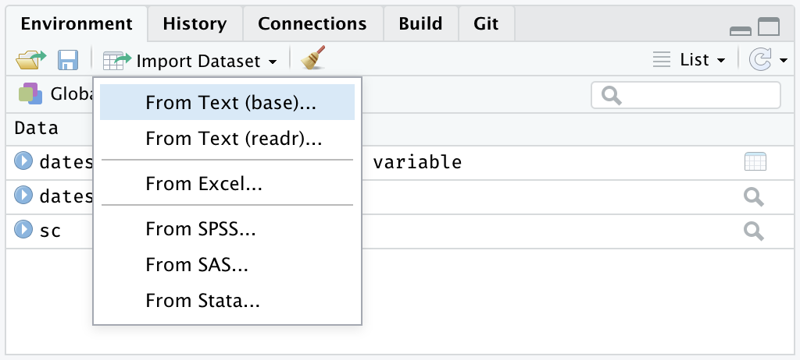

```{r setup, include = FALSE}
# libraries --------------------------------------------------------------------
library(anicon)
library(countdown)
library(fontawesome)
library(here)
library(knitr)
library(tidyverse)
library(tweetrmd)

# options ----------------------------------------------------------------------
options(scipen = 999, htmltools.preserve.raw = FALSE)
opts_chunk$set(echo = FALSE, fig.align = "center", fig.retina = 3)
theme_update(text = element_text(size = 24))

# data -------------------------------------------------------------------------
organisation_beta <- read_csv(here("data/organisation_beta.csv"))
```

```{r xaringan-extra-styles, echo=FALSE}
xaringanExtra::use_extra_styles(
  hover_code_line = TRUE, 
  mute_unhighlighted_code = TRUE
)
```

# Brief Introduction

Modern data science uses free and open-source computer languages:

* Proprietary languages (e.g., Matlab) and software (e.g., SPSS, Stata, SAS) are outdated
* Main open-source computer languages for data science are Python and R

While Python is the most used language by computer engineers for web and app development, R has some advantages:

.pull-left[
1. **Easy to write**, to read and to use
2. Focused on **reports and journal papers** with reproducibility
3. Advanced **statistical packages**
4. **Friendly and open** community

### So let's useR!
]

.pull-right[
```{r out.width='100%'}
tweet_screenshot(
  tweet_url("Pop_Watson", "1280351422953840640"),
  maxwidth = 300,
  hide_media = TRUE,
  theme = "dark"
  )
```
]

---

class: inverse, mline, center, middle

# 1. R and RStudio

---

# What are R and RStudio?

There are some key concepts you need to understand and to remember:

* R is the name of the language
* RStudio is the name of the upgraded interface to write R code

R is usually used via RStudio and First time users often confuse the two. At its simplest, **R is like a car’s engine** while **RStudio is like a car’s dashboard**.

.pull-left[
.center[R: The engine]
```{r out.width='100%'}
include_graphics("img/car_motor.jpeg")
```
]

.pull-right[
.center[RStudio: The dashboard]
```{r out.width='100%'}
include_graphics("img/car_dashboard.jpeg")
```
]

---
class: clear

## .center[**Time to enter ...**]

--

```{r out.width='150%'}
include_graphics("img/the_matrix.gif")
```

---

# Posit Cloud

In your webrowser (Chrome, Firefox, ...), go to: https://posit.cloud/
  - Sign up
  - In your workspace, Click "new project"

```{r out.width='100%'}
include_graphics("https://miro.medium.com/max/1400/1*JBHNRwGr3ZiyBzYWpvH6zg.png")
```

---

# Code in Rstudio

Most of the R code displayed in this lecture is included in these slides. Rather than typing it manually, open these slides in another tab to copy-paste the code

Two ways to access these slides:

  - From Loop: Lectures Slides > Lecture 7
  - Or from the URL: https://damien-dupre.github.io/mt611/lectures/lecture_7

```{r out.width='50%'}
include_graphics("https://c.tenor.com/0heitU7-tg4AAAAC/copy-paste-paste.gif")
```

---
class: inverse, mline, center, middle

# 2. Coding in RStudio

---

# RStudio IDE

When you create a new project, you will lauch Rstudio see the following 3 windows (also called panes):

* **Console**: where the results are printed
* **Workspace**: where the objects are stored
* **Files, Plots, Package, Help and Viewer**: where data science materials are

```{r out.width='60%'}
include_graphics("img/rstudio_panes.png")
```

The last window **Code Editor** opens when creating a new R Script

---

# Console: R’s Heart

The console displays 1. **What has been ran**, 2. The **results** (or some parts) of has been ran, and 3. The **status of the R process**.

.pull-left[
The Status of R is indicated by the symbol in the console prompt:

* `>` means ready to process code 
* `+` means incomplete command (escape with <kbd>Esc</kbd>)
* &#128721; at the top right corner means the console is busy processing your code
]

.pull-right[
```{r out.width = '100%'}
include_graphics("img/r_console.png")
```
]

You can execute code by typing it directly into the Console. However, it will not be saved. And if you make a mistake you will have to re-type everything all over again. 

Instead, it is better to **write all your code in a document (R script or Quarto file) in the Code Editor**.

---

# Environment: R’s Brain

The Environment tab of this pane shows you the **names of all the data objects** (like vectors, matrices, and data frames) that you have defined in your current R session. 

You can also see **information** like the number of observations and rows in data objects. 

```{r out.width='100%'}
include_graphics("https://www.statology.org/wp-content/uploads/2021/10/envir1.png")
```

---

# Files / Plots / Packages / Help

* The **Files** panel gives you access to the file directory on your hard drive.

* The **Plots** panel shows all your plots. There are buttons for opening the plot in a separate window and exporting the plot as a pdf or jpeg.

* The **Packages** shows a list of all the R packages installed on the local or remote machine and indicates whether or not they are currently loaded.

* With the **Help** menu for R functions you can access to essential information to use them. Just have a look at some of them by typling <kbd>F1</kbd> with the cursor on the function, using the `help()` function, or by typing `?` followed by the function name such as:

```{r echo=TRUE, eval=FALSE}
help(seq)
?seq
help(lm)
?lm
```

---

# Code Editor: R's Nervous System

- It makes the link between all the previous pane and allows to reproduce actions and behaviours.

- You can open as many R Script / Quarto file as you want.

- These documents are the only documents that have to be saved. No need to save you data, figures and calculations as you can reproduce them every time instantaneously with the code.

- Save your eyes and look like a nerd by changing the code's appearance

```{r out.width='60%'}
include_graphics("https://miro.medium.com/max/1600/1*eLjON45R_kHIfg_IgL8FIg.jpeg")
```
.center.tiny[Credit: towardsdatascience.com [`r emo::ji("link")`](https://towardsdatascience.com/customize-your-rstudio-theme-914cca8b04b1)]

---
class: inverse, mline, center, middle

# 3. The Basics of R Code

---

# What are .R and .qmd files?

**.R** is the extension for a R script (document including only R code): 
- Click **File > New File > R Script** in RStudio
- Includes only code which can be active or inactive (line starts with `#`)
- Used for code testing

Example of non-active code

```{r echo=TRUE}
# non active code
```

Example of active code

```{r echo=TRUE}
paste("active", "code")
1 + 1 # everything after `#` is non active and is used for comments
```

---

# What are .R and .qmd files?

**.qmd** is the extension for a Quarto file: 
- Click **File > New File > Quarto document...** in RStudio
- Refers to a document that includes code and text
- Generates a specific type of output
  - .html (web page, slides, books, and dashboards)
  - .pdf (Academic LaTex papers and reports)
  - .doc (MS Word documents)
  
```{r out.width='80%'}
include_graphics("https://r4ds.hadley.nz/quarto/diamond-sizes-report.png")
```

---

# How to Run R Code?

.pull-left[
In a R Script, place your cursor anywhere on the line you want to run and either:
- Press <kbd>Ctrl</kbd> & <kbd>Enter</kbd> (Win)
- Press <kbd>command</kbd> & <kbd>Enter</kbd> (Mac)
- Click the `Run` button on RStudio's interface

In a Quarto file:
- Use the **green** arrow to run the current chunk of code
- Use the `Knit` button on RStudio's interface to create the output file
]

.pull-right[
```{r out.width='100%'}
include_graphics("img/rstudio_run.gif")
```
]

---

# What are R packages?

R packages extend the functionality of R. They are written by a worldwide community of R users and can be downloaded for free from the internet.

A good analogy for **R packages are like apps you can download onto a mobile phone**.

.pull-left[
.center[R: A new phone]
```{r out.width='100%'}
include_graphics("img/phone_design.jpeg")
```
]

.pull-right[
.center[R Packages: Apps you can download]
```{r out.width='100%'}
include_graphics("img/phone_apps.jpeg")
```
]

---

# What are R packages?

Say you have purchased a new phone, to use Instagram you need to **install the app once** and to **open the app** every time you want to use it.

The process is very similar for using an R package. You need to:

* **Install the package** with the function `install.packages()`.

```{r echo=TRUE, eval=FALSE}
install.packages("praise")
```

* **“Load” the package** with the function `library()`. 

```{r echo=TRUE, eval=FALSE}
library(praise)
```

Once the package is loaded you can use all the functions from this package such as:

```{r echo=TRUE, eval=FALSE}
praise()
```

---
class: title-slide, middle

## Live Demo

---
class: title-slide, middle

## Exercise

Open a R Script in RStudio. In this document:
- Use line 1 to **install the package "praise"**
```{r echo=TRUE, eval=FALSE}
install.packages("praise")
```
- Use line 2 to **load the library praise**
```{r echo=TRUE, eval=FALSE}
library(praise)
```
- Use line 3 to **run the function `praise()`** as it is, without arguments
```{r echo=TRUE, eval=FALSE}
praise()
```

```{r}
countdown(minutes = 5, warn_when = 60)
```

---

# Calling Functions

Functions are algorithms (or lines of code) which **transform data to something else**. For example, the function `lm()`, uses data to compute the result of a linear regression model.
 
Functions have **a name** and **several arguments** that require some information.

```{r echo=TRUE, eval=FALSE}
function_name(argument_1 = value_1, argument_2 = value_2, ...)
```

For example, the function `seq()` makes a sequences of numbers:
* The first argument `from` is the number starting the sequence
* The second argument `to` is last number of the sequence

```{r echo=TRUE, eval=TRUE}
seq(from = 1, to = 10)
```

`r faa("exclamation-triangle", animate="flash", speed="slow", color="red")` Arguments doesn't need to be explicitly called, they can also be matched by position:

```{r echo=TRUE, eval=TRUE}
seq(1, 10)
```

---

# Assign Values to Objects in R

Usually the arguments of functions expects an Object name to access the data.

An object is a box that **can include anything** (e.g., values, dataframes, figures, models, functions, ...) and **has a name** that you have to choose. 

--

To create an object, you need to **assign something** to a name using the `<-` operator. If you type the name of the object, R will print out its content.

```{r echo=TRUE}
x <- 4
x
seq(x, 10)
```

---

# Assign Values to Objects in R

It is very important to distinguish values and objects in R:

```{r}
tribble(
                  ~Type,            ~Class,                        ~Example, 
               "Number",   "Numeric Value",                     "1, 2, ...",
     "Word with quotes", "Character Value",             '"one", "two", ...',
  "Word without quotes",     "Object Name", "function name, data name, ..."
  ) |>
  kable(format = "html")
```

These types of values are then stored in different objects:

```{r out.width='50%'}
include_graphics("http://r.qcbs.ca/workshop01/workshop01-en/images/matrix.png")
```

---

# Different R Objects

All object assignments have the same form:

```{r echo=TRUE, eval=FALSE}
object_name <- object_content
```

You want your object names to be descriptive, so you will need a convention for multiple words. I recommend **snake_case** where you separate lower-case words with `_`.

```{r, eval=FALSE, echo=TRUE}
numeric_value <- 1

character_value <- "one"

vectors_with_numeric_values <- c(1, 2)

vectors_with_character_values <- c("one", "two")

dataframe_example <- data.frame(col1 = c("one", "two"), col2 = c(1, 2))

dataframe_example <- data.frame(
  col1 = vectors_with_character_values, 
  col2 = vectors_with_numeric_values
  )
```

---
class: title-slide, middle

## Live Demo

---
class: title-slide, middle

## Exercise

In the same R Script in RStudio, **Copy, Paste, and Run** the following code:

```
my_power <- c(0.5, 99.5)

my_knowledge <- c("without R", "with R")

barplot(height = my_power, names.arg = my_knowledge)
```

```{r}
countdown(minutes = 5, warn_when = 60)
```

---
class: inverse, mline, center, middle

# 4. Access Data in Posit Cloud

---

# Open your Data as R Object (1)

Posit Cloud is a free remote computer, the computing is not run on your computer.

To open Data on Posit Cloud, you first need to `Upload` your file on this computer and to `Import` the data in R.

.pull-left[
.center[Step 1: Upload your File]
```{r out.width='100%'}
include_graphics("https://community-cdn.rstudio.com/uploads/default/original/2X/9/91a128299a9d910f84279be9ecd89b60aa15f20b.png")
```
]

.pull-right[
.center[Step 2: Import your Data]
```{r out.width='100%'}

```
]

Remember that **.csv files are basically text files**

---

# Open your Data as R Object (2)

For early beginners on the Desktop version, directly open data with RStudio 's `Import Dataset` button.

```{r out.width='70%'}
include_graphics("https://support.rstudio.com/hc/article_attachments/360017333414/data-import-rstudio-overview.gif")
```

If you see your data in the preview, you can click `Import` to create an object containing your data. A code will be executed on the console, **Copy and Paste the first line of this code in your R script**. You will not have to do it manually once the code is in your script.

---

# Open your Data as R Object (3)

To ensure code reproducibility, open data with the appropriate function (e.g., `read.csv()` for csv files).

The main argument of these functions is `file` which corresponds to the path to a file, followed by the name of the file and it extension:

```{r echo=TRUE, eval=FALSE}
# Windows
my_file_object <- read.csv(file = "C:/path/to/my/file.csv")
my_file_object <- read.csv("C:/path/to/my/file.csv")

# Macos
my_file_object <- read.csv(file = "/Users/path/to/my/file.csv")
my_file_object <- read.csv("/Users/path/to/my/file.csv")
```

The following codes will generate an error:

```{r echo=TRUE, eval=FALSE}
# Incomplete path
my_file_object <- read.csv("/path/to/my/file.csv")
# Missing file extension
my_file_object <- read.csv("C:/path/to/my/file")
# Use of backward slash
my_file_object <- read.csv("C:\path\to\my\file.csv")
```


---
class: title-slide, middle

## Live Demo

---
class: title-slide, middle

## Exercise

1. Click on `Upload` to upload your "organisation_beta.csv" file on your Posit Cloud

2. Click on `Import` to import these data in R

```{r}
countdown(minutes = 5, warn_when = 60)
```

---
class: inverse, mline, center, middle

# 5. Save Your Data

---

# Save Your Data

Usually, **only R Script file (.R) or Quarto file (.qmd) have to be saved** as they allow the full replicability of transformations and result.

However, if you want to use the data that have been transformed, joined or pivoted, a function has to be used according the type of export.

The simplest export is a .csv file with the function `write.csv()`. It as two main arguments:
- `x` which is the name of the object to save
- `file` which is the name of the output file

Note: don't forget the file extension in the argument `file`

Example:

```{r eval=FALSE, echo=TRUE}
# Saved in the current directory
write.csv(x = my_file_object, file = "my_file_name.csv")
write.csv(my_file_object, "my_file_name.csv")

# Saved in the directory you prefer
write.csv(my_file_object, "C:/path/to/my/my_file_name.csv") # Windows
write.csv(my_file_object, "/Users/path/to/my/my_file_name.csv") # Macos
```

---
class: title-slide, middle

## Exercise

Save the data contained in the object "organisation_beta" in a new .csv file (give a different name than "organisation_beta.csv" else this document will be overwritten)

```{r}
countdown(minutes = 3, warn_when = 60)
```

---

# Become Expert in R

Because R is free, plenty of free learning materials are available online:

* Video tutorials in Youtube, Tik Tok (@chelseaparlettpelleriti, @tommyteaches, ...)
  
* Interactive tutorials, see for example:
  - [Posit Primers](https://posit.cloud/learn/primers)
  - [R-Bootcamp](https://r-bootcamp.netlify.com)
  - [Introduction to R](https://www.quantargo.com/courses/course-r-introduction)
  - [DCU R tutorials](https://dcu-r-tutorials.netlify.app)

* Book tutorials, see for example:
  - [R for Data Science](https://r4ds.hadley.nz/) by Wickham & Grolemund (2023)
  - [A ModernDive into R and the tidyverse](https://moderndive.com/) by Ismay & Kim (2022)
  - [Getting Used to R, RStudio, and Quarto file](https://rbasics.netlify.com/) by Kennedy (2021)
  - [Introduction to Open Data Science](https://ohi-science.org/data-science-training/) by the Ocean Health Index Team (2019)
  
Note: All books are included in the [Big Book of R](https://www.bigbookofr.com/)

---

# How to solve your pRoblems

.pull-left[
### 1. Look at your error
  * If it's obvious, solve it by yourself
  * If it's not obvious, copy paste the error in google
  
### 2. Look at your object
  * `str(ObjectName)`

### 3. Look at the function
  * Documentation (`F1` or `?`)

### 4. Look at the web
  * Google "R how to ..."
  * Stack Overflow
]

.pull-right[
```{r out.width='100%'}
include_graphics("https://pbs.twimg.com/media/DAsjfPjXkAIBoET?format=jpg&name=medium")
```
]

---
class: inverse, mline, center, middle

# 6. Linear Regression Models in R

---

# Model and Equations

A model contains:

- Only one Outcome/Dependent Variable
- One or more Predictor/Independent Variables of any type (categorical or continuous)
- Main and/or Interaction Effects

To evaluate their relationship with the outcome, each effect hypothesis is related with a coefficient called **Estimate** and represented with $b$ as follow:

$$Outcome = b_0 + b_1 Pred1 + b_2 Pred2 + b_3 Pred1 * Pred2 + e$$

Testing for the significance of the effect means evaluating if this estimate $b$ value is significantly **different, higher or lower than 0** as hypothesised in $H_a$ by the scientist.

---

# Estimates and Linear Regression in R

The `lm()` function calculate each estimate and test them against 0 for you.

`lm()` has only two arguments that you should care about: `formula` and `data`. 

- `formula` is the translation of the equation of the model

- `data` is the name of the data frame object containing the variables.

Here is a generic example:

```{r echo=TRUE, eval=FALSE}
lm(formula = Outcome ~ Pred1 + Pred2, data = my_data_object)
```

Here is an example with `organisation_beta.csv`:

```{r echo=TRUE, eval=FALSE}
lm(formula = js_score ~ salary + perf, data = organisation_beta)
```

---

# Mastering the Formula

`lm()` has only one difficulty, the `formula`. The `formula` is the direct translation of the equation tested but with its own representation:

1. The = sign is replaced by `~` (read "according to" or "by")
2. Each predictor is added with the `+` sign
3. An interaction effect uses the symbol `:` instead of *

--

Here are some generic equations and their conversion in `formula`:

$$Outcome = b_0 + b_1 Pred1 + b_2 Pred2 + e$$

```{r echo=TRUE, eval=FALSE}
lm(formula = Outcome ~ Pred1 + Pred2, data = my_data_object)
```

$$Outcome = b_0 + b_1 Pred1 + b_2 Pred2 + b_3 Pred3 + e$$

```{r echo=TRUE, eval=FALSE}
lm(formula = Outcome ~ Pred1 + Pred2 + Pred3, data = my_data_object)
```

$$Outcome = b_0 + b_1 Pred1 + b_2 Pred2 + b_3 Pred1*Pred2 + e$$

```{r echo=TRUE, eval=FALSE}
lm(formula = Outcome ~ Pred1 + Pred2 + Pred1 : Pred2, data = my_data_object)
```

---

# Mastering the Formula

Here are some equations from the `organisation_beta.csv` dataset and their conversion in `formula`:

--

$$js\_score = b_0 + b_1 salary + b_2 perf + e$$

```{r echo=TRUE, eval=FALSE}
lm(formula = js_score ~ salary + perf, data = organisation_beta)
```

--

$$js\_score = b_0 + b_1 salary + b_2 perf + b_3 salary * perf + e$$

```{r echo=TRUE, eval=FALSE}
lm(formula = js_score ~ salary + perf + salary:perf, data = organisation_beta)
```

---
class: title-slide, middle

## Live Demo

---
class: title-slide, middle

## Exercise

Test the following models in RStudio Cloud:

$$js\_score = b_0 + b_1 salary + b_2 gender + e$$

$$js\_score = b_0 + b_1 salary + b_2 gender + b_3 salary * gender + e$$

```{r echo=FALSE}
countdown(minutes = 5, warn_when = 60)
```

---
class: title-slide, middle

## Linear Regression Results

---

# Categorical Predictor

Exactly as in Jamovi, `lm()` by default investigates continuous predictors or categorical predictors having 2 categories:

```{r echo=TRUE, eval=FALSE}
lm_js <- lm(formula = js_score ~ salary + gender, data = organisation_beta)
```

However, to test the hypothesis of a categorical predictor having 3 or more categories, the ANOVA omnibus test is required.

It can be obtained by using the `aov()` function with the lm model as input:

```{r echo=TRUE, eval=FALSE}
lm_js <- lm(formula = js_score ~ salary + location, data = organisation_beta)

aov(lm_js)
```

---

# LM Summary

While the function `lm()` computes the model, the function `summary()` display the results

.small[
```{r echo=TRUE}
lm_js <- lm(formula = js_score ~ salary + gender, data = organisation_beta)

summary(lm_js)
```
]

---

# LM Summary

The output of the `summary()` function is pretty dense, but let's analyse it line by line. 

The first line reminds us of what the actual regression model is:

```
Call:
lm(formula = js_score ~ salary + gender, data = organisation_beta)
```

The next part provides a quick summary of the residuals (i.e., the $e$ values),

```
Residuals:
      Min       1Q   Median       3Q      Max 
 -2.04185 -0.49565  0.06529  0.61611  1.71635 
```

This can be convenient as a quick check that the model is okay. **Linear regression assumes that these residuals were normally distributed, with mean 0.** In particular it’s worth quickly checking to see if the median is close to zero, and to see if the first quartile is about the same size as the third quartile. If they look badly off, there’s a good chance that the assumptions of regression are violated. 

---

# LM Summary

The next part of the R output looks at the coefficients of the regression model:

```
Coefficients:
                Estimate  Std. Error t value   Pr(>|t|)    
 (Intercept) -49.1865079   7.6889114  -6.397 0.00000663 ***
 salary        0.0018837   0.0002575   7.316 0.00000121 ***
 gendermale   -0.5946699   0.4055990  -1.466      0.161 
---
Signif. codes:  0 ‘***’ 0.001 ‘**’ 0.01 ‘*’ 0.05 ‘.’ 0.1 ‘ ’ 1
```

Each row in this table refers to one of the coefficient estimated in the regression model. 

The first row is the intercept term, and the later ones look at each of the predictors. The columns give you all of the relevant information:
- The first column is the actual estimate of b (e.g., -49.1865079 for the intercept, 0.0018837 for salary and -0.5946699 for gender). 
- The second column is the standard error estimate (SE). 
- The third column gives you the t-statistic. 
- Finally, the fourth column gives you the actual p value for each of these tests. 

---

# LM Summary

The only thing that the previous table doesn’t list is the degrees of freedom used in the t-test, which is always N−K−1 and is listed immediately below, in this line:

```
Residual standard error: 0.8854 on 17 degrees of freedom
```

The value of df=17 is equal to N−K−1, so that’s what we use for our t-tests. In the final part of the output we have the F-test and the R<sup>2</sup> values which assess the performance of the model as a whole

```
Multiple R-squared:  0.7613,    Adjusted R-squared:  0.7333 
F-statistic: 27.12 on 2 and 17 DF,  p-value: 0.000005141
```

So in this case, the model did not perform significantly better than you’d expect by chance (F(2,17) = 27.12, p < 0.001), which isn’t all that surprising: the R<sup>2</sup> = 0.7333 value indicate that the regression model accounts for 73.3% of the variability in the outcome measure. 

When we look back up at the t-tests for each of the individual coefficients, we have pretty strong evidence that salary and year have a significant effect. 

---

# Reporting Clean Results

To communicate about your statistical analyses in an academic report, the simplest method is to find the values in the `summary()` output and to copy-paste them in the text according to the format expected that we have seen in the previous lectures.

However, this task can be long, difficult and lead to human errors. Thankfully, R has additional packages that are providing alternative functions to read linear regression models and communicate results. Because there are too many packages, I will focus only on two additional packages: {performance} and {report}.

```{r echo=FALSE}
include_graphics("https://pbs.twimg.com/media/En_y198W8AAT97N?format=jpg&name=small")
```

---

# Assumption Check with {performance}

To install {performance} use the usual `install.packages()` function:

```{r echo=TRUE, eval=FALSE}
install.packages("performance")
```

The package {performance} will print visualisations allowing to check the model's assumptions (see https://easystats.github.io/performance/).

To print the performance diagnosis:

1. Load the package {performance}
2. Create an object containing the output of the function `lm()`
3. Use this object as input of the function `check_model()` from the {performance} package

---

# Assumption Check with {performance}

```{r echo=TRUE, fig.height=5}
library(performance)

lm_js <- lm(formula = js_score ~ salary + perf, data = organisation_beta)

check_model(lm_js)
```

---

# Automatic Results with {report}

To install {report} use the usual `install.packages()` function:

```{r echo=TRUE, eval=FALSE}
install.packages("report")
```

The package {report} will print a text containing all the statistics already in sentences ready to be interpreted (see https://easystats.github.io/report/).

To print the statistical analyses:

1. Load the package {report}
2. Create an object containing the output of the function `lm()`
3. Use this object as input of the function `report()` from the {report} package

**Note: If used in a quarto document, the chunk containing `report()` has to include the chunk option `results='asis'`**

---

# Automatic Results with {report}

```{r echo=TRUE, warning = FALSE, results='asis'}
library(report)

lm_js <- lm(formula = js_score ~ salary + perf, data = organisation_beta)

report(lm_js)
```

---
class: title-slide, middle

## Live Demo

---
class: title-slide, middle

## Exercise

In RStudio Cloud, check the `check_model()` and `report()` output from the `lm()` function testing the following models:

$$js\_score = b_0 + b_1 salary + b_2 gender + e$$

$$js\_score = b_0 + b_1 salary + b_2 gender + b_3 salary * gender + e$$

$$js\_score = b_0 + b_1 salary + b_2 location + b_3 salary * location + e$$

```{r echo=FALSE}
countdown(minutes = 5, warn_when = 60)
```

---
class: inverse, mline, left, middle


# Thanks for your attention and don't hesitate to ask if you have any questions!

[`r fa(name = "twitter")` @damien_dupre](http://twitter.com/damien_dupre)  
[`r fa(name = "github")` @damien-dupre](http://github.com/damien-dupre)  
[`r fa(name = "link")` damien-datasci-blog.netlify.app](https://damien-datasci-blog.netlify.app)  
[`r fa(name = "paper-plane")` damien.dupre@dcu.ie](mailto:damien.dupre@dcu.ie)
