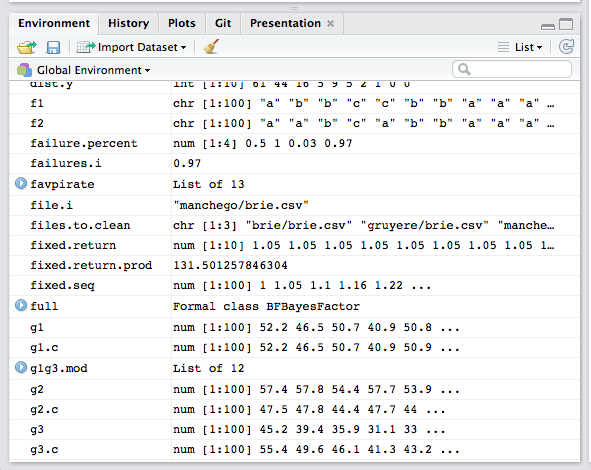

```{r setup, include = FALSE}
# general options --------------------------------------------------------------
options(
  scipen = 999,
  htmltools.preserve.raw = FALSE
)
set.seed(42)
# chunk options ----------------------------------------------------------------
knitr::opts_chunk$set(
  cache.extra = knitr::rand_seed, 
  message = FALSE, 
  warning = FALSE, 
  error = FALSE, 
  echo = FALSE,
  cache = FALSE,
  comment = "", 
  fig.align = "center", 
  fig.retina = 3
  )
# libraries --------------------------------------------------------------------
library(tidyverse)
library(knitr)
library(kableExtra)
library(fontawesome)
library(norris)
library(tweetrmd)
library(countdown)
library(gapminder)
# functions --------------------------------------------------------------------
# https://bookdown.org/yihui/rmarkdown-cookbook/font-color.html#using-an-r-function-to-write-raw-html-or-latex-code

colorize <- function(x, color) {
  sprintf("<span style='color: %s;'>%s</span>", color, x)
  }
```

---

class: inverse, mline, center, middle

# 1. Coding in RStudio

---

# R so far

We have already seen how to:

- Use RStudio Cloud
- Install, load and use packages
- Run R code in R Script or R Markdown files
- Use keyboard shortcuts: `Ctrl` & `Enter` (Win) / `Command` & `Enter` (Mac)
- Create object with the assignment arrow `<-` sign
- Upload and read data in RStudio Cloud

---

# Rstudio Cloud

In your webrowser (Chrome, Firefox, ...):

1. Open these same slides on a tab to copy-paste the examples
  - From Loop: Lectures > Lecture 7
  - Or from the URL: https://damien-dupre.github.io/mt611/lectures/lecture_7

2. In another tab, go to: https://rstudio.cloud/
  - Sign in or Sign up (if not already done)
  - In your workspace, Click "Untitled Project" or "New Project" (if not already done) 

```{r out.width='100%'}
knitr::include_graphics("https://miro.medium.com/max/1400/1*JBHNRwGr3ZiyBzYWpvH6zg.png")
```

---

# RStudio IDE

When you open RStudio, you’ll see the following 3 windows (also called panes):

* **Console**: where the results are printed
* **Workspace**: where the objects are stored
* **Files, Plots, Package, Help and Viewer**: where data science materials are

```{r out.width='70%'}
knitr::include_graphics("img/rstudio_ide.png")
```

The last window **Code Editor** needs to be opened by clicking:

 * *File* > *New File* > *R Script*

---

# Console: R’s Heart

Where R actually evaluates code:

* Ready to process code if the prompt is `>` . 
* If a command is incomplete at the end of a line, the prompt `+` is displayed
* If the console shows a red icon in the top right corner, the console is currently processing your script

```{r out.width = '30%'}
knitr::include_graphics("img/r_console.png")
```

You can execute code by typing it directly into the Console. However, it won’t be saved. And if you make a mistake you will have to re-type everything all over again. 

Instead, it’s better to write all your code in a document called the **Code Editor**.

---

# Environment: R’s Brain

The Environment tab of this panel shows you the names of all the data objects (like vectors, matrices, and data frames) that you have defined in your current R session. 

You can also see information like the number of observations and rows in data objects. 

```{r out.width = '50%'}

```

---

# Files / Plots / Packages / Help

* The **Files** panel gives you access to the file directory on your hard drive.

* The **Plots** panel shows all your plots. There are buttons for opening the plot in a separate window and exporting the plot as a pdf or jpeg.

* The **Packages** shows a list of all the R packages installed on the local or remote machine and indicates whether or not they are currently loaded.

* With the **Help** menu for R functions you can access to essential information to use them. Just have a look at some of them by typing `?` followed by the function name such as:

```{r echo=TRUE, eval=FALSE}
?seq
?lm
```

---

# Code Editor: R's Nervous System

It makes the link between all the previous pane and allows to reproduce actions and behaviours.

```{r out.width = '50%'}
knitr::include_graphics("img/rstudio_panes.png")
```

In a R Script, each line corresponds to a command except if:

* A function is spread on multiple lines until the closing brackets
* A `%>%` operator is used to chain multiple commands 
* A `+` operator is used to add multiple layers to a ggplot

All text starting with the symbol `#` is not computed and used as a comment to give information.

---

# Become Expert in R

Because R is free, plenty of free learning materials are available online:

* Video tutorials

* Book tutorials, see for example:
  - [R for Data Science](https://r4ds.had.co.nz/) by Wickham & Grolemund (2017)
  - [A ModernDive into R and the tidyverse](https://moderndive.com/) by Ismay & Kim (2019)
  - [Getting Used to R, RStudio, and R Markdown](https://rbasics.netlify.com/) by Kennedy (2019)
  - [Introduction to Open Data Science](https://ohi-science.org/data-science-training/) by the Ocean Health Index Team (2019)
  
* Interactive tutorials, see for example:
  - [RStudio Primers](https://rstudio.cloud/learn/primers)
  - [R-Bootcamp](https://r-bootcamp.netlify.com)
  - [Introduction to R](https://www.quantargo.com/courses/course-r-introduction)
  - [DCU R tutorials](https://dcu-r-tutorials.netlify.app)

---

# How to solve your pRoblems

1. Look at your error
  * If it's obvious, solve it by yourself
  * If it's not obvious, copy paste the error in google
  
2. Look at your object (`str(ObjectName)`)

3. Look at the function (documentation)

4. Look at the web
  * Google "R how to ..."
  * Stack Overflow

---

class: inverse, mline, center, middle

# 2. Transformations with {dplyr}

---

# Using {dplyr} in the {tidyverse}

The {tidyverse} package is primarily made up of a set of super useful R packages ({ggplot2}, {dplyr}, {purrr}, {tidyr}, {readr}, {tibble}).

It is also a new way of thinking about implementing “tidy” data analysis. 

If you combine tidy thinking with the {tidyverse} packages, you will inevitably become a master of tidy analysis. 

The tidyverse has a very detailed website for more information: https://www.tidyverse.org/.

```{r eval=FALSE, echo=TRUE}
install.packages("tidyverse")
library(tidyverse)
```

---

# {dplyr}'s main functions

There are five **{dplyr}** functions that you will use to do the vast majority of data manipulations:

- `filter()`: Subset observations (pick observations by their values)

- `select()`: Subset variables (pick variables by their names)

- `mutate()`: Make new variables (create new variables with functions of existing variables)

- `summarise()`: Summarise data (collapse many values down to a single summary)

These can all be used in conjunction with `group_by()` which changes the scope of each function from operating on the entire dataset to operating on it group-by-group.

These five functions provide the verbs for a language of data manipulation.

---

# {dplyr}'s main functions

All verbs work similarly:

- `r colorize("The first argument is a dataframe object name", "red")` 
- `r colorize("The subsequent arguments describe how the dataframe is transformed", "green")` 
- `r colorize("The result is a new dataframe", "blue")`

Here is a generic example:

.center[**`r colorize("dataframe_transformed", "blue")` `<-` function_name(`r colorize("dataframe_name", "red")`, `r colorize("transformation", "green")`)**
]

---

# The gapminder dataset

The dataset used today is stored in the {gapminder} package into an object called `gapminder`. 

Each row in this table corresponds to a country at a specific year. For each row, we have 6 columns:

- **country**: Name of country.
- **year**: Year of the observation (between 1952 and 2007).
- **pop**: Number of people living in the country.
- **continent**: Which of the five continents the country is part of. 
- **lifeExp**: Life expectancy in years.
- **gdpPercap**: Gross domestic product (in US dollars).

---
class: title-slide, middle

## Live Demo

---
class: title-slide, middle

## Exercise

1. Install the package {gapminder} which contains the data gapminder
2. Load the package {gapminder} to access the data
3. Use the function `str()` on the gapminder data 

```{r}
countdown(minutes = 5, warn_when = 60)
```

---

class: title-slide, middle

## The filter() function

---

# The filter() function

You will want to isolate bits of your data; maybe you want to only look at a single country or a few years. R calls this subsetting and `filter()` allows you to subset observations based on their values.

`filter()`'s transformation is a conditional statement, only observations TRUE to the condition are kept.

For example

```{r eval=FALSE, echo=TRUE}
filter(gapminder, country == "Ireland")
```

Importantly, Column/Variable names are not between quotation marks in the Tidyverse whereas the value to filter is
- A Column/Variable is an object containing multiple values inside the data frame object.
- The string "Ireland" does not exist in our environment and will not be saved. It is here just as a value, which explains the quotation marks.

---

# Comparisons

To use filtering effectively, you have to know how to select the observations that you want using the comparison operators. R provides the standard suite: `>`, `>=`, `<`, `<=`, `!=` (not equal), and `==` (exactly equal).

When you’re starting out with R, the easiest mistake to make is to use `=` instead of `==` when testing for equality. When this happens you’ll get an informative error:

```{r eval=FALSE, echo=TRUE}
filter(gapminder, country = "Ireland")
```

```out
Error: Problem with `filter()` input `..1`.
x Input `..1` is named.
ℹ This usually means that you've used `=` instead of `==`.
ℹ Did you mean `country == "Ireland"`?
```

---

# Multiple filters

Whereas the `filter()` can include as many conditions as possible, it is also possible to store the result of the `filter()` function in a new object and then to apply a new filter on this new object.

```{r eval=FALSE, echo=TRUE}
gapminder_ireland <- filter(gapminder, country == "Ireland")

gapminder_ireland_2007 <- filter(gapminder_ireland, year == 2007)
```

A choice is offered to you, you can either overwrite the original object by using the same object name or to use a different object name.

---
class: title-slide, middle

## Live Demo

---
class: title-slide, middle

## Exercise

1. Be sure that the packages {tidyverse} and {gapminder} are loaded
2. Create a new object that only contains data for France
3. Create a new object using the previous object that only contains data for France in 1982

```{r}
countdown(minutes = 5, warn_when = 60)
```

---

class: title-slide, middle

## The select() function

---

# The select() function

It’s not uncommon to get datasets with hundreds or even thousands of variables. In this case, the first challenge is often narrowing in on the variables you’re actually interested in. 

`select()` allows you to rapidly zoom in on a useful subset using operations based on the names of the variables. 

Again the first argument is the name of the data frame object to process and the following arguments are the name of the columns to keep.

```{r eval=FALSE, echo=TRUE}
select(gapminder, country, year, pop)
```

---

# Keep and remove variables

The `select()` function can not only be used to keep specific variables but it can also be used to remove them from the data frame object. 

To do so, just add the `-` sign in front of the variable name to be removed. For example:

```{r eval=FALSE, echo=TRUE}
gapminder_keep <- select(gapminder, country, year, pop)

gapminder_remove <- select(gapminder, -continent, -lifeExp, -gdpPercap)
```

In the previous example the objects `gapminder_keep` and `gapminder_remove` should have the same number of variable and therefore be equal.

---

# Select and rename variables

While you are keeping only specify variables with `select()`, these variables can also be renamed on the same time. 

The new name has to be first, followed by the `=` sign, and the old name.

Example:

```{r eval=FALSE, echo=TRUE}
select(gapminder, country, population = pop, measure_year = year)
```

---
class: title-slide, middle

## Live Demo

---
class: title-slide, middle

## Exercise

1/ From the data frame object `gapminder`, select the columns `lifeExp` and `gdpPercap` and rename them as life_expectancy and gdp_per_capita:

```{r eval=FALSE, echo=TRUE}
select(_ _ _, _ _ _ = _ _ _, _ _ _ = _ _ _)
```

2/ From the data frame object `gapminder`, remove the columns `pop` and `year` and assign the result in a new object. The display the value of this object:

```{r eval=FALSE, echo=TRUE}
new_data <- select(_ _ _, -_ _ _, -_ _ _)

new_data
```

```{r}
countdown(minutes = 5, warn_when = 60)
```

---

class: title-slide, middle

## The mutate() function

---

# The mutate() function

Besides selecting sets of existing columns, it’s often useful to add new columns that are functions of existing columns. That’s the job of `mutate()`. 

Once again the first argument is the name of the data frame object to modify, then the second argument is the name of the column to create followed by the `=` sign and the condition creating the new values.

For example we can create a new column called `gdp_total` which contains the values resulting from the multiplication between `pop` and `gdpPercap`:

```{r eval=FALSE, echo=TRUE}
mutate(gapminder, gdp_total = pop * gdpPercap)
```

`mutate()` can also create multiple columns in the same statement, they just have to be separated by a comma `,`.

---
class: title-slide, middle

## Live Demo

---
class: title-slide, middle

## Exercise

1/ From the data frame object `gapminder`, create a new column called `country_upper` with the function `toupper()` using the column `country`:

```{r eval=FALSE, echo=TRUE}
mutate(_ _ _, _ _ _ = _ _ _(_ _ _))
```

2/ From the data frame object `gapminder`, filter the countries in Europe and their values for 2007. Assign the result to an new object called `europe_2007`. 
Then create a new column called `europe_prop` corresponding to the value of the column `pop` divided by the total population in Europe in 2007.

```{r eval=FALSE, echo=TRUE}
europe_2007 <- filter(_ _ _, _ _ _ == _ _ _ & _ _ _ == _ _ _)

mutate(_ _ _, _ _ _ = _ _ _/_ _ _(_ _ _))
```

```{r}
countdown(minutes = 5, warn_when = 60)
```

---

class: title-slide, middle

## The summarise() function

---

# The summarise() function

The last key verb is `summarise()`. It collapses a data frame to a single row:

```{r eval=FALSE, echo=TRUE}
summarise(gapminder, mean(pop))
summarise(gapminder, sd(pop))
```

The result of `summarise()` is a dataframe, the default header of the summary is the calculation but a new header can be defined by using the `=` sign when summarising the data:

```{r eval=FALSE, echo=TRUE}
summarise(gapminder, m_pop = mean(pop))
summarise(gapminder, sd_pop = sd(pop))
```

Finally, more than one summary can be done inside a `summarise()`:

```{r eval=FALSE, echo=TRUE}
summarise(gapminder, m_pop = mean(pop), sd_pop = sd(pop))
```

---

# The summarise() function

`summarise()` is not terribly useful unless we pair it with `group_by()`. This changes the unit of analysis from the complete dataset to individual groups. Then, when you use the dplyr verbs on a grouped data frame they’ll be automatically applied “by group”. 

For example, if we applied exactly the same code to a data frame grouped by year, we get the average world population per year:

```{r echo=TRUE}
gapminder_by_year <- group_by(gapminder, year)

summarise(gapminder_by_year, mean_pop = mean(pop))
```

---
class: title-slide, middle

## Live Demo

---
class: title-slide, middle

## Exercise

1/ From the data frame object `gapminder`, summarise the population average with the `mean()` function by `year` and by `continent` by adding the second grouping variable after the first one (use a coma to separate them):

```{r eval=FALSE, echo=TRUE}
gapminder_group <- group_by(_ _ _, _ _ _, _ _ _)

summarise(_ _ _, _ _ _ = _ _ _(_ _ _))
```

2/ From the data frame object `gapminder`, summarise the population standard deviation with the `sd()` function by `year` and by `continent` by adding the second grouping variable after the first one (use a coma to separate them):

```{r eval=FALSE, echo=TRUE}
gapminder_group <- group_by(_ _ _, _ _ _, _ _ _)

summarise(_ _ _, _ _ _ = _ _ _(_ _ _))
```

```{r}
countdown(minutes = 5, warn_when = 60)
```

---

class: title-slide, middle

## The pipe operator %>%

---

# The pipe operator %>%

Imagine that we want to summarise the population average and standard deviation only of Europe. Using what you know about {dplyr}, you might write code like this:

```{r eval=FALSE, echo=TRUE}
gapminder_europe <- filter(gapminder, continent == "Europe")

gapminder_summary_europe <- summarise(gapminder_europe, 
  m_pop = mean(pop),
  sd_pop = sd(pop)
)
```

This code is a little frustrating to write because we have to give each intermediate data frame a name, even though we don’t care about it. Naming things is hard, so this slows down our analysis.

---

# The pipe operator %>% 

There’s another way to tackle the same problem with the pipe, `%>%`:

```{r eval=FALSE, echo=TRUE}
gapminder_summary_europe <- gapminder %>% 
  filter(continent == "Europe") %>% 
  summarise(m_pop = mean(pop), sd_pop = sd(pop))
```

---

# The pipe operator %>%

You can read it as a series of imperative statements: group, then summarise, then filter in the first example and: filter, then summarise in the second example. As suggested by this reading, a good way to pronounce `%>%` when reading code is **“then”**.

```{r eval=FALSE, echo=TRUE}
gapminder_summary_europe <- gapminder %>% 
  filter(continent == "Europe") %>% 
  summarise(m_pop = mean(pop), sd_pop = sd(pop))
```

Becomes

> Create the object "gapminder_summary_europe" from the object "gapminder", then

> Filter all the values exactly equals to "Europe" in the continent variable, then

> Summarise the average population as "m_pop" and the standard deviation as "sd_pop".

---

# The pipe operator %>%

Behind the scenes, `x %>% f()` turns into `f(x)`, and `x %>% f() %>% g()` turns into `g(f(x))` and so on.

The following sequence can be read as:
1. Take `x` then
2. Use it as the input to the function `f()` then
3. Use `f(x)` as the input to the function `g()` then
4. Use `g(f(x))` as the input to the function `h()`

```{r eval=FALSE, echo=TRUE}
x %>% 
  f() %>% 
  g() %>% 
  h()
```

Working with the pipe is one of the key criteria for belonging to the tidyverse. The only exception is {ggplot2}.

---
class: title-slide, middle

## Live Demo

---
class: title-slide, middle

## Exercise

1/ From the data frame object `gapminder`, summarise the population average with the `mean()` function by `year` and by `continent` by adding the second grouping variable after the first one (use a coma to separate them) and by using the pipe operator:

```{r eval=FALSE, echo=TRUE}
_ _ _ %>% 
  group_by(_ _ _, _ _ _) %>% 
  summarise(_ _ _ = _ _ _(_ _ _))
```

2/ From the data frame object `gapminder`, summarise the population standard deviation with the `sd()` function by `year` and by `continent` by adding the second grouping variable after the first one (use a coma to separate them) and by using the pipe operator:

```{r eval=FALSE, echo=TRUE}
_ _ _ %>% 
  group_by(_ _ _, _ _ _) %>% 
  summarise(_ _ _ = _ _ _(_ _ _))
```

```{r}
countdown(minutes = 5, warn_when = 60)
```

---
class: inverse, mline, left, middle


# Thanks for your attention and don't hesitate to ask any questions!

[`r fa(name = "twitter")` @damien_dupre](http://twitter.com/damien_dupre)  
[`r fa(name = "github")` @damien-dupre](http://github.com/damien-dupre)  
[`r fa(name = "link")` damien-datasci-blog.netlify.app](https://damien-datasci-blog.netlify.app)  
[`r fa(name = "paper-plane")` damien.dupre@dcu.ie](mailto:damien.dupre@dcu.ie)
