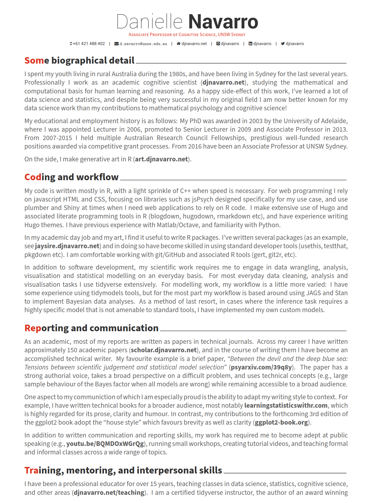

```{r setup, include = FALSE}
# general options --------------------------------------------------------------
options(scipen = 999)
set.seed(42)
# chunk options ----------------------------------------------------------------
knitr::opts_chunk$set(
  cache.extra = knitr::rand_seed, 
  message = FALSE, 
  warning = FALSE, 
  error = FALSE, 
  echo = FALSE,
  cache = FALSE,
  eval = TRUE,
  comment = "", 
  fig.align = "center", 
  fig.retina = 3
  )
# libraries --------------------------------------------------------------------
library(tidyverse)
library(knitr)
library(kableExtra)
library(countdown)
library(ymlthis)
```

# Objectives

In this tutorial, with RStudio Cloud, we will see how to create:

- **Markdown:** a simple text-only format for writing documents
- **R markdown:** a tool for mixing R code with markdown 

--

#### What do I need to do before starting?

- Sign up for a free RStudio cloud account
- https://rstudio.cloud/

--

#### Where can I find the resources?

- These slides: [slides.djnavarro.net/starting-rmarkdown](https://slides.djnavarro.net/starting-rmarkdown)
- YouTube videos: [youtube.djnavarro.net/starting-rmarkdown](https://youtube.djnavarro.net/starting-rmarkdown)

---

# Two Sides of R Markdown Files

.pull-left[
<br>
### On the input side...

- Write text in markdown
- Insert code using R
- Write "metadata" with YAML
- Insert equation with LaTeX
]

.pull-right[
<br>
### On the output side...

- Output to HTML
- Output to PDF
- Output to Word
- Many other variations too
]

---
class: middle, inverse

# Lots of little things to learn!<br>We'll start with markdown...

---

# What do we want?

- Something that... you can write in **plain text**
- Something that... is **human readable**
- Something that... allows **formatting**
- Something that... can **build** to something pretty 

---

# Markdown

.pull-left[

**Here's an example of a markdown document...**

```
## Introduction


Welcome to my **awesome** class. You 
will learn all kinds of useful things 
about R Markdown.

- Markdown is simple
- You can add R code
```
]

--

.pull-right[

**Here's what the output looks like...**

## Introduction

Welcome to my **awesome** class. You will learn 
all kinds of useful things about R Markdown. 

- Markdown is simple
- You can add R code

]

---
class: middle, inverse

## Everyone: Okaaaay, but this seems really boring?

## Me: ... hm, yeah, but let me show you where it takes you later!

---

# Professional websites

```{r, echo=FALSE, out.height="70%", out.width="50%"}
knitr::include_graphics("img/example_professional_site.png")
```

---

# Visual blogs

```{r, echo=FALSE, out.height="70%", out.width="50%"}
knitr::include_graphics("img/example_visual_blog.png")
```

---

# Books

```{r, echo=FALSE, out.height="70%", out.width="80%"}
knitr::include_graphics("img/example_book.png")
```


---

# Academic papers

```{r, echo=FALSE, out.height="70%", out.width="60%"}
knitr::include_graphics("img/example_papers.png")
```

---

# Slide decks

```{r, echo=FALSE, out.height="70%", out.width="80%"}
knitr::include_graphics("img/example_slides.png")
```

---

# CV

```{r, echo=FALSE, out.height="70%", out.width="80%"}

```

---
class: middle, inverse

# Everyone: Okay, let's dive into the details...

---

# Emphasising text

--
.pull-left[
<br><br>
### What you type...
<br>
```

this is *italics*

this is **bold**

this is ***bold italics***
```
]
--
.pull-right[
<br><br>
### What you get...
<br>

this is *italics*

this is **bold**

this is ***bold italics***
]

---

# Creating lists

--
.pull-left[
<br><br>
### What you type...
<br>
```
- unnumbered lists
- look like this

1. numbered lists
2. look like this
```
]
--
.pull-right[
<br><br>
### What you get...
<br>

- unnumbered lists
- look like this

1. numbered lists
2. look like this
]

---

# Creating headings

--
.pull-left[
<br><br>
### What you type...
<br>
```
# Level 1 heading
## Level 2 heading
### Level 3 heading

```
]
--
.pull-right[
<br><br>
### What you get...
<br>

## Level 1 heading
### Level 2 heading
#### Level 3 heading
]

---
class: middle, inverse

# Demonstration:<br>Write a markdown document

---
class: middle, inverse

# Exercise

In RStudio Cloud:
- Create a new plain Markdown file
- Save it as "my_first_markdown.md"
- Write some markdown about your emotions (positive and negative) triggered by R and RStudio
- Click "Preview" once finished

---
class: middle

## What do we want?

- Something that... lets you write text in **Markdown**
- Something that... lets you include **R code** (e.g. for data vis)
- Something that... can **build** to HTML, PDF, Word, etc

---

class: middle, inverse

# Demonstration:<br>Write an R Markdown document

---

# Let's dissect the document obtained!

```{r, echo=FALSE}
knitr::include_graphics("img/my_first_rmd_plain.png", dpi = 200)
```

---

# The part inside --- is the "YAML"

```{r, echo=FALSE}
knitr::include_graphics("img/my_first_rmd_yaml.png", dpi = 200)
```

---

# The part in grey is R code

```{r, echo=FALSE}
knitr::include_graphics("img/my_first_rmd_r.png", dpi = 200)
```

---

# The rest is Markdown 

```{r, echo=FALSE}
knitr::include_graphics("img/my_first_rmd_markdown.png", dpi = 200)
```

---

class: middle, inverse

# Wait... what's the YAML acronym?

- Originally: "Yet Another Markup Language"
- Later: "YAML Ain't Markup Language"
- ... it really doesn't matter `r emo::ji("face_with_rolling_eyes")`

---

# Output HTML

### Simple

```
---
title: "My First R Markdown Document"
output: html_document
---
```

### Complex

```
---
title: "My First R Markdown Document"
author: "Damien Dupre"
date: "99/99/9999"
output: html_document
---
```

---

class: middle, inverse

# Demonstration:<br>R Markdown presenting the Titanic Data 